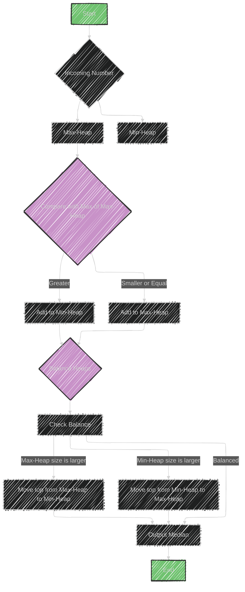

# Two Heaps Algorithm

> This content is dual-licensed under your choice of the following licenses:
> 1.  **MIT License:** For the code implementations in Swift and Mermaid provided in this document.
> 2.  **Creative Commons Attribution 4.0 International License (CC BY 4.0):** For all other content, including the text, explanations, and the Mermaid diagrams and illustrations.

---

The "Two Heaps" algorithm is a technique used to efficiently handle problems where you need to maintain and query data dynamically. It involves maintaining two separate heaps:

1. **Min-Heap**: This heap is used to keep track of the larger half of the numbers. It's organized such that the smallest element in this half can be easily retrieved, allowing you to access the minimum of the larger numbers quickly.

2. **Max-Heap**: This heap keeps track of the smaller half of the numbers. It allows for easy access to the maximum of the smaller numbers.

## Usage
- This method is useful when you need to quickly find the smallest element in one part of a dataset and the largest element in another part. 
- A common application is finding the median of a stream of numbers. As new numbers arrive, you can balance them between the min-heap and max-heap, allowing quick access to the median.

## Data Structures Involved
- **Heap**: Used to maintain the order of elements dynamically.
- **Array**: Often used to represent the heap structures.

## Sample Problems
- **Find the Median of a Number Stream**: Continuously finding the median as new elements are added.
- **Next Interval**: Finding intervals in a set of ranges based on certain conditions.

By maintaining a balance between the two heaps, you ensure efficient access and updates, making operations like finding the median or solving interval problems both fast and scalable.


---


## Mermaid illustration


Here's a conceptual diagram for the "Two Heaps" algorithm using Mermaid:



## Explanation
- **Incoming Number**: Each new number from the stream is compared with the maximum of the Max-Heap.
- **Comparison**: Determines whether the number goes into the Max-Heap or Min-Heap.
- **Balancing**: Ensures heaps are balanced (difference in size is at most one).
- **Output Median**: The median is derived from the tops of the heaps depending on their sizes.


---


## Full code implementation of the algorithm in Swift

Here is a full Swift implementation of the "Two Heaps" algorithm to find the median of a number stream:

```swift
import Foundation

class MedianFinder {

    private var maxHeap: Heap<Int>
    private var minHeap: Heap<Int>

    init() {
        maxHeap = Heap(sort: >) // Max-Heap
        minHeap = Heap(sort: <) // Min-Heap
    }

    func addNum(_ num: Int) {
        if let maxElement = maxHeap.peek(), num < maxElement {
            maxHeap.insert(num)
        } else {
            minHeap.insert(num)
        }

        // Balance the heaps
        if maxHeap.count > minHeap.count + 1 {
            if let maxTop = maxHeap.remove() {
                minHeap.insert(maxTop)
            }
        } else if minHeap.count > maxHeap.count {
            if let minTop = minHeap.remove() {
                maxHeap.insert(minTop)
            }
        }
    }

    func findMedian() -> Double {
        if maxHeap.count == minHeap.count {
            return Double(maxHeap.peek()! + minHeap.peek()!) / 2.0
        } else {
            return Double(maxHeap.peek()!)
        }
    }
}

struct Heap<Element: Comparable> {
    private var elements: [Element]
    private let sort: (Element, Element) -> Bool

    var isEmpty: Bool {
        return elements.isEmpty
    }

    var count: Int {
        return elements.count
    }

    init(sort: @escaping (Element, Element) -> Bool) {
        self.sort = sort
        self.elements = []
    }

    func peek() -> Element? {
        return elements.first
    }

    mutating func insert(_ value: Element) {
        elements.append(value)
        siftUp(elementAtIndex: elements.count - 1)
    }

    mutating func remove() -> Element? {
        guard !elements.isEmpty else { return nil }
        if elements.count == 1 {
            return elements.removeLast()
        } else {
            let value = elements[0]
            elements[0] = elements.removeLast()
            siftDown(elementAtIndex: 0)
            return value
        }
    }

    private mutating func siftUp(elementAtIndex index: Int) {
        let parent = parentIndex(ofElementAtIndex: index)
        guard !isRoot(index),
              sort(elements[index], elements[parent]) else { return }
        elements.swapAt(index, parent)
        siftUp(elementAtIndex: parent)
    }

    private mutating func siftDown(elementAtIndex index: Int) {
        let childIndex = self.rightChildIndex(ofElementAtIndex: index)
        var first = index
        if childIndex < elements.count && sort(elements[childIndex], elements[first]) {
            first = childIndex
        }
        let leftChildIndex = self.leftChildIndex(ofElementAtIndex: index)
        if leftChildIndex < elements.count && sort(elements[leftChildIndex], elements[first]) {
            first = leftChildIndex
        }
        if first == index { return }
        elements.swapAt(index, first)
        siftDown(elementAtIndex: first)
    }

    private func isRoot(_ index: Int) -> Bool {
        return index == 0
    }

    private func leftChildIndex(ofElementAtIndex index: Int) -> Int {
        return (2 * index) + 1
    }

    private func rightChildIndex(ofElementAtIndex index: Int) -> Int {
        return (2 * index) + 2
    }

    private func parentIndex(ofElementAtIndex index: Int) -> Int {
        return (index - 1) / 2
    }
}
```

## Explanation

- **Max-Heap and Min-Heap**: Max-Heap holds the smaller half of numbers, and Min-Heap holds the larger half.
- **Adding a Number**: Insert into the appropriate heap based on its comparison with the maximum of Max-Heap.
- **Balancing Heaps**: Ensure the size difference between the heaps is at most one.
- **Finding the Median**: If heaps are of equal size, the median is the average of the tops. Otherwise, the median is the top of the Max-Heap.


---


## Iterate all the cases and print out all the cases from the algorithm

Here's how you can iterate over multiple numbers, add them to the "MedianFinder", and print out the median after each addition:

```swift
import Foundation

// Example usage of the MedianFinder
func main() {
    let medianFinder = MedianFinder()
    let numbers = [5, 15, 1, 3, 8, 7, 9, 10]

    for number in numbers {
        medianFinder.addNum(number)
        print("Added \(number), Current Median: \(medianFinder.findMedian())")
    }
}

main()

class MedianFinder {
    private var maxHeap: Heap<Int>
    private var minHeap: Heap<Int>

    init() {
        maxHeap = Heap(sort: >) // Max-Heap
        minHeap = Heap(sort: <) // Min-Heap
    }

    func addNum(_ num: Int) {
        if let maxElement = maxHeap.peek(), num < maxElement {
            maxHeap.insert(num)
        } else {
            minHeap.insert(num)
        }

        // Balance the heaps
        if maxHeap.count > minHeap.count + 1 {
            if let maxTop = maxHeap.remove() {
                minHeap.insert(maxTop)
            }
        } else if minHeap.count > maxHeap.count {
            if let minTop = minHeap.remove() {
                maxHeap.insert(minTop)
            }
        }
    }

    func findMedian() -> Double {
        if maxHeap.count == minHeap.count {
            return Double(maxHeap.peek()! + minHeap.peek()!) / 2.0
        } else {
            return Double(maxHeap.peek()!)
        }
    }
}

struct Heap<Element: Comparable> {
    private var elements: [Element]
    private let sort: (Element, Element) -> Bool

    var isEmpty: Bool {
        return elements.isEmpty
    }

    var count: Int {
        return elements.count
    }

    init(sort: @escaping (Element, Element) -> Bool) {
        self.sort = sort
        self.elements = []
    }

    func peek() -> Element? {
        return elements.first
    }

    mutating func insert(_ value: Element) {
        elements.append(value)
        siftUp(elementAtIndex: elements.count - 1)
    }

    mutating func remove() -> Element? {
        guard !elements.isEmpty else { return nil }
        if elements.count == 1 {
            return elements.removeLast()
        } else {
            let value = elements[0]
            elements[0] = elements.removeLast()
            siftDown(elementAtIndex: 0)
            return value
        }
    }

    private mutating func siftUp(elementAtIndex index: Int) {
        let parent = parentIndex(ofElementAtIndex: index)
        guard !isRoot(index),
              sort(elements[index], elements[parent]) else { return }
        elements.swapAt(index, parent)
        siftUp(elementAtIndex: parent)
    }

    private mutating func siftDown(elementAtIndex index: Int) {
        let childIndex = self.rightChildIndex(ofElementAtIndex: index)
        var first = index
        if childIndex < elements.count && sort(elements[childIndex], elements[first]) {
            first = childIndex
        }
        let leftChildIndex = self.leftChildIndex(ofElementAtIndex: index)
        if leftChildIndex < elements.count && sort(elements[leftChildIndex], elements[first]) {
            first = leftChildIndex
        }
        if first == index { return }
        elements.swapAt(index, first)
        siftDown(elementAtIndex: first)
    }

    private func isRoot(_ index: Int) -> Bool {
        return index == 0
    }

    private func leftChildIndex(ofElementAtIndex index: Int) -> Int {
        return (2 * index) + 1
    }

    private func rightChildIndex(ofElementAtIndex index: Int) -> Int {
        return (2 * index) + 2
    }

    private func parentIndex(ofElementAtIndex index: Int) -> Int {
        return (index - 1) / 2
    }
}
```

## Explanation

- **Example Numbers**: The array `numbers` holds the numbers being added.
- **Iterate and Add**: The `for` loop iterates over each number, adds it to the `MedianFinder`, and prints the current median.
- **Output**: Shows the addition process and intermediate medians dynamically.

---
**Licenses:**

- **MIT License:**  [](LICENSE) - Full text in [LICENSE](LICENSE) file.
- **Creative Commons Attribution 4.0 International:** [](LICENSE-CC-BY) - Legal details in [LICENSE-CC-BY](LICENSE-CC-BY) and at [Creative Commons official site](http://creativecommons.org/licenses/by/4.0/).

---