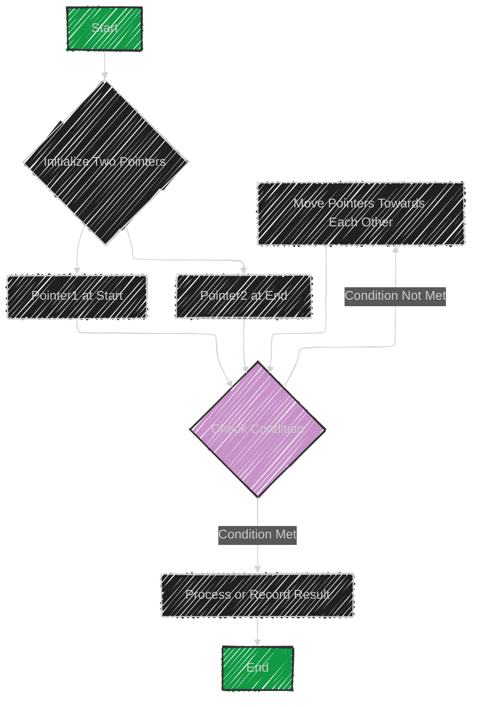

# Two Pointers Algorithm


The "Two Pointers" technique is a method used to iterate through input data such as arrays, strings, or linked lists using two pointers. These pointers typically start at opposite ends of the data structure or array and move towards each other at a constant interval.

## Key Points:
- **Usage:** Two pointers are used to solve problems involving linear data structures by optimizing time complexity. This technique is often employed when searching, sorting, and manipulating data.
- **Data Structures Involved:** It is commonly used with arrays, strings, and linked lists.
- **Sample Problems:**
  - **Squaring a Sorted Array:** Use two pointers to efficiently calculate the square of each number and maintain sorted order.
  - **Dutch National Flag Problem:** Arrange the elements in three groups using two pointers.
  - **Minimum Window Sort:** Find the smallest window in an array which, if sorted, will sort the entire array.

## How It Works:
- **Initialization:** Place Pointer1 at the start and Pointer2 at the end of the data structure.
- **Iteration:** Move the pointers towards each other based on a certain condition or logic relevant to the problem.
- **Termination:** The process continues until the pointers meet or a condition is satisfied.

This technique optimizes space and time complexity, making it more efficient than using nested loops.


---


## Mermaid illustration

Here's a Mermaid diagram illustrating the Two Pointers technique:



This flowchart depicts the general process of using the Two Pointers technique, where the pointers are initialized at opposite ends and move towards each other based on specific conditions until the operation is complete.


---

## Full code implementation of the algorithm in Swift*


Here's a Swift implementation using the Two Pointers technique to solve the "Squaring a Sorted Array" problem. The goal is to return a new array where each element is the square of the original, sorted in non-decreasing order.

```swift
func sortedSquares(_ nums: [Int]) -> [Int] {
    var left = 0
    var right = nums.count - 1
    var result = Array(repeating: 0, count: nums.count)
    var position = nums.count - 1

    while left <= right {
        let leftSquare = nums[left] * nums[left]
        let rightSquare = nums[right] * nums[right]

        if leftSquare > rightSquare {
            result[position] = leftSquare
            left += 1
        } else {
            result[position] = rightSquare
            right -= 1
        }
        position -= 1
    }

    return result
}

// Example usage:
let inputArray = [-4, -1, 0, 3, 10]
let sortedSquaresArray = sortedSquares(inputArray)
print(sortedSquaresArray) // Output: [0, 1, 9, 16, 100]
```

## Explanation:
- **Initialization:** Two pointers are initialized: `left` at the start and `right` at the end of the array.
- **Comparison:** Squares of the elements pointed by `left` and `right` are compared.
- **Store Result:** The larger square is placed at the `position` index of the result array, and the respective pointer is moved inward.
- **Iteration:** This process repeats until the pointers meet.
- **Result:** The function returns a new array of squared values sorted in non-decreasing order.

---


## Iterate all the case and print out all the cases from the algorithm


You can iterate through each case and print the internal state at each step.
This will help you see how the algorithm processes the array.

Here's the extended Swift implementation with detailed print statements:

```swift
func sortedSquares(_ nums: [Int]) -> [Int] {
    var left = 0
    var right = nums.count - 1
    var result = Array(repeating: 0, count: nums.count)
    var position = nums.count - 1

    print("Initial Array: \(nums)")
    print("Initial Result: \(result)")
    
    while left <= right {
        let leftSquare = nums[left] * nums[left]
        let rightSquare = nums[right] * nums[right]

        print("Comparing: leftSquare \(leftSquare) at index \(left), rightSquare \(rightSquare) at index \(right)")

        if leftSquare > rightSquare {
            result[position] = leftSquare
            print("Placing \(leftSquare) at result[\(position)]")
            left += 1
        } else {
            result[position] = rightSquare
            print("Placing \(rightSquare) at result[\(position)]")
            right -= 1
        }
        
        position -= 1
        print("Result so far: \(result)")
        print("Left pointer at \(left), Right pointer at \(right)\n")
    }

    print("Final Sorted Squares Array: \(result)")
    return result
}

// Example usage:
let inputArray = [-4, -1, 0, 3, 10]
let sortedSquaresArray = sortedSquares(inputArray)
```

## What This Code Does:
- **Prints Initial State:** Displays the initial input array and the initialized result array.
- **Iterates with Detailed Outputs:** For each iteration, prints the current squares being compared, which element is placed into the result array, and updates the position.
- **Shows Final Sorted Array:** Displays the fully sorted squared array at the end. 

This setup allows you to trace each step the algorithm takes.


---
