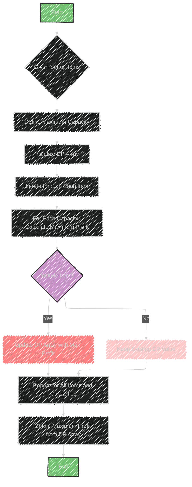

# Unbounded Knapsack Algorithm

> This content is dual-licensed under your choice of the following licenses:
> 1.  **MIT License:** For the code implementations in Swift and Mermaid provided in this document.
> 2.  **Creative Commons Attribution 4.0 International License (CC BY 4.0):** For all other content, including the text, explanations, and the Mermaid diagrams and illustrations.

---

The Unbounded Knapsack problem is a variation of the classic knapsack problem. In this problem, you aim to select items from a given set to maximize the total profit without exceeding a specified capacity.

Each item can be chosen multiple times.

## Key Points

- **Usage**: 
  - The main goal is to maximize profit given a set of items, each with a specific weight and value. Unlike the traditional knapsack problem, there is no limit to how many times you can choose each item.

- **Data Structures Involved**:
  - **Array**: Typically used to store the maximum profit obtainable with different capacities.
  - **HashTable**: May be used for optimized storage and retrieval, depending on implementation.

- **Sample Problems**:
  - **Rod Cutting**: Determine the maximum profit obtainable by cutting a rod of a given length into smaller pieces, each with its own profit.
  - **Coin Change**: Find the number of ways to make a certain amount using an unlimited number of available coin denominations.

## Approach

1. **Dynamic Programming**:
   - Use a dynamic programming array to store the maximum profit for each capacity from 0 to the target capacity.
   - For each item, decide whether including it would yield a higher profit compared to not including it.

2. **Recurrence Relation**:
   - For each capacity, calculate the maximum profit that can be obtained by either:
     - Including the item (and thus still having room to potentially include it again).
     - Not including the item.

3. **Complexity**:
   - Time and space complexities are generally O(nW), where n is the number of items and W is the capacity.

This approach is effective for problems that require maximizing profits or values when repetition of elements is allowed.

---


## Mermaid illustration

Here's a Mermaid diagram that illustrates the Unbounded Knapsack problem and its approach:



This diagram outlines the key steps and logic flow for solving the Unbounded Knapsack problem using dynamic programming.


---


## Full code implementation of the algorithm in Swift


Here's a complete Swift implementation of the Unbounded Knapsack algorithm using dynamic programming:

```swift
import Foundation

func unboundedKnapsack(capacity: Int, weights: [Int], profits: [Int]) -> Int {
    let n = weights.count
    var dp = [Int](repeating: 0, count: capacity + 1)
    
    for i in 0..<n {
        for w in weights[i]...capacity {
            dp[w] = max(dp[w], dp[w - weights[i]] + profits[i])
        }
    }
    
    return dp[capacity]
}

// Example usage:
let weights = [1, 3, 4]
let profits = [15, 50, 60]
let maxCapacity = 8

let maxProfit = unboundedKnapsack(capacity: maxCapacity, weights: weights, profits: profits)
print("Maximum profit is \(maxProfit)")
```

### Explanation

- **Function `unboundedKnapsack`**:
  - Takes in the maximum capacity of the knapsack, an array of weights, and an array of profits.
  - Initializes a DP array to store maximum profit for each capacity from 0 to the given capacity.
  - Iterates through each item and capacity, updating the DP array to reflect the maximum profit possible.

- **Example Usage**:
  - Defines weights and profits of items.
  - Calls the function with a specified maximum capacity.
  - Prints the maximum profit achievable.

This code calculates the maximum profit while allowing items to be included multiple times, as described in the Unbounded Knapsack problem.

---


## Iterate all the cases and print out all the cases from the algorithm

To iterate through all cases and print each state of the DP array, you can modify the code to include more detailed logging.

Here’s how you can achieve that in Swift:

```swift
import Foundation

func unboundedKnapsack(capacity: Int, weights: [Int], profits: [Int]) -> Int {
    let n = weights.count
    var dp = [Int](repeating: 0, count: capacity + 1)
    
    print("Initial DP Array: \(dp)")
    
    for i in 0..<n {
        print("\nProcessing item with weight \(weights[i]) and profit \(profits[i]):")
        for w in weights[i]...capacity {
            if dp[w] < dp[w - weights[i]] + profits[i] {
                dp[w] = dp[w - weights[i]] + profits[i]
                print("Updated DP[\(w)] to \(dp[w])")
            }
        }
        print("DP Array after item \(i): \(dp)")
    }
    
    return dp[capacity]
}

// Example usage:
let weights = [1, 3, 4]
let profits = [15, 50, 60]
let maxCapacity = 8

let maxProfit = unboundedKnapsack(capacity: maxCapacity, weights: weights, profits: profits)
print("\nMaximum profit is \(maxProfit)")
```

### Key Changes

- The code now includes print statements to show the initial state of the DP array.
- As each item is processed, it prints updates to the DP array whenever a higher profit is found.
- After processing each item, it prints the DP array to show its state.

This will provide a detailed view of how the algorithm progresses and updates the potential maximum profits for each capacity.


---
**Licenses:**

- **MIT License:**  [](LICENSE) - Full text in [LICENSE](LICENSE) file.
- **Creative Commons Attribution 4.0 International:** [](LICENSE-CC-BY) - Legal details in [LICENSE-CC-BY](LICENSE-CC-BY) and at [Creative Commons official site](http://creativecommons.org/licenses/by/4.0/).

---