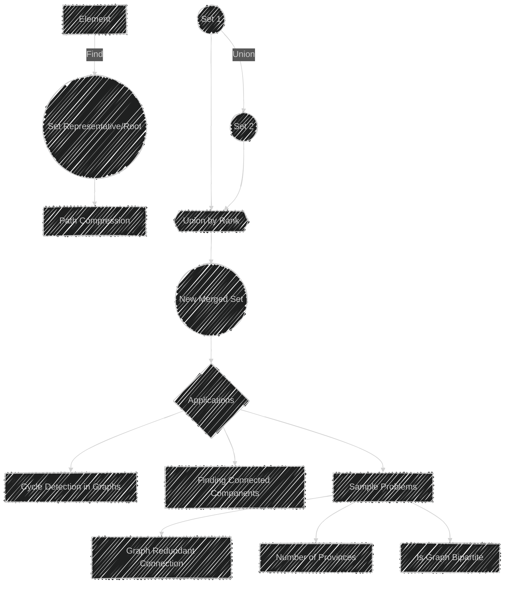

# Union Find Algorithm

> This content is dual-licensed under your choice of the following licenses:
> 1.  **MIT License:** For the code implementations in Swift and Mermaid provided in this document.
> 2.  **Creative Commons Attribution 4.0 International License (CC BY 4.0):** For all other content, including the text, explanations, and the Mermaid diagrams and illustrations.

---

The Union-Find algorithm, also known as Disjoint Set Union (DSU), is a data structure used to manage and keep track of a partition of a set into disjoint subsets. 

It supports two primary operations efficiently:

1. **Find:** Determines the set (or subset) a particular element belongs to. This is typically used to check if two elements are in the same subset.
2. **Union:** Merges two subsets into a single subset, effectively connecting elements.

## Key Concepts

- **Disjoint Sets:** Each element is in exactly one subset.
- **Representative (or Root):** Each subset is identified by one of its members, which acts as the root or representative.
- **Path Compression:** During the Find operation, it helps flatten the structure, making future queries faster by pointing directly to the root.
- **Union by Rank (or Size):** During the Union operation, always attach the smaller tree under the larger tree, optimizing the structure.

## Usage

The Union-Find data structure is particularly useful in scenarios involving connectivity and is commonly used in:

- **Graph Algorithms:** To detect cycles or determine connected components.
- **Sample Problems:** 
  - **Graph Redundant Connection:** Finding extra edges in a graph that form cycles.
  - **Number of Provinces:** Determining the number of disconnected subgraphs.
  - **Is Graph Bipartite:** Checking whether a graph can be colored with two colors.

The combination of path compression and union by rank ensures that both operations run in nearly constant time, making Union-Find a highly efficient data structure for connectivity problems.


---


## Mermaid illustration

Here’s a Mermaid diagram illustrating the Union-Find operations and concepts:



### Explanation
- **Find Operation**: This finds the root or representative of the set containing the element and uses path compression for efficiency.
- **Union Operation**: Merges two sets using union by rank to maintain a balanced tree structure.
- **Applications**: Illustrates common problems where Union-Find is effectively used.


---


## Full code implementation of the algorithm in Swift

Below is a full Swift implementation of the Union-Find algorithm with path compression and union by rank:

```swift
class UnionFind {
    private var parent: [Int]
    private var rank: [Int]

    init(size: Int) {
        parent = Array(0..<size)
        rank = Array(repeating: 1, count: size)
    }

    func find(_ i: Int) -> Int {
        if parent[i] != i {
            parent[i] = find(parent[i])  // Path compression
        }
        return parent[i]
    }

    func union(_ x: Int, _ y: Int) {
        let rootX = find(x)
        let rootY = find(y)

        if rootX != rootY {
            if rank[rootX] > rank[rootY] {
                parent[rootY] = rootX
            } else if rank[rootX] < rank[rootY] {
                parent[rootX] = rootY
            } else {
                parent[rootY] = rootX
                rank[rootX] += 1
            }
        }
    }

    func connected(_ x: Int, _ y: Int) -> Bool {
        return find(x) == find(y)
    }
}

// Example Usage:

let uf = UnionFind(size: 10)

uf.union(1, 2)
uf.union(2, 3)
print(uf.connected(1, 3)) // true
print(uf.connected(1, 4)) // false

uf.union(3, 4)
print(uf.connected(1, 4)) // true
```

### Explanation

- **Initialization**: Sets up two arrays to keep track of the parent and rank of each element.
- **Find Operation**: Uses path compression to flatten the tree structure, which ensures future find operations are faster.
- **Union Operation**: Uses union by rank to attach the shorter tree under the root of the taller tree, maintaining balance.
- **Connected Operation**: Checks if two elements are in the same set.

This implementation is efficient for problems involving dynamic connectivity, such as checking connected components in a network.


---


## Iterate all the cases and print out all the cases from the algorithm

Below, I've added a method to iterate through each element, showing its representative and the merged sets.

This will help illustrate how the Union-Find structure evolves.

```swift
class UnionFind {
    private var parent: [Int]
    private var rank: [Int]

    init(size: Int) {
        parent = Array(0..<size)
        rank = Array(repeating: 1, count: size)
    }

    func find(_ i: Int) -> Int {
        if parent[i] != i {
            parent[i] = find(parent[i])  // Path compression
        }
        return parent[i]
    }

    func union(_ x: Int, _ y: Int) {
        let rootX = find(x)
        let rootY = find(y)

        if rootX != rootY {
            if rank[rootX] > rank[rootY] {
                parent[rootY] = rootX
            } else if rank[rootX] < rank[rootY] {
                parent[rootX] = rootY
            } else {
                parent[rootY] = rootX
                rank[rootX] += 1
            }
        }
    }

    func connected(_ x: Int, _ y: Int) -> Bool {
        return find(x) == find(y)
    }

    func printSets() {
        var sets: [Int: [Int]] = [:]
        for i in 0..<parent.count {
            let root = find(i)
            sets[root, default: []].append(i)
        }
        for (root, members) in sets {
            print("Set with representative \(root): \(members)")
        }
    }
}

// Example Usage:

let uf = UnionFind(size: 10)

uf.union(1, 2)
uf.union(2, 3)
uf.union(3, 4)

uf.union(5, 6)
uf.union(6, 7)

uf.printSets() // Should show the sets and their members
```

### Explanation

- **printSets Method**: This method creates a dictionary to collect all elements under their representative roots and then prints each set.
- As you union different elements, you can call `printSets()` to see how the structure changes over time. This visualization helps understand how Union-Find manages the partitions.

---
**Licenses:**

- **MIT License:**  [](LICENSE) - Full text in [LICENSE](LICENSE) file.
- **Creative Commons Attribution 4.0 International:** [](LICENSE-CC-BY) - Legal details in [LICENSE-CC-BY](LICENSE-CC-BY) and at [Creative Commons official site](http://creativecommons.org/licenses/by/4.0/).

---