# Quantum Harmonic Atomic Model
> **Disclaimer:**
>
> This document contains my personal notes on the topic,
> compiled from publicly available documentation and various cited sources.
> The materials are intended for educational purposes, personal study, and reference.
> The content is dual-licensed:
> 1. **MIT License:** Applies to all code implementations (Swift, Mermaid, and other programming languages).
> 2. **Creative Commons Attribution 4.0 International License (CC BY 4.0):** Applies to all non-code content, including text, explanations, diagrams, and illustrations.
---

## Harmonic Atomica: Core Thesis

This mind map provides a high-level overview of the central concept presented.

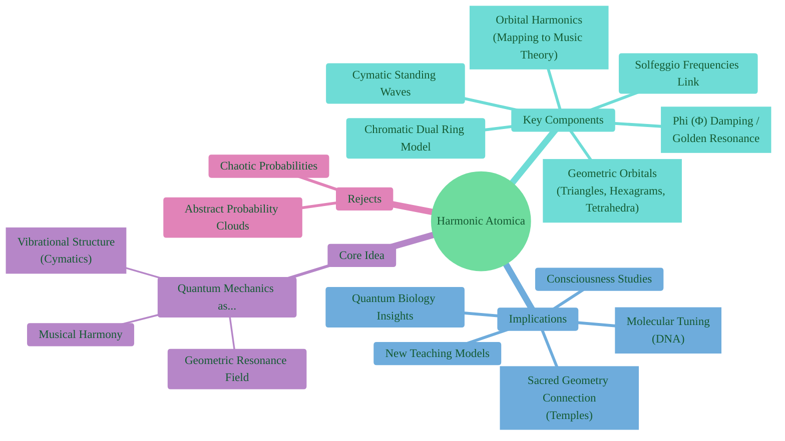

---

## 1. Geometric Orbital Model (s & p Subshells)

This diagram illustrates the proposed geometric representation of s and p orbitals.

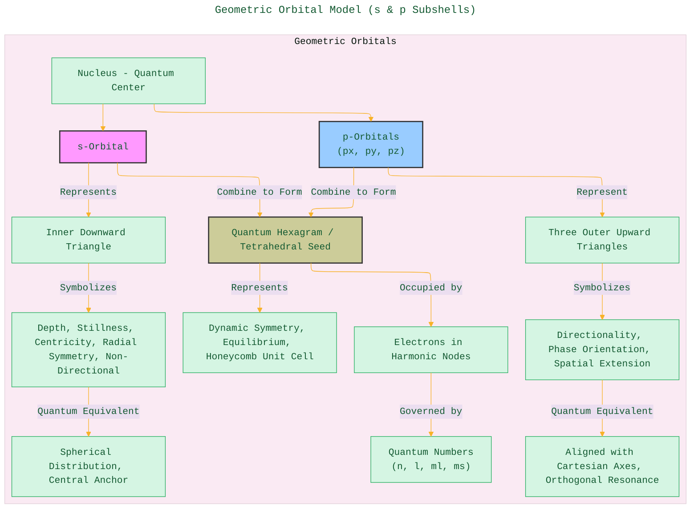

----

## 2. Mapping Electron Orbitals to Musical Harmonics

This flowchart shows the proposed correspondence between orbital types and musical concepts.

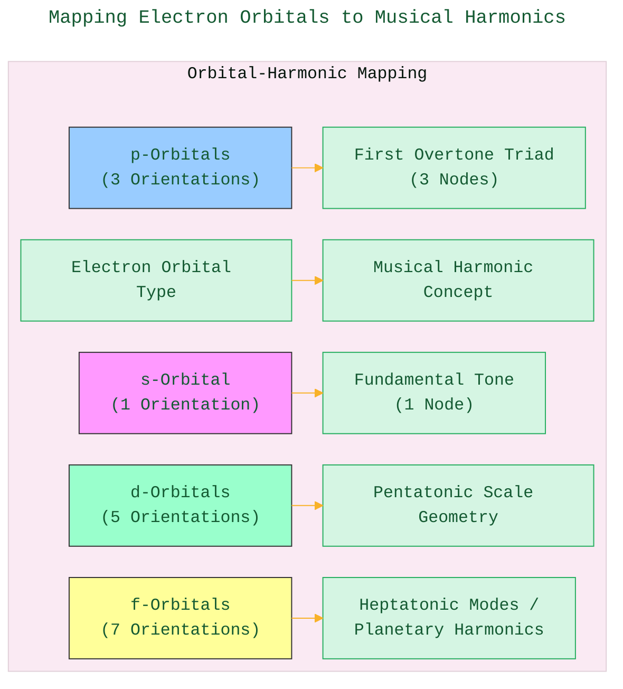

---

## 3. Cymatic Orbitals: Standing Wave Model

This diagram illustrates the idea of orbitals as cymatic patterns or standing waves.

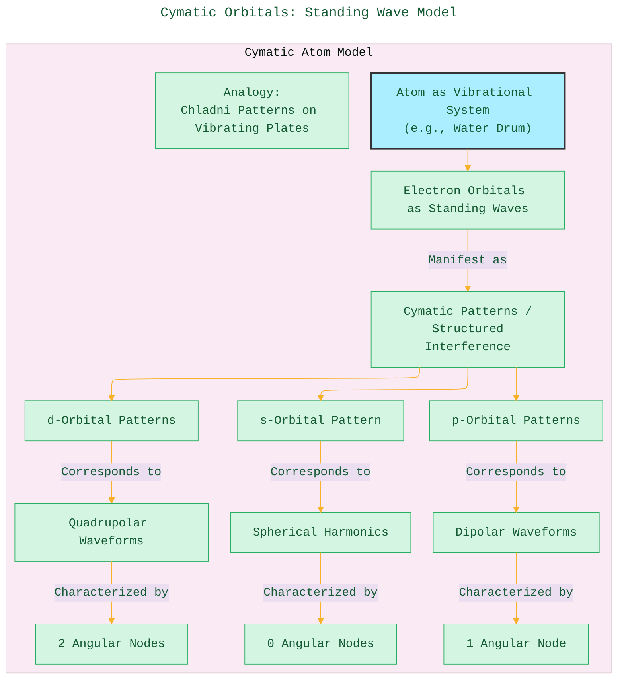

----

## 4. Bosons and Fermions as Harmonic Nodes

A simple representation of how particles might fit into the harmonic model.

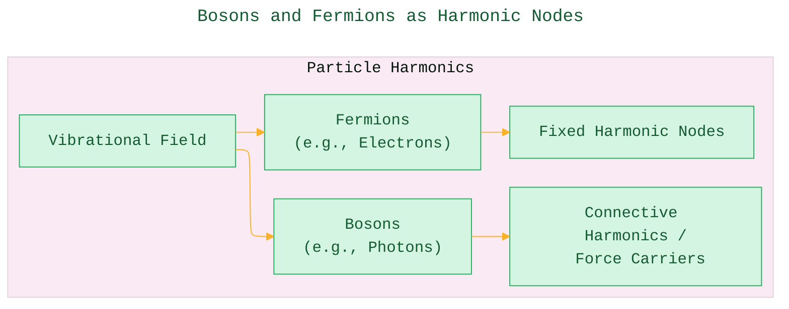

---

## 5. DNA Codons and the Chromatic Dual Ring

Mapping biological information to the proposed musical/geometric structure.

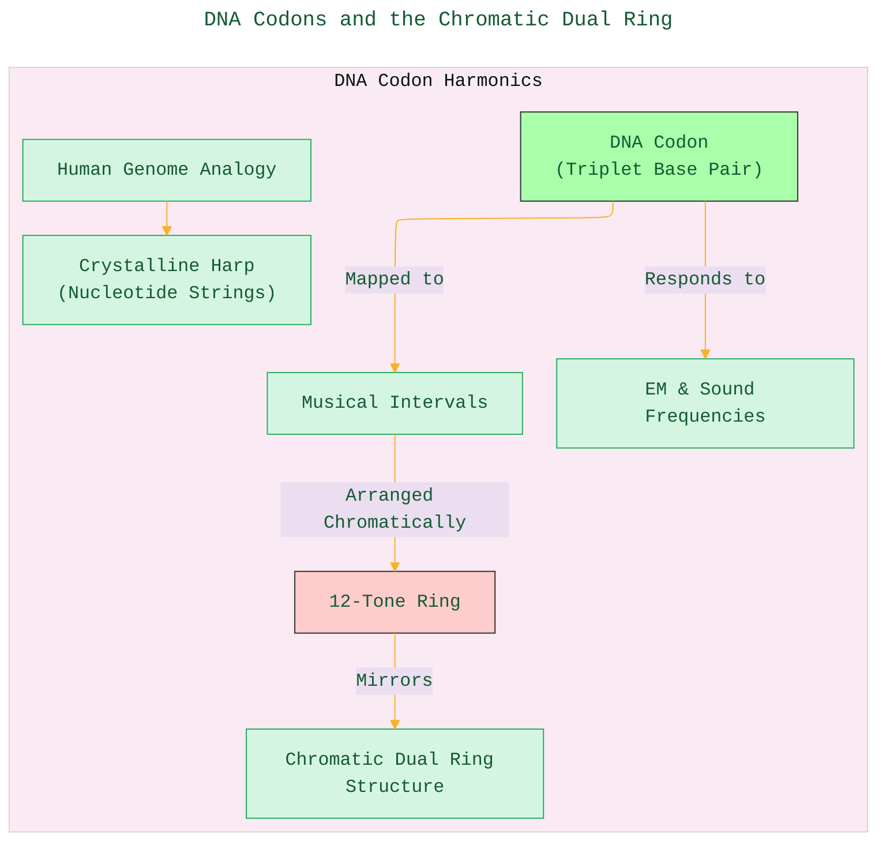

----

## 6. Phi-Damping and the Geometry of Silence

Illustrating the concept of selective resonance and forbidden states.

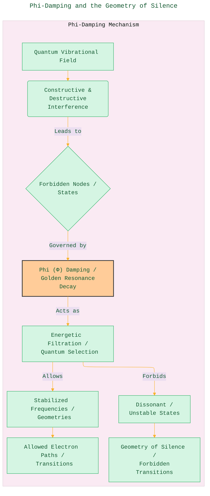

---

## 7. Chromatic Dual Ring Conceptual Structure

This mind map breaks down the components of the Chromatic Dual Ring model discussed.

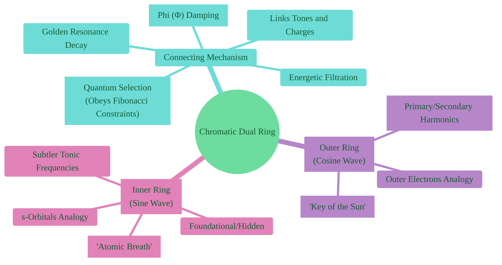

---

## 8. Solfeggio Frequencies Integration

Mapping the Solfeggio frequencies to the proposed quantum and biological correlations.

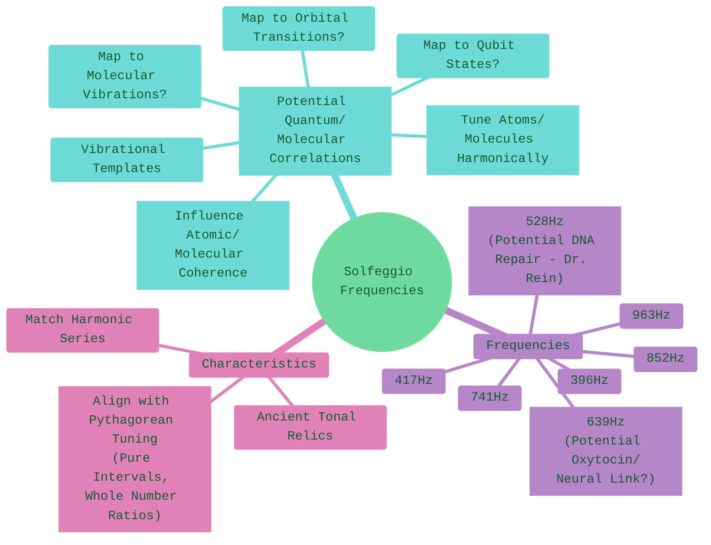

---

## 9. Quantum Interference and Forbidden Geometry

Explaining selection rules through the lens of resonance and interference.

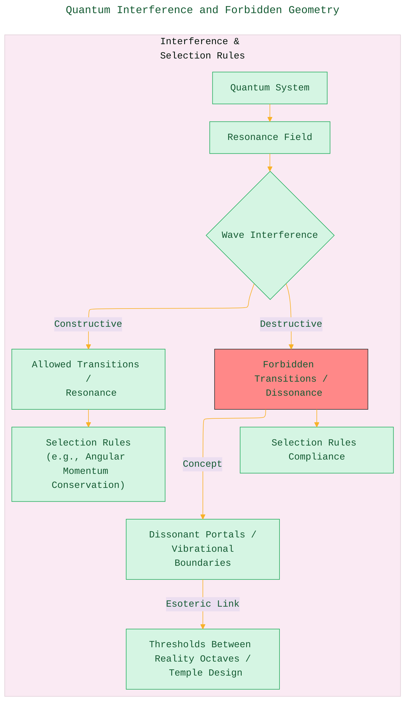

---

## 10. Resonance in Molecular Biology

Connecting the harmonic model to the function of biomolecules.

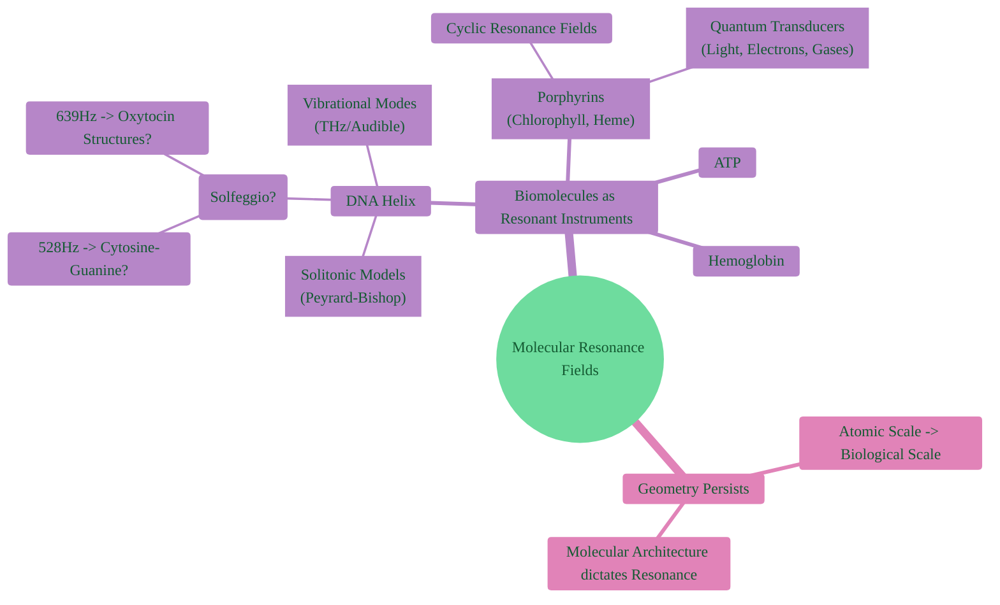

---

## 11. Quantum Temple Architectures

Proposing a link between ancient structures and quantum harmonic fields.

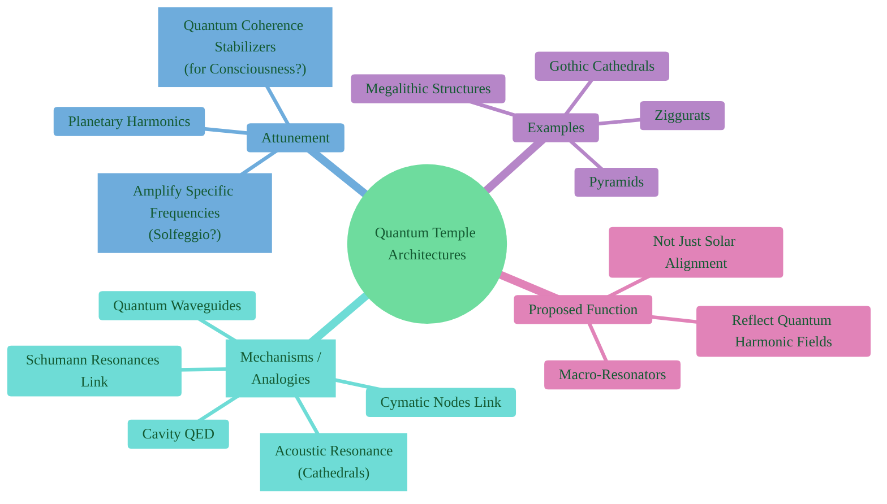

---

## 12. Quantum Numbers vs. Harmonic Numbers

A direct mapping as described in the text.

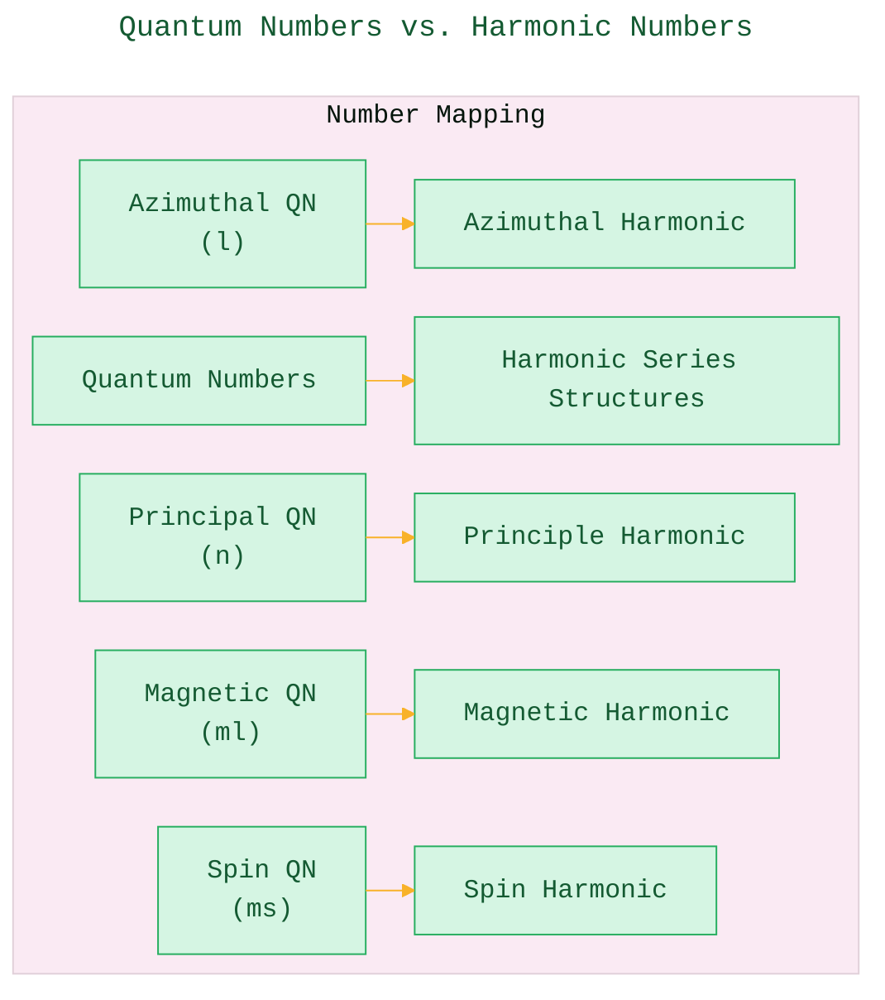

---

## 13. Phi-Symmetry in Quantum Systems

Highlighting the role of the Golden Ratio (Phi).

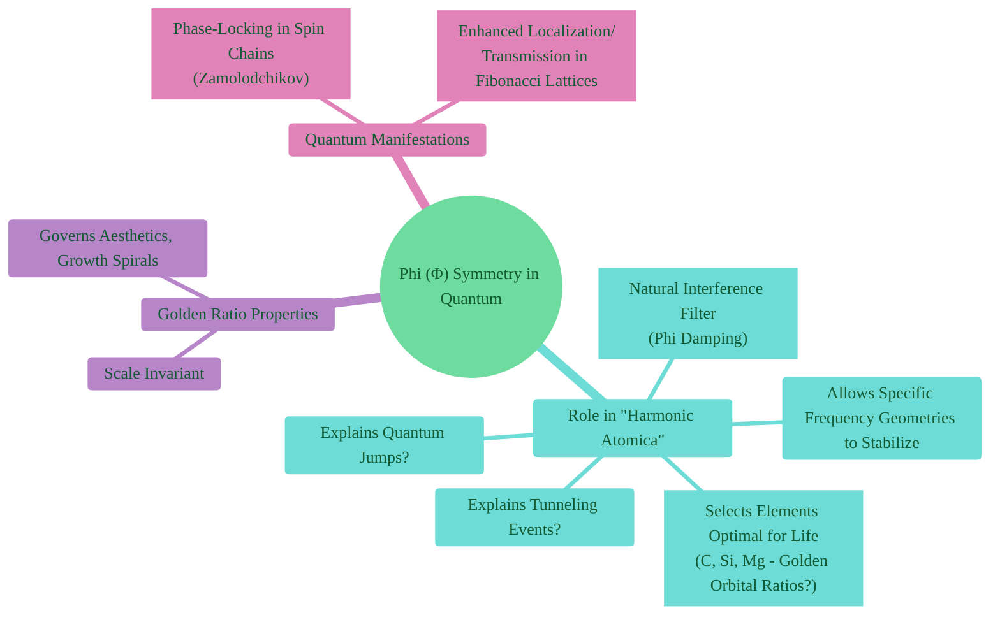

----

## 14. Fractal Harmonics and Nested Shell Geometry

Describing orbitals as nested, recursive structures.

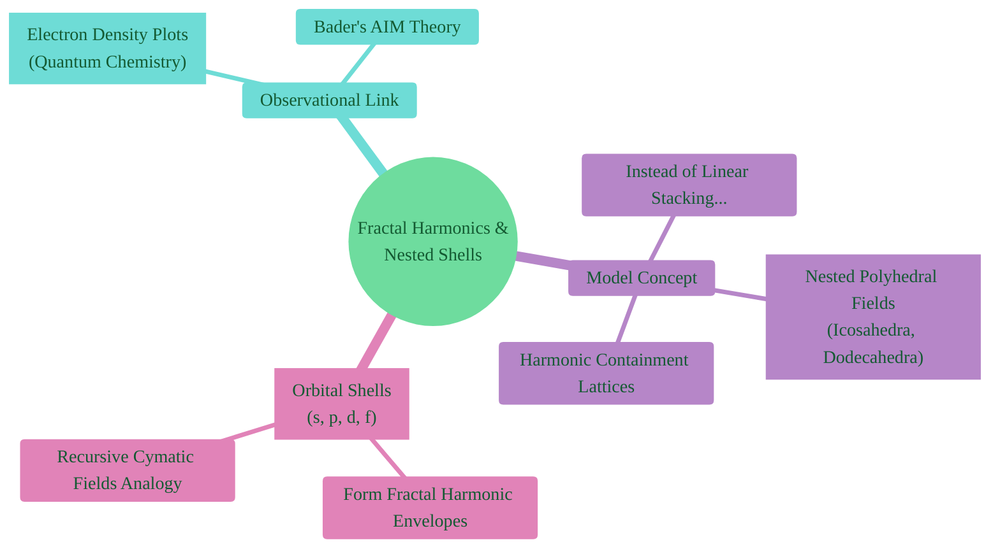

---
**References:**  
1. Cohen-Tannoudji, C. et al. (Quantum Mechanics)  
2. Shankar, R. (Principles of Quantum Mechanics)  
3. Weyl, H. (The Theory of Groups...)  
4. Billam & Gardiner, Quantum Resonances (arXiv:0809.4373)  
5. Tymoczko, D. (A Geometry of Music)  
6. Gardner, M. (Ambidextrous Universe)  
7. Lincoln Xavier N. N. (2025). SACRED GEOMETRY - BEYOND THE EYES.

---

---
**Licenses:**

- **MIT License:**   - Full text in [LICENSE](LICENSE) file.
- **Creative Commons Attribution 4.0 International:**  - Legal details in [LICENSE-CC-BY](LICENSE-CC-BY) and at [Creative Commons official site](http://creativecommons.org/licenses/by/4.0/).

---