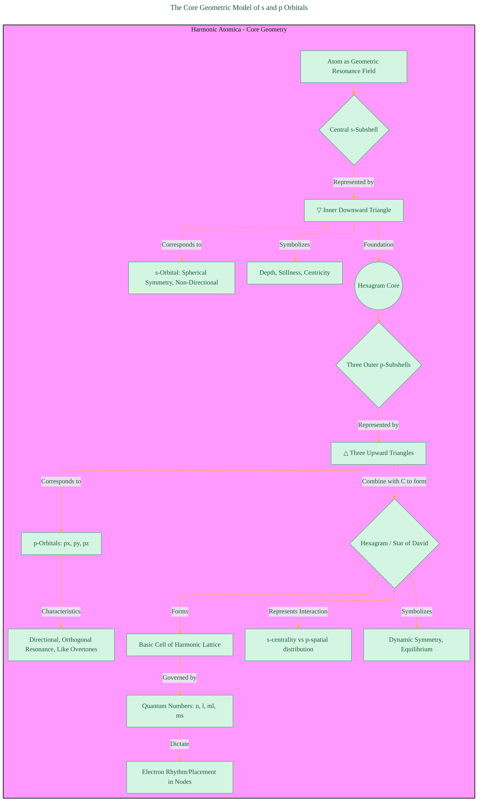
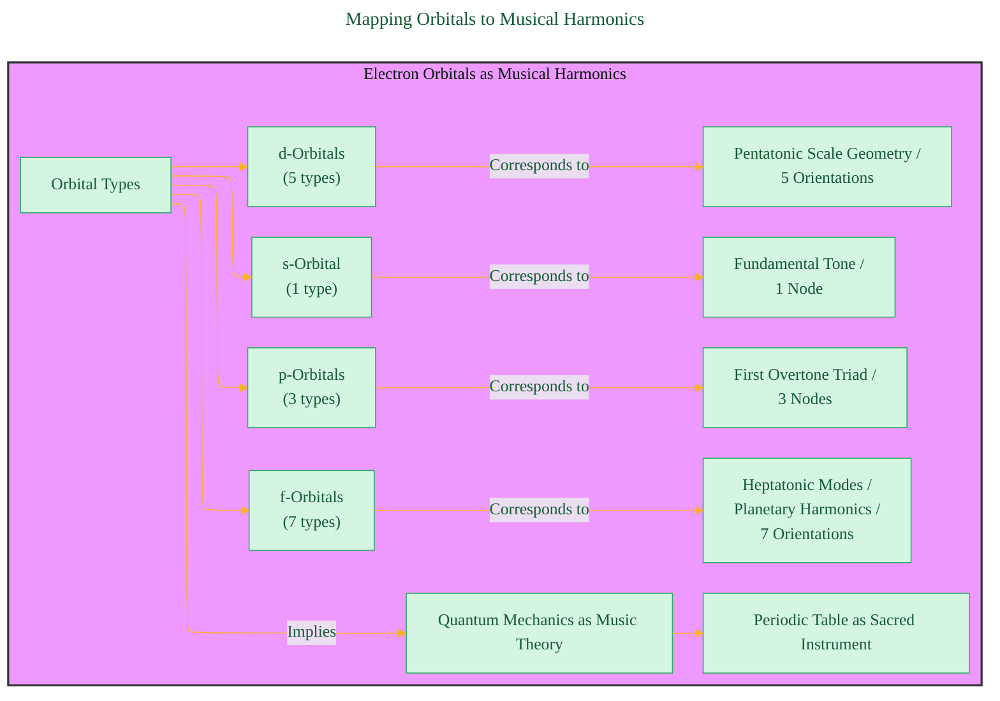
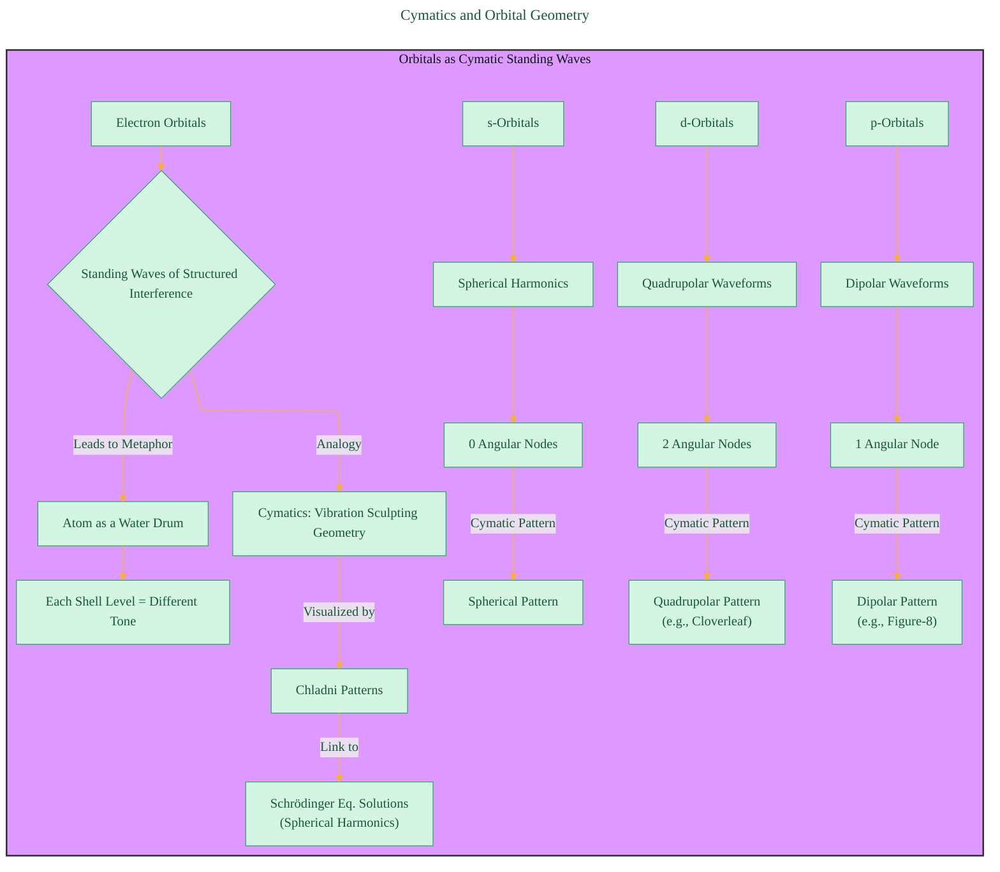
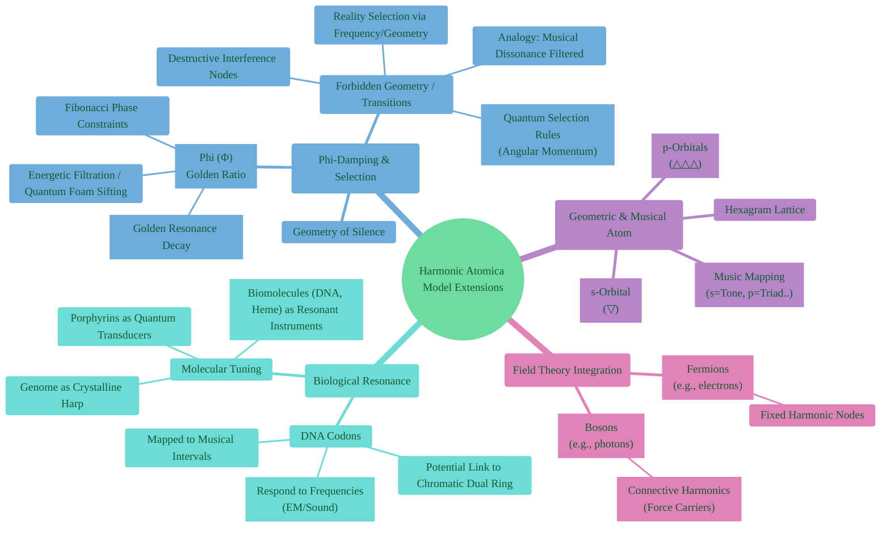
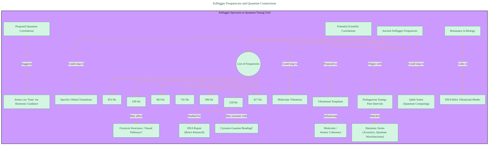
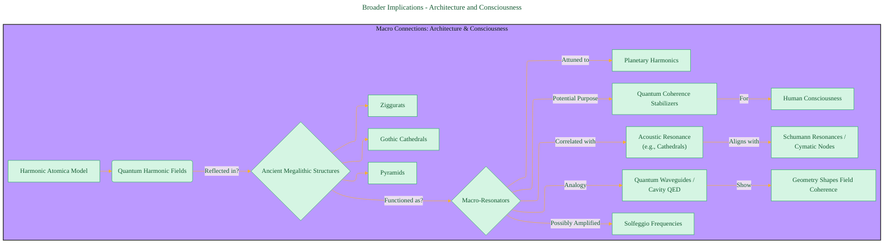
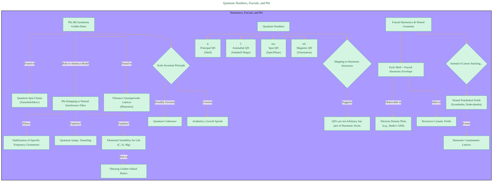

# Quantum Harmonic Atomic Model
> **Disclaimer:**
>
> This document contains my personal notes on the topic,
> compiled from publicly available documentation and various cited sources.
> The materials are intended for educational purposes, personal study, and reference.
> The content is dual-licensed:
> 1. **MIT License:** Applies to all code implementations (Swift, Mermaid, and other programming languages).
> 2. **Creative Commons Attribution 4.0 International License (CC BY 4.0):** Applies to all non-code content, including text, explanations, diagrams, and illustrations.
---

## Diagram 1: The Core Geometric Model of s and p Orbitals

This diagram illustrates the fundamental geometric metaphor proposed for the s and p electron subshells, forming a "Quantum Hexagram."

**Explanation:** This flowchart breaks down the initial geometric interpretation presented. It shows the s-orbital conceptualized as a central downward triangle (representing symmetry and centricity) and the three p-orbitals as surrounding upward triangles (representing directionality and overtones). Together, they form a hexagram, symbolizing a fundamental unit of a harmonic lattice governed by quantum numbers.

---

## Diagram 2: Mapping Orbitals to Musical Harmonics

This diagram visualizes the proposed correspondence between electron orbital types and concepts from music theory.

**Explanation:** This diagram uses a simple left-to-right graph to show the direct mapping proposed in the text: associating the 's', 'p', 'd', and 'f' orbitals with musical concepts like fundamental tones, triads, and scales based on the number of their orientations or nodes.

---

## Diagram 3: Cymatics and Orbital Geometry

This diagram illustrates the connection drawn between the shapes of atomic orbitals (as standing waves) and the patterns observed in Cymatics.

**Explanation:** This diagram connects the idea of orbitals as standing waves to visual cymatic patterns. It shows how the s, p, and d orbitals, characterized by their number of angular nodes and corresponding mathematical descriptions (spherical harmonics, dipolar, quadrupolar), could be conceptually visualized as specific cymatic geometries created by vibration.

---

## Diagram 4: Extending the Model - Fields, Biology, and Damping

This diagram uses a mind map to show how the core harmonic model is extended to include field theory concepts (bosons/fermions), biological elements (DNA), and the idea of "Phi-damping."

**Explanation:** This mind map branches out from the core model to show its proposed applications and related concepts. It covers the distinction between fermions and bosons within this harmonic framework, the integration of DNA and musical mapping via the "Chromatic Dual Ring" concept, and the crucial role of "Phi-damping" as a selective filter based on the golden ratio, leading to "forbidden" geometries or transitions.

----

## Diagram 5: Solfeggio Frequencies and Quantum Connections

This diagram focuses on the specific Solfeggio frequencies mentioned and their proposed connections to DNA, molecular coherence, and quantum phenomena.

**Explanation:** This flowchart details the specific claims made about the Solfeggio frequencies. It lists the frequencies, mentions the purported scientific link (especially 528Hz and DNA repair), connects them to Pythagorean tuning and harmonics, and outlines the speculative quantum correlations, suggesting these frequencies could influence atomic and molecular states.

----

## Diagram 6: Broader Implications - Architecture and Consciousness

This diagram explores the connections proposed between the quantum harmonic model, ancient architecture, and potentially human consciousness.

**Explanation:** This diagram illustrates the text's speculation linking the principles of the harmonic atom model to large-scale structures. It proposes that ancient architectures might have been designed as resonators tuned to specific planetary or Solfeggio frequencies, potentially influencing quantum coherence and consciousness.

----

## Diagram 7: Quantum Numbers, Fractals, and Phi

This final diagram summarizes the connection between standard quantum numbers and the harmonic model, introduces the concept of fractal geometry, and reinforces the role of Phi (Golden Ratio).

**Explanation:** This flowchart connects fundamental quantum numbers (n, l, ml, ms) to the harmonic series concept central to the text. It introduces the idea of orbital shells being fractal, nested geometries rather than simple layers. It also reiterates the significance of the Golden Ratio (Phi) as a fundamental symmetry influencing quantum coherence and acting as a selective filter ("Phi-damping") in this model.

---
**References:**  
1. Cohen-Tannoudji, C. et al. (Quantum Mechanics)  
2. Shankar, R. (Principles of Quantum Mechanics)  
3. Weyl, H. (The Theory of Groups...)  
4. Billam & Gardiner, Quantum Resonances (arXiv:0809.4373)  
5. Tymoczko, D. (A Geometry of Music)  
6. Gardner, M. (Ambidextrous Universe)  
7. Lincoln Xavier N. N. (2025). SACRED GEOMETRY - BEYOND THE EYES.

---
**Licenses:**

- **MIT License:**   - Full text in [LICENSE](LICENSE) file.
- **Creative Commons Attribution 4.0 International:**  - Legal details in [LICENSE-CC-BY](LICENSE-CC-BY) and at [Creative Commons official site](http://creativecommons.org/licenses/by/4.0/).

---