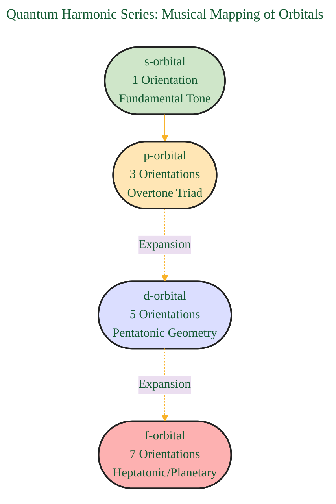

# Quantum Harmonic Atomic Model
> **Disclaimer:**
>
> This document contains my personal notes on the topic,
> compiled from publicly available documentation and various cited sources.
> The materials are intended for educational purposes, personal study, and reference.
> The content is dual-licensed:
> 1. **MIT License:** Applies to all code implementations (Swift, Mermaid, and other programming languages).
> 2. **Creative Commons Attribution 4.0 International License (CC BY 4.0):** Applies to all non-code content, including text, explanations, diagrams, and illustrations.
---

# Harmonic Atomica: Geometric Resonance, Quantum Numbers, and Cymatic Fields

---

## 1. Geometric Essence of Atomic Orbitals
### *The Quantum Hexagram: Mapping s+p Orbitals to Sacred Geometry*

* **Explanation:** 
    * **Center downward triangle** = s-subshell (dreamlike radial spherical symmetry).
    * **Three upward triangles** = px, py, pz subshells (align with axes, form hexagram with s).
    * **Hexagonal lattice** becomes honeycomb—foundation for crystalline, harmonic atomic fields.

---

## 2. Quantum Harmonic Series: Musical Mapping of Orbitals

- **Explanation:** Each quantum sub-shell aligns with a musical structure:
    - **s (1)** → Fundamental root
    - **p (3)** → Musical triad (3 overtones)
    - **d (5)** → Pentatonic scale
    - **f (7)** → Modes/planetary harmonics

---

## 3. Quantum Numbers: Nodes in the Harmonic Web

* **Interpretation:**  
    - Each quantum number acts as a node in a *musical web*, assigning harmonic roles and geometries to electrons.

---

## 4. Resonance Lattices: From Atoms to Sacred Sites

- **Summary:**  
    - Geometry, in vibration, resonates from atomic orbitals to temples and cathedrals—each a quantum field “instrument”.

---

## 5. Cymatics, Standing Waves, and Atomic Orbitals

* **Cross-mapping:**  
    - Each orbital maps directly to a unique **standing wave pattern** seen in cymatics/chladni figures.

---

## 6. Quantum Harmonics: Field, Damping & Selection

- **Explanation:** Destructive resonances suppress certain geometries—**selection rules** in quantum transitions act like musical dissonance filters.

---

## 7. Phi (Φ) Damping, Golden Ratio & Quantum Selection

- **Summary:** Only those geometries/nodes allowed by Phi-harmonic resonance stabilize—others are “damped out”.

---

## 8. DNA and the Chromatic Dual Ring

- **Summary:** Genetics and music entwine—DNA may be tuned or perturbed by frequency, each codon mapping onto the 12-tone wheel.

---

## 9. Solfeggio Spectrum as a Quantum Grid

* **Explanation:**  
    - Ancient Solfeggio frequencies act as “harmonic pillars”. Each frequency may correspond to a quantum orbital or biological function.

---

## 10. Nested Polyhedral Shells & Fractal Orbital Geometry

* **Interpretation:**
    - Each new quantum shell forms a higher-order polyhedron.
    - Eigenvalues nest, forming a fractal lattice as visualized in modern quantum chemistry.

---

## 11. Resonance Cascade: Quantum → Macro

* **Summary:**  
    - Resonance and geometry propagate upward—from atom, through DNA and proteins, to conscious beings and their creations (cathedrals as large-scale resonance chambers).

---

## 12. Overview: Harmonic Atomica Schema

---

## 13. Summary Table: Interdisciplinary Mappings

| **Quantum Concept** | **Geometry**      | **Music Theory**    | **Cymatics**      | **Biology**            | **Architecture**      |
| ------------------- | ----------------- | ------------------- | ----------------- | ---------------------- | --------------------- |
| *s-orbital*         | Downward Triangle | Root Tone (1)       | Centered Bubble   | Central Carbon ring    | Central altar/chamber |
| *p-orbitals*        | Triad Triangles   | Triad/Chord (3)     | Orthogonal Nodes  | DNA bases (A, T, G, C) | Nave, Transepts       |
| *d-orbitals*        | Icosahedron       | Pentatonic Scale    | 2 Nodal Rings     | Porphyrin rings        | Rose windows          |
| *f-orbitals*        | Dodecahedron      | Heptatonic Modes    | 3+ Nodal Regions  | Photosynthetic lattice | Spiraled corridors    |
| *Phi damping*       | Golden Rhombus    | Filtered Dissonance | Forbidden Nodes   | DNA repair intervals   | Golden mean geometry  |
| *Quantum numbers*   | Layered Shells    | Harmonic Series     | Wave Interference | Protein folding        | Temple floors/levels  |

---

### **Closing Image**:  
The atom is reframed as a **musical mandala**: harmonic lattices, animated by quantum numbers, sifting frequencies through sacred ratios, manifesting as the beauty of both a DNA helix and a cathedral dome. Physics, music, and geometry are revealed as facets of the same universal resonance.

<!--  -->

---
**References:**  
1. Cohen-Tannoudji, C. et al. (Quantum Mechanics)  
2. Shankar, R. (Principles of Quantum Mechanics)  
3. Weyl, H. (The Theory of Groups...)  
4. Billam & Gardiner, Quantum Resonances (arXiv:0809.4373)  
5. Tymoczko, D. (A Geometry of Music)  
6. Gardner, M. (Ambidextrous Universe)  
7. Lincoln Xavier N. N. (2025). SACRED GEOMETRY - BEYOND THE EYES.

---

---
**Licenses:**

- **MIT License:**   - Full text in [LICENSE](LICENSE) file.
- **Creative Commons Attribution 4.0 International:**  - Legal details in [LICENSE-CC-BY](LICENSE-CC-BY) and at [Creative Commons official site](http://creativecommons.org/licenses/by/4.0/).

---