# Autonomous clustering by fast find of mass and distance peaks
> **Disclaimer:**
>
> This document contains my personal notes on the topic,
> compiled from publicly available documentation and various cited sources.
> The materials are intended for educational purposes, personal study, and reference.
> The content is dual-licensed:
> 1. **MIT License:** Applies to all code implementations (Swift, Mermaid, and other programming languages).
> 2. **Creative Commons Attribution 4.0 International License (CC BY 4.0):** Applies to all non-code content, including text, explanations, diagrams, and illustrations.
---

## A Diagram Overview on the Paper

```mermaid
---
title: Torque Clustering
config:
  layout: elk
  look: handDrawn
  theme: dark
---
%%{
  init: {
    'fontFamily': 'verdana',
    'themeVariables': {
      'primaryColor': '#BB2528',
      'primaryTextColor': '#f529',
      'primaryBorderColor': '#7C0000',
      'lineColor': '#F8B229',
      'secondaryColor': '#006100',
      'tertiaryColor': '#fff'
    }
  }
}%%
graph LR
    subgraph Introduction["Introduction"]
        A["Torque Clustering<br>(TC)"] --> B{Novel Clustering Algorithm}
        B --> C[Parameter-Free]
        B --> D[Autonomous Cluster Recognition]
        B --> E[Effective Noise Handling]
        B --> F[Competitive Performance]
        B --> G[Hierarchical Merging]
        B --> H[Intuitive Merging Strategy]
    end
    
    subgraph Algorithm_Overview["Algorithm Overview"]
        I[Algorithm Steps] --> J[Define Clusters and Connections]
        J --> K[Initial Clusters]
        K --> L(Each data point is a cluster with initial mass 1)
        J --> M["Forming Connections<br>(Eq. 1)"]
        M --> N[Nearest Neighbor Merging]
        N --> O["Hierarchical Tree Formation<br>(Eq. 2)"]
        O --> P[Iterative Merging]

        I --> Q["Defining Connection Properties (Mass and Distance)"]
        Q --> R("Mass (𝑀𝑀𝑖𝑖) = product of cluster masses")
        Q --> S("Distance (𝐷𝐷𝑖𝑖) = minimum distance between clusters")

        I --> T["Defining Torque<br>(𝜏𝜏𝑖𝑖)"]
        T --> U(𝜏𝜏𝑖𝑖 = 𝑀𝑀𝑖𝑖 × 𝐷𝐷𝑖𝑖^2)
        
        I --> V["Sorting Connections in Descending Order<br>(TSCL)"]
        V --> W["Identifying Abnormal Connections<br>(Torque Gap)"]
        W --> X["Identifying Halo Connections<br>(Noise)"]
        
        I --> Y[Removing Abnormal and Halo Connections]
        Y --> Z[Final Cluster Partitioning]
    end
    
    subgraph Experimental_Evaluation["Experimental Evaluation"]
        AA[Experiments] --> BB[Synthetic Data Sets]
        BB --> CC["Diverse Challenges<br>(Overlaps, Imbalances, Noise)"]
        BB --> DD[Automated Cluster Count Determination]
        
        AA --> EE[Real-World Data Sets]
        EE --> FF["Image Recognition<br>(MNIST, YTF, COIL-100, CMU-PIE)"]
        EE --> GG[Biology, Medicine, Physics, NLP, Astronomy]

        AA --> HH[Comparison with Existing Methods]
        HH --> II["Hierarchical Clustering<br>(AC-S, AC-W)"]
        HH --> JJ["Density-Based Clustering<br>(DPC, Variants)"]
        HH --> KK[Other Automatic/Parameter-Free Methods]
        HH --> LL[Deep Clustering Algorithms]

        AA --> MM[Performance Evaluation Metrics]
        MM --> NN["Normalized Mutual Information<br>(NMI)"]
        MM --> OO["Accuracy<br>(ACC)"]
        MM --> PP["Adjusted Mutual Information<br>(AMI)"]
        MM --> QQ["Execution Time Comparison"]
        
    end
    
    subgraph Future_Work["Future Work"]
        AAA["Future Work"] --> BBB["Refining Halo Detection"]
        BBB --> CCC["Individual Cluster Thresholds"]

        AAA --> DDD["Deep TC Clustering"]
        DDD --> EEE["Neural Network-Based Representation Learning"]
    end
    
```

---

### Explanation and Considerations

*   **Hierarchical Structure:** The use of nested subgraphs effectively represents the hierarchical nature of the algorithm and its evaluation process.
*   **Algorithm Steps:**  The `Algorithm_Overview` subgraph details the key steps of the Torque Clustering algorithm, making the process clear and allowing for individual step-by-step visualizations.
*   **Experimental Evaluation:**  The `Experimental_Evaluation` subgraph highlights the comprehensive evaluation of TC, comparing it with other algorithms and across diverse datasets.  Use of different shapes (e.g., boxes, rounded rectangles) for different types of evaluations (e.g., synthetic vs. real-world, NMI vs. ACC).
*   **Mathematical Equations:**  Mathematical expressions (e.g., 𝜏𝜏𝑖𝑖 = 𝑀𝑀𝑖𝑖 × 𝐷𝐷𝑖𝑖^2) can be included as labels on edges or in separate nodes, emphasizing their role in the algorithm.  Use LaTeX to format these equations for clarity.
*   **Visual Comparisons:** The use of figures (e.g., Fig. 1, Fig. 2, Fig. 4, Fig. 6) and tables (e.g., Table 1, Table 3, Table 5, Table 6, Table 7) is critical for supporting the discussion of experimental results and comparisons with other algorithms. Use text within the subgraph to briefly describe what is being illustrated.
*   **Future Work:** The `Future_Work` subgraph outlines the planned enhancements for Torque Clustering, including potential directions for improvement.

This detailed representation will greatly aid in conveying the core concepts and complexities of the paper, allowing a reader to quickly grasp the algorithm's methodology, its evaluation process, and potential future directions. Remember to incorporate the actual figures and tables into the Mermaid diagrams for a complete visual representation.

---
**Licenses:**

- **MIT License:**   - Full text in [LICENSE](LICENSE) file.
- **Creative Commons Attribution 4.0 International:**  - Legal details in [LICENSE-CC-BY](LICENSE-CC-BY) and at [Creative Commons official site](http://creativecommons.org/licenses/by/4.0/).

---