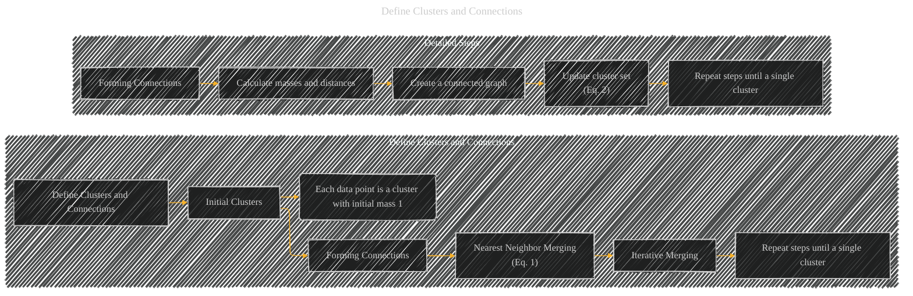

# Define Clusters and Connections
> **Disclaimer:**
>
> This document contains my personal notes on the topic,
> compiled from publicly available documentation and various cited sources.
> The materials are intended for educational purposes, personal study, and reference.
> The content is dual-licensed:
> 1. **MIT License:** Applies to all code implementations (Swift, Mermaid, and other programming languages).
> 2. **Creative Commons Attribution 4.0 International License (CC BY 4.0):** Applies to all non-code content, including text, explanations, diagrams, and illustrations.
---

## Define Clusters and Connections - A Diagram Structure

DOI: [10.13140/RG.2.2.11751.97447](http://dx.doi.org/10.13140/RG.2.2.11751.97447)

---

### Explanation of "Define Clusters and Connections"

This section of the Torque Clustering (TC) algorithm outlines the initial setup and the process of forming connections between data points to create the initial cluster structure.

**1. Initial Clusters (B):**  The algorithm begins by treating each individual data point as a separate cluster. Each of these initial clusters has an initial mass (value) of 1, reflecting its constituent data point.  This sets the base level of the hierarchy.

**2. Forming Connections (D):**  This is the core step in establishing the connections, creating an adjacency matrix.  This step is further broken down into:

   * **Nearest Neighbor Merging (E):**  TC identifies the nearest neighbor for each cluster among all the current clusters that has a higher mass. The "nearest neighbor" is determined using a distance metric.  A connection is then formed between these two clusters, effectively merging them into a larger cluster.  This process is guided by the equation referenced as (Eq. 1).

   * **Iterative Merging (F):** The merging process continues iteratively. The algorithm repeatedly finds the nearest higher-mass neighbor and merges them.  This process continues until all data points are combined into a single, top-level cluster.

   * **Repeat steps until a single cluster (G):** This emphasizes the iterative nature of the connection formation process, iterating until all clusters are merged into one.

**3. Calculating Masses and Distances (I):**

  * **Mass:** 𝑀𝑀𝑖𝑖 is the product of the masses of the two connected clusters at each iteration.
  * **Distance:** 𝐷𝐷𝑖𝑖 is the minimum distance between any data points in the two connected clusters.

**4. Create a connected graph (J):** This step uses the calculated masses and distances to build a graph, where each cluster is a node and the connections are the edges.

**5. Updating cluster set (Eq. 2):**  This step updates the list of clusters and their respective masses after each merger.

---

### Key Considerations

*   **Iterative Nature:** The algorithm's core mechanism is iterative merging based on proximity and mass.
*   **Hierarchical Structure:** This step lays the foundation for the hierarchical structure of clusters, which is a key element of the algorithm.
*   **Connection Formation:** The connection formation step is guided by the criterion of finding the nearest neighbor with a higher mass. This prioritization is key to preventing errors in the merging process.

This detailed breakdown and the diagram should clarify the "Define Clusters and Connections" stage of the Torque Clustering algorithm.  Remember that the actual implementation would involve specific distance metrics and how the algorithm tracks the masses of the clusters throughout the merging process.

---
**Licenses:**

- **MIT License:**   - Full text in [LICENSE](LICENSE) file.
- **Creative Commons Attribution 4.0 International:**  - Legal details in [LICENSE-CC-BY](LICENSE-CC-BY) and at [Creative Commons official site](http://creativecommons.org/licenses/by/4.0/).

---