# Defining Connection Properties (Mass and Distance)
> **Disclaimer:**
>
> This document contains my personal notes on the topic,
> compiled from publicly available documentation and various cited sources.
> The materials are intended for educational purposes, personal study, and reference.
> The content is dual-licensed:
> 1. **MIT License:** Applies to all code implementations (Swift, Mermaid, and other programming languages).
> 2. **Creative Commons Attribution 4.0 International License (CC BY 4.0):** Applies to all non-code content, including text, explanations, diagrams, and illustrations.
---

## Defining Connection Properties - A Diagram Structure

```mermaid
---
title: Defining Connection Properties (Mass and Distance)
config:
  layout: elk
  look: handDrawn
  theme: dark
---
%%{
  init: {
    'fontFamily': 'verdana',
    'themeVariables': {
      'primaryColor': '#BB2528',
      'primaryTextColor': '#f529',
      'primaryBorderColor': '#7C0000',
      'lineColor': '#F8B229',
      'secondaryColor': '#006100',
      'tertiaryColor': '#fff'
    }
  }
}%%
graph LR
    subgraph Defining_Connection_Properties["Defining Connection Properties"]
        A["Defining Connection Properties<br>(Mass and Distance)"] --> B{Connection Properties}
        B --> C("Mass<br>(𝑀𝑀𝑖𝑖)")
        C --> D(𝑀𝑀𝑖𝑖 = product of cluster masses)

        B --> E("Distance<br>(𝐷𝐷𝑖𝑖)")
        E --> F("𝐷𝐷𝑖𝑖 = minimum distance between any point in the two clusters")
    end
    
```

---

### Explanation of Defining Connection Properties (Mass and Distance)

This step in the Torque Clustering algorithm focuses on quantifying the characteristics of connections between clusters.  It doesn't just look at proximity but considers the "mass" of each cluster and the distance between them, reflecting the intuition of gravitational interactions in galaxy mergers.

*   **Mass (𝑀𝑀𝑖𝑖):**  This property directly measures the size or importance of each cluster involved in the connection.  The mass of a cluster is simply the number of data points contained within it.  A larger mass indicates a larger and potentially more significant cluster. The crucial idea here is that the mass of the cluster is *relative* to the other clusters, and the *product* of the masses of the connected clusters. A large mass implies a large cluster size.

*   **Distance (𝐷𝐷𝑖𝑖):** This metric calculates the minimum distance between any point belonging to one cluster and any point belonging to the other cluster that are connected. This is the measure of the *distance* between the clusters.  A smaller distance implies a stronger connection, indicating that the two clusters are closely located in the data space.

---

### Key Considerations

*   **Relativity:** The significance of both mass and distance is relative. A large mass in one context might be small in another, and a small distance in one context might be large in another.  The product of the two values and the *square* of the distance (in the torque calculation) is crucial.

*   **Minimum Distance:** Using the minimum distance between points in the two clusters ensures that the measure of distance is representative of the entire cluster rather than just a few isolated points.

*   **Relevance to the Algorithm:** These calculated values for mass and distance, along with the torque calculation, will be used in subsequent steps to identify "abnormal" connections that should be removed from the graph, providing a refined clustering structure.

This step provides the fundamental quantitative measures needed to construct the "decision graph" and to identify abnormal and halo connections.

---
**Licenses:**

- **MIT License:**   - Full text in [LICENSE](LICENSE) file.
- **Creative Commons Attribution 4.0 International:**  - Legal details in [LICENSE-CC-BY](LICENSE-CC-BY) and at [Creative Commons official site](http://creativecommons.org/licenses/by/4.0/).

---