# Defining Torque
> **Disclaimer:**
>
> This document contains my personal notes on the topic,
> compiled from publicly available documentation and various cited sources.
> The materials are intended for educational purposes, personal study, and reference.
> The content is dual-licensed:
> 1. **MIT License:** Applies to all code implementations (Swift, Mermaid, and other programming languages).
> 2. **Creative Commons Attribution 4.0 International License (CC BY 4.0):** Applies to all non-code content, including text, explanations, diagrams, and illustrations.
---

## Defining Torque - A Diagram Structure

```mermaid
---
title: Defining Torque (𝜏𝜏𝑖𝑖)
config:
  layout: elk
  look: handDrawn
  theme: dark
---
%%{
  init: {
    'fontFamily': 'verdana',
    'themeVariables': {
      'primaryColor': '#BB2528',
      'primaryTextColor': '#f529',
      'primaryBorderColor': '#7C0000',
      'lineColor': '#F8B229',
      'secondaryColor': '#006100',
      'tertiaryColor': '#fff'
    }
  }
}%%
graph LR
    A["Defining Torque<br>(𝜏𝜏𝑖𝑖)"] --> B["Calculate 𝜏𝜏𝑖𝑖 for each connection"]
    B --> C{"For each connection 𝐶𝐶𝑖𝑖"}
    
    subgraph Torque_Calculation["Torque Calculation"]
        C --> D["Calculate Mass<br>(𝑀𝑀𝑖𝑖)"]
        D --> E("𝑀𝑀𝑖𝑖 = product of the masses of the two connected clusters")
        
        C --> F["Calculate Distance<br>(𝐷𝐷𝑖𝑖)"]
        F --> G("𝐷𝐷𝑖𝑖 = minimum distance between any point in one cluster and any point in the other cluster")
        
        C --> H["Calculate Torque<br>(𝜏𝜏𝑖𝑖)"]
        H --> I("𝜏𝜏𝑖𝑖 = 𝑀𝑀𝑖𝑖 × 𝐷𝐷𝑖𝑖^2")
    end
    
    I --> J["Store 𝜏𝜏𝑖𝑖"]
    J --> K["Move to next connection"]

```

DOI: [10.13140/RG.2.2.20140.58240](http://dx.doi.org/10.13140/RG.2.2.20140.58240)

---

### Explanation of Defining Torque (𝜏𝜏𝑖𝑖)

This section focuses on calculating the `torque` (𝜏𝜏𝑖𝑖) for each connection (𝐶𝐶𝑖𝑖) in the Torque Sorted Connection List (TSCL).  The torque is a metric that considers both the mass of the connected clusters and the distance between them.

**For each connection 𝐶𝐶𝑖𝑖:**

1.  **Calculate Mass (𝑀𝑀𝑖𝑖):** The mass of a connection is determined by multiplying the masses of the two clusters connected by that connection.  The mass of a cluster is typically defined as the number of data points it contains.

2.  **Calculate Distance (𝐷𝐷𝑖𝑖):** The distance between two clusters is calculated as the minimum distance between any data point in one cluster and any data point in the other cluster.  This measure of the spatial separation of clusters is crucial for identifying connections between clusters that are far apart.

3.  **Calculate Torque (𝜏𝜏𝑖𝑖):** The torque of the connection, denoted as 𝜏𝜏𝑖𝑖, is determined by multiplying the mass (𝑀𝑀𝑖𝑖) and the square of the distance (𝐷𝐷𝑖𝑖^2). This calculation combines the two properties of the connection. A larger torque value reflects a stronger connection, which might potentially be an abnormal connection.  The importance of the distance is squared to emphasize the role of distance in determining torque.

**Store and Move to Next:** The calculated torque (𝜏𝜏𝑖𝑖) is stored for later sorting, and the algorithm proceeds to the next connection in the list. This iterative process continues for all connections.

---

### Key Considerations

*   **Mass as a Measure of Cluster Size:** The mass (𝑀𝑀𝑖𝑖) represents the size of the clusters involved in the connection. Larger clusters will contribute more to the torque value.
*   **Distance as a Measure of Cluster Separation:** The distance (𝐷𝐷𝑖𝑖) quantifies how far apart the connected clusters are.  A larger distance value contributes significantly to the torque value, emphasizing the importance of spatial separation.
*   **Combined Effect:** The torque value (𝜏𝜏𝑖𝑖) incorporates both the mass and the distance to identify connections that may be abnormal, based on a global view of the entire data set, which is critical for identifying potential noise or outliers.

This detailed explanation, along with the Mermaid diagram, clarifies the process of calculating torque for each connection in the Torque Clustering Algorithm.  Remember that the specific mathematical expressions for 𝑀𝑀𝑖𝑖 and 𝐷𝐷𝑖𝑖 should be replaced with their exact formulations for a complete representation.

---
**Licenses:**

- **MIT License:**   - Full text in [LICENSE](LICENSE) file.
- **Creative Commons Attribution 4.0 International:**  - Legal details in [LICENSE-CC-BY](LICENSE-CC-BY) and at [Creative Commons official site](http://creativecommons.org/licenses/by/4.0/).

---