# Sorting Connections in Descending Order
> **Disclaimer:**
>
> This document contains my personal notes on the topic,
> compiled from publicly available documentation and various cited sources.
> The materials are intended for educational purposes, personal study, and reference.
> The content is dual-licensed:
> 1. **MIT License:** Applies to all code implementations (Swift, Mermaid, and other programming languages).
> 2. **Creative Commons Attribution 4.0 International License (CC BY 4.0):** Applies to all non-code content, including text, explanations, diagrams, and illustrations.
---

## Sorting Connections in Descending Order - A Diagram Structure

```mermaid
---
title: Sorting Connections in Descending Order
config:
  layout: elk
  look: handDrawn
  theme: dark
---
%%{
  init: {
    'fontFamily': 'verdana',
    'themeVariables': {
      'primaryColor': '#BB2528',
      'primaryTextColor': '#f529',
      'primaryBorderColor': '#7C0000',
      'lineColor': '#F8B229',
      'secondaryColor': '#006100',
      'tertiaryColor': '#fff'
    }
  }
}%%
graph LR
    subgraph Sorting_Connections["Sorting Connections"]
        A["Sorting Connections in Descending Order<br>(TSCL)"] --> B{Algorithm Steps}
        B --> C[Input:<br>TSCL - Torque Sorted Connection List]
        C --> D(List of connections with corresponding torque values)


        B --> E[Sort connections in descending order based on their torque values]
        E --> F["Output:<br>Sorted TSCL"]
        
        subgraph Detailed_Sorting["Detailed Sorting"]
            E --> G[Iterate through all connections in the input list]
            G --> H["Compare torque values (𝜏𝜏𝑖𝑖) of current connection and previous one"]
            H --> I[If current torque is greater, swap positions in the list]
            I --> J[Continue until the list is fully sorted in descending order]
        end
    end

```

DOI: [10.13140/RG.2.2.31884.63364](http://dx.doi.org/10.13140/RG.2.2.31884.63364)

---

### Explanation of Sorting Connections in Descending Order (TSCL)

The `Sorting Connections in Descending Order` step takes the Torque Sorted Connection List (TSCL) as input, which is a list of connections. Each connection in the list is associated with a torque value (𝜏𝜏𝑖𝑖).  The algorithm sorts these connections based on these torque values, placing the connection with the highest torque value at the beginning of the list, followed by those with progressively lower torque values.  This process is crucial for identifying abnormal connections in the later stages of the algorithm.

**Detailed Steps:**

1. **Input:** The input is a list of connections (each with a corresponding torque value), represented as `TSCL`.

2. **Sort Connections:** The algorithm sorts the connections in the `TSCL` list in descending order based on their torque values. This step involves iterating through the `TSCL`:

   *   For each connection in the `TSCL`, compare its torque value (𝜏𝜏𝑖𝑖) with the torque value of the previous connection in the sorted list.
   *   If the current connection's torque is greater than the previous one's, swap their positions in the list to maintain the descending order.
   *   This comparison and swapping operation is repeated until the entire `TSCL` is fully sorted in descending order.

3. **Output:** The output of this step is the sorted `TSCL` list, where connections with higher torque values appear at the beginning of the list.  This ordered list is essential for the subsequent steps of the algorithm, enabling identification of abnormal connections and noise.

---

### Key Considerations

*   **Efficiency:**  The sorting algorithm should be efficient (e.g., merge sort or quick sort) to minimize the computational cost of this step, especially for large datasets.
*   **Torque Values:** The torque values (𝜏𝜏𝑖𝑖) are used as the primary criterion for sorting.
*   **Order Matters:** The order in which the connections are sorted in the `TSCL` list is critical for the next stage of the algorithm (identifying abnormal connections).

This description, combined with the Mermaid diagram, should provide a clear picture of the `Sorting Connections in Descending Order` process.  Remember that `TSCL` is just a list or array containing the connections and their corresponding torque values.

---
**Licenses:**

- **MIT License:**   - Full text in [LICENSE](LICENSE) file.
- **Creative Commons Attribution 4.0 International:**  - Legal details in [LICENSE-CC-BY](LICENSE-CC-BY) and at [Creative Commons official site](http://creativecommons.org/licenses/by/4.0/).

---