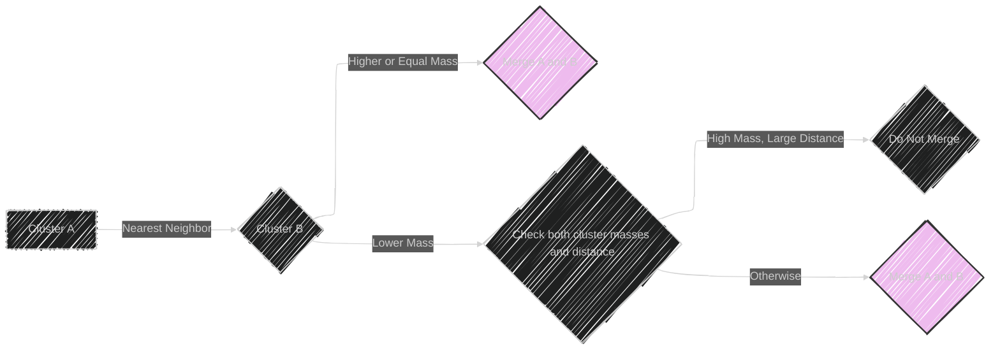
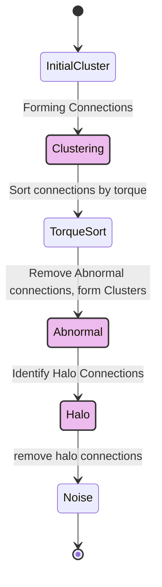
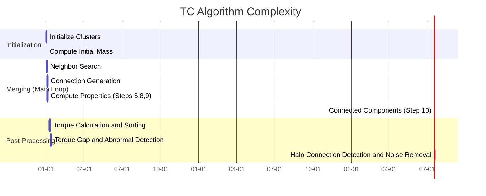

# Autonomous clustering by fast find of mass and distance peaks - Mermaid diagrams
> This content is dual-licensed under your choice of the following licenses:
> 1.  **MIT License:** For the code implementations in Swift and Mermaid provided in this document.
> 2.  **Creative Commons Attribution 4.0 International License (CC BY 4.0):** For all other content, including the text, explanations, and the Mermaid diagrams and illustrations.

---

## 1.  TC Algorithm Overview (Flowchart)

```mermaid
---
config:
  layout: elk
  look: handDrawn
  theme: dark
---
graph LR
    A["Start"];
    B{"Input Data:<br>Distance Matrix or Dataset"};
    C["Initialize:<br>Each point = cluster, form initial cluster set Γ"];
    
    D{"while cluster set has more than two clusters"};
    
    E["Compute mass (Θ) of each cluster 𝜁"];
    F["Find 1-nearest neighbor for each 𝜁"];
    G["Generate connections based on neighbor relationship"];
    H["Compute properties (M, D) for each connection C"];
    I["Compute connected components in the graph G, update cluster set Γ"];
    J["Compute Torque (𝜏) for each connection"];
    K["Sort connections by Torque<br>(TSCL)"];
    L["Compute Torque Gap (TGap) and find largest gap"];
    M["Identify and remove L abnormal connections"];
    N["Update graph G, find connected components<br>(final clusters)"];
    O["Identify and remove halo (noise) connections"];
    
    P["Output:<br>Cluster Partition (𝜙),<br>Cluster halo"];

    A --> B
    B --> C
    
    C --> D
    D --> E
    E --> F
    F --> G
    G --> H
    H --> I
    
    I --> D
    D -- No --> J
    J --> K
    K --> L
    L --> M
    M --> N
    N --> O
    O --> P
    
    style D fill:#f395,stroke:#333,stroke-width:2px
    
```

---

## 2.  TC Algorithm: Connection and Properties (Sequence Diagram)

```mermaid
---
config:
  layout: elk
  look: handDrawn
  theme: dark
---
sequenceDiagram
	autonumber
    participant Data
    participant Cluster
    participant Connection
    participant Property
    
    Note over Data: Input Data points (X)

    Data->>Cluster: Initialize: each point as a cluster
    Cluster->>Connection: Find 1-nearest neighbor
    Connection->>Cluster: Define merge criteria(mass)
    Cluster->>Connection: Create connection
    Connection->>Property: Compute Mass<br>(M)
    Property->>Connection: Return M
    Connection->>Property: Compute Distance<br>(D)
    Property->>Connection: Return D
    Connection->>Property: Compute Torque<br>(𝜏 = M * D)
    Property->>Connection:Return 𝜏
    Connection->>Property:Sort connections based on 𝜏
    Property->>Property: Calculate Torque Gap, identify abnormal and halo based on gap

```

---

## 3.  TC's Cluster Merging Rule (Flowchart)

---

## 4. Decision Graph and Torque (Flowchart)

```mermaid
graph LR
    A["Connection C"] --> B{"Compute Mass M"};
    A --> C{"Compute Distance D"};
    B --> D["Torque<br>(𝜏) = M \* D"];
    D --> E["Sort Connections<br>(TSCL) by 𝜏"];
    E --> F{"Calculate Torque Gap<br>(TGap)"};
    F --> G["Find Largest TGap"];
    G --> H{"Identify Abnormal Connections"};
    
    style B fill:#f395,stroke:#333,stroke-width:1px
    style C fill:#f395,stroke:#333,stroke-width:1px
    style E fill:#f395,stroke:#333,stroke-width:1px
    
```

----

## 5. Noise Detection (State Diagram)

---

## 6. Algorithm Complexity (Gantt Chart)

---
**Licenses:**

- **MIT License:**   - Full text in [LICENSE](LICENSE) file.
- **Creative Commons Attribution 4.0 International:**  - Legal details in [LICENSE-CC-BY](LICENSE-CC-BY) and at [Creative Commons official site](http://creativecommons.org/licenses/by/4.0/).

---