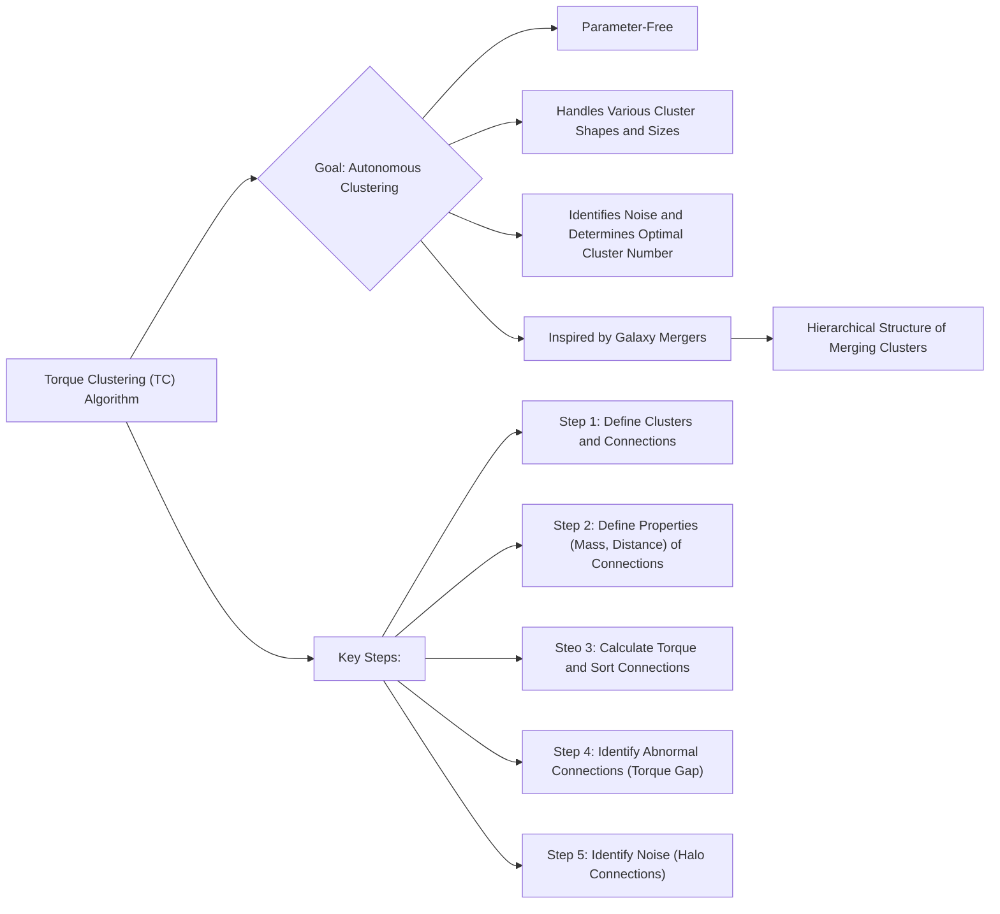
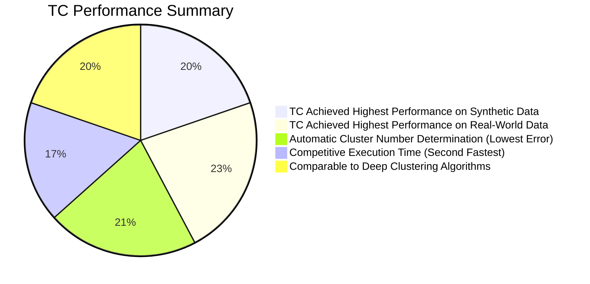

# Autonomous clustering by fast find of mass and distance peaks - Mermaid diagrams
> This content is dual-licensed under your choice of the following licenses:
> 1.  **MIT License:** For the code implementations in Swift and Mermaid provided in this document.
> 2.  **Creative Commons Attribution 4.0 International License (CC BY 4.0):** For all other content, including the text, explanations, and the Mermaid diagrams and illustrations.

---


## 1. Overview of the Torque Clustering (TC) Algorithm




**Explanation:** This diagram provides a high-level overview of the TC algorithm, its purpose, key features, and the main steps of the process.

---

## 2. Algorithm Details: Defining Clusters and Connections

```mermaid
graph LR
    A[Data Set X = {x1, x2, ..., xn}] --> B{Each data point xi is a cluster};
    subgraph Initial_Mass["Initial Mass"]
        B --> C[Initial Mass θi = 1 for all clusters];
    end
    subgraph Connections["Connections"]
        C --> D[Connect each cluster ζi to its 1-nearest cluster ζj (θi <= θj)];
        D --> E[Formation of Connected Graph G (each cluster vertex)];
    end
    subgraph NewClusters["New Clusters"]
        E --> F[Apply Eq. (2): Forming new clusters G' from connected components of G (ζi -> Φ(G))  ];
        F --> G[Mass of new cluster = number of points];
         G --> H[Repeat steps until one cluster];

    end
```

**Explanation:** This diagram focuses on the initial steps of TC, including how clusters are defined, how connections are established based on nearest neighbors, and how the cluster set evolves through merging. Eq. (1) and Eq. (2) from the paper are referenced here implicitly.

---

## 3. Algorithm Details: Torque, Properties, and Decision Graph

```mermaid
graph LR
    A[Connection Properties] --> B[Mass (Mi) = θi * θj  (Product of cluster masses)];
    A --> C[Distance (Di) = d(ζi, ζj) (Minimum distance between points in clusters)];
    A --> D{Decision Graph: Plot Mi vs Di};
    subgraph Torque["Torque"]
        D --> E[Torque (τi) = Mi * Di^2];
        E --> F[Sort Connections by τi (Descending) -> Torque Sorted Connections List (TSCL) ];
    end
    subgraph Identify_Abnormal_Connections["Identify Abnormal Connections"]
        F --> G[Large Mi and Di -> High τi  (Abnormal Connections Appear at Top of TSCL)];
    end
```

**Explanation:** This diagram breaks down the calculation of torque and how connection properties (mass and distance) are used to construct a decision graph and identify potential abnormal connections. The sorting of connections based on torque is emphasized.

----

## 4. Algorithm Details: Torque Gap and Halo Connections

```mermaid
graph LR
    A[Torque Gap (TGap)] --> B{Calculate TGap between consecutive connections in TSCL};
    B --> C[TGap Formula:  TGap = ωi * (τi - τi+1)  (Eq. 6)};
    C --> D{ωi: Clustering Resolution (proportion of TSCL connections with large Mi, Di)};
    D --> E[Find Largest TGap -> Identify L abnormal connections (remove)];
    subgraph Noise_Detection["Noise Detection"]
        E --> F[Define Halo Connections (Halo_C) : Large Mi, and Small Di];
        F --> G[Halo_C Formula(Eq.10): Mi <= mean_M and  Di <= mean_D ];
        G --> H[Remove Halo Connections -> Identify noise from clustering];
    end
```

**Explanation:** This diagram describes how the Torque Gap is calculated to identify abnormal connections and how halo connections are defined and used for noise detection. The roles of ωi and the global means from the paper are visualized.

---

## 5. Algorithm Steps Illustrated with Figure 2

```mermaid
graph LR
    A[Fig 2. Step-by-Step Example] --> B[Fig. 2A: Initial Data, each point as a cluster];
    B --> C[Eq.(1) Connections, graph formation (Fig. 2B)];
    C --> D[Apply Eq.(2) - Forming new clusters (Fig. 2B)];
    D --> E[Fig. 2C, Fig. 2D:  Connections and Cluster properties ];
    E --> F[Properties Table 1A, Table 1B];
    F --> G[Decision Graph (Fig. 2G):  Mi vs Di];
    G --> H[Abnormal Connections Removed (Fig. 2H)];
    H --> I[Clustering Tree(Fig 2H), final partitioning (Fig 2I)];
```

**Explanation:** This diagram uses the visual example from Figure 2 in the paper to illustrate the step-by-step application of the TC algorithm.  It references figures and tables in the paper to make the process visual.

---

## 6. Time and Space Complexity

```mermaid
graph LR
    A[Time Complexity (TC)] --> B[Distance matrix input: O(n^2)];
    B --> C[Steps 6,8,9 (inside loop): O(m*H)]; // H: average # of neighbors
    C --> D[Step 7 (nearest neighbor search): O(H) ];
    D --> E[Steps 10,16,18 (cluster set update/remove) O(n) ];
    A --> F[If using fast-approximate KNN: complexity is slightly different];
    A --> G[Overall (Distance Matrix): O(n^2) + O(mH)];
    A --> H[Best case O of TC ≈ O(nH)]

    I[Space Complexity (TC)] --> J[Store: Clusters, connections (sparse matrix), Mi, Di, TGap];
    J --> K[Basic space O = O(n)];  //linear to n, data points.
     J --> L[with Distance Matrix,Space = O(n^2)];
    K --> L;
```

**Explanation:** This diagram presents  the time complexity of the TC process, the space complexity, in terms of Big O notation.

---

## 7. Performance Comparison Diagram



**Explanation:** A pie chart summarizing key performance highlights of TC, relative to other algorithms discussed in the paper. The percentages are approximate. The percentages reflect the quantitative performance compared to other algorithms as reported in the research.

---

## 8.  Visual Comparison of Clustering Algorithms (Figure 4)

```mermaid
graph LR
    A[Figure 4  (Synthetic Data)] --> B[Original Data Distribution];
    A --> C[AC-S (Agglomerative Clustering - Single Linkage) ];
    A --> D[AC-W (Agglomerative Clustering - Ward Linkage)];
    A --> E[FINCH (Efficient Parameter-Free Clustering)];
    A --> F[DPC (Density Peak Clustering)];
    A --> G[TC (Torque Clustering) - Stage 1 to 5];
    style A fill:#f9f,stroke:#333,stroke-width:2px
    style B fill:#ccf,stroke:#333,stroke-width:1px
    style C fill:#ccf,stroke:#333,stroke-width:1px
    style D fill:#ccf,stroke:#333,stroke-width:1px
    style E fill:#ccf,stroke:#333,stroke-width:1px
    style F fill:#ccf,stroke:#333,stroke-width:1px
    style G fill:#ccf,stroke:#333,stroke-width:1px
    B --> B1[Depict Clusters in various colors]
    C --> C1[AC-S : Sensitive to outliers which leads to inaccurate clusters]
    D --> D1[AC-W : Difficult to detect complex shapes of clusters]
    E --> E1[FINCH : Produces incorrect mergers with constrained merging approach.]
    F --> F1[Sensitivity towards data with varying densities]
    G --> G1[TC : Illustrates step-by-step merging process and correct clustering results]
```

**Explanation:** This graph represents the result comparisons in the paper, highlighting the advantages and disadvantages of each method and how accurately they cluster the synthetic data.

---

## 9. Limitations and Future Work

```mermaid
graph LR
    A[Potential Limitations] --> B[Halo connection thresholding might not identify all types of non-uniform noise];
    A --> C[Challenges with datasets with large cluster count lack clear boundaries];
    A --> D[TC - relies on global mean values];

    E[Future Work] --> F[Adaptive Threshold for Halo Connections (Improve noise handling)];
    E --> G[Deep TC Clustering (Integrate deep learning for better representation learning and improved boundary detection)];
```

**Explanation:** This diagram highlights the limitations of the current TC algorithm and proposes future research directions.


---
**Licenses:**

- **MIT License:**  [](LICENSE) - Full text in [LICENSE](LICENSE) file.
- **Creative Commons Attribution 4.0 International:** [](LICENSE-CC-BY) - Legal details in [LICENSE-CC-BY](LICENSE-CC-BY) and at [Creative Commons official site](http://creativecommons.org/licenses/by/4.0/).

---