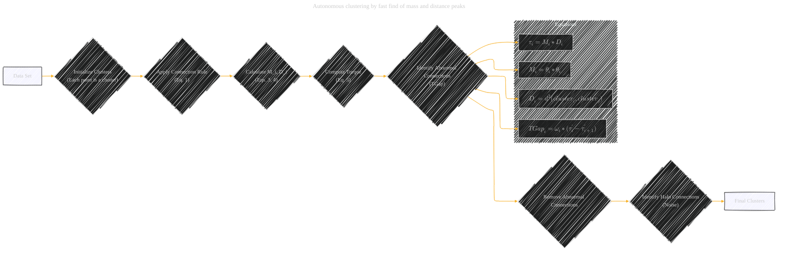

# Autonomous Clustering by Fast Find of Mass and Distance Peaks Paper Overview - Draft 1
> **Disclaimer:**
>
> This document contains my personal notes on the topic,
> compiled from publicly available documentation and various cited sources.
> The materials are intended for educational purposes, personal study, and reference.
> The content is dual-licensed:
> 1. **MIT License:** Applies to all code implementations (Swift, Mermaid, and other programming languages).
> 2. **Creative Commons Attribution 4.0 International License (CC BY 4.0):** Applies to all non-code content, including text, explanations, diagrams, and illustrations.
---

## Autonomous Clustering by Fast Find of Mass and Distance Peaks - A Diagram Structure

### I. Torque Clustering (TC) Algorithm

*   **Core Idea:** A novel clustering algorithm based on merging clusters with their nearest neighbor that has a higher mass, unless both clusters have relatively large masses and the distance between them is substantial. This balances cluster density and separation.

*   **Analogy:** Inspired by galaxy mergers in astronomy, mirroring gravitational interactions.

*   **Graphical Representation:**

    *   **Type:** Directed Acyclic Graph (DAG) or a custom diagram to represent the merging hierarchy.
    *   **Nodes:**
        *   'Data Points' (xi): Initial nodes, each with a mass of 1.
        *   'Clusters' (ζi): Intermediate and final clusters formed during merging.  The mass of each cluster can be displayed as a node property.
        *   'Connections' (Ci): Edges connecting clusters, labeled with the mass (Mi), distance (Di), and torque (τi).
        *   'Abnormal Connections':  Highlighted connections that are removed.
    *   **Edges:** Directed edges representing the merging process from smaller to larger clusters. The absence of an edge indicates a cut.
    *   **Formulas:** Annotate the graph with key equations:

        *   Mass: Mi = θi × θi
        *   Distance: Di = d2(ζi, ζi)
        *   Torque: τi = Mi × Di
        *   Torque Gap: TGapi = ωi × (τ`i - τ`i+1)

        *   Halo Connections: Based on formulas that describe halo and halo_c thresholds
*    **Process Visulization**: 

```mermaid
---
title: "Autonomous clustering by fast find of mass and distance peaks"
config:
  layout: elk
  look: handDrawn
  theme: dark
---
%%%%%%%% Mermaid version v11.4.1-b.14
%%%%%%%% Available curve styles include the following keywords:
%% basis, bumpX, bumpY, cardinal, catmullRom, linear, monotoneX, monotoneY, natural, step, stepAfter, stepBefore.
%%{
  init: {
    "graph": { "htmlLabels": true, 'curve': 'linear' },
    'fontFamily': 'Fantasy',
    'themeVariables': {
      'primaryColor': '#BB2528',
      'primaryTextColor': '#f529',
      'primaryBorderColor': '#7C0000',
      'lineColor': '#F8B229',
      'secondaryColor': '#006100',
      'tertiaryColor': '#fff'
    }
  }
}%%
flowchart LR
 A -- Iteration 1 --> B(Form Clusters and compute their initial mass):::detail
        style B fill:#f9f3,stroke:#333,stroke-width:1px
        B --> C{"Apply the connection rule of Eq(1) to link the clusters"}:::detail
        C --> D{"Calculate the M_i and D_i properties using Eq(3) and Eq(4)"}:::detail
        D --> E{"Apply Eq(2) to generate the next cluster set and update all the connections"}:::detail
        E --> F{"Repeat until the top of the hierarchy tree is reached"}:::detail
        F --> G{"Identify and remove 'abnormal' connections."}:::detail
        G --> H{"The algorithms identifies and removes abnormal connections with large mass and distance values"}:::detail
        H --> I{"Final Clustering Scheme"}:::detail
    
        classDef detail fill:#f9f3,stroke:#333,stroke-width:1px
        
```

----

### II. Key Components and Metrics

*   **Mass (θ):** The number of points in a cluster.
*   **Distance (d):** The minimum distance between points in two clusters.
*   **Torque (τ):** Product of mass and distance; used to identify abnormal connections.
*   **Torque Gap (TGap):** Used to automatically identify the optimal cut point in the hierarchical tree.
*   **Halo Connections:** Connections to noise points (relatively large distance, small mass).

*   **Graphical Representation:**
        *  **Node:** "Torque Calculation", "Abnormal Connection Removal", "Halo Noise Removal"
        *  **Edges:** Formulas for calculating torque, criteria for identifying abnormal connections, process for removing noise.
        * **Metrics:** NMI, ACC, and AMI, average rank.

----

### III. Algorithm Comparisons

*   **Benchmarked Algorithms:** K-means++, spectral clustering, hierarchical clustering (single, complete, average, ward, centroid linkage), DPC (and its variants), FINCH, DBSCAN, affinity propagation, border-peeling clustering, robust continuous clustering. Deep clustering algorithms: EAEDC , N2D ,DnC-SC ,DipDECK,GCML,AESC

*   **Evaluation Metrics:** Normalized Mutual Information (NMI), Accuracy (ACC), Adjusted Mutual Information (AMI), and Execution time.

*   **Graphical Representation:**
        *   **Chart (Bar/Line):** Visualize performance comparison of TC vs. other algorithms across different datasets and metrics.
        *   **Table:** Summarize results (as shown in Tables 3A-F, 4, 5, 6 and 7 in the paper).

---

### IV. Data Sets

*   **Synthetic Data:** Overlapping, FLAME, spectral-path, unbalanced, noisy, heterogeneous geometric, and multi-objective.
*   **Real-World Data:** MNIST, YouTube Faces Database (YTF), COIL-100, CMU-PIE, gene expression analysis (RNA-seq), cell tracking (Cell-track), UCI Zoo, Soybean, Haberman's Survival, Reuters, NASA Shuttle

*   **Graphical Representation:**
        *  List the datasets with short descriptions of their properties. 
        * Link the data to its sources

----

### V. TC Advantages

*   **Parameter-Free:** Does not require manual parameter tuning.
*   **Handles Diverse Clusters:** Identifies varying shapes, sizes, and densities.
*   **Constrained Merging:** Avoids incorrect mergers typical of agglomerative methods.
*   **Automatic Cluster Number Determination:**  Torque Gap mechanism automatically determines the number of clusters
*   **Robust to Noise/Outliers:**  Halo connection removal.
*   **Computational Efficiency:** Able to work efficiently for large number of datasets.

*   **Graphical Representation:**
        * Highlighting nodes with description

**VI. Future Work**

*   **Adaptive Thresholds for Halo Detection:** Setting distinct thresholds for individual clusters to increase robustness against non-uniform noise.

*   **Deep TC Clustering:** Integrating neural network-based representation learning for datasets with a large number of clusters and unclear boundaries.
        *  **Graphical Representation:**  Visualize the Deep TC Clustering architecture with added neural network components.

----

### Example Mermaid Diagram (Conceptual)

---
**Licenses:**

- **MIT License:**   - Full text in [LICENSE](LICENSE) file.
- **Creative Commons Attribution 4.0 International:**  - Legal details in [LICENSE-CC-BY](LICENSE-CC-BY) and at [Creative Commons official site](http://creativecommons.org/licenses/by/4.0/).

---