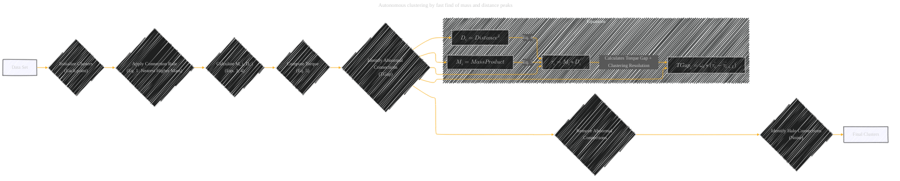
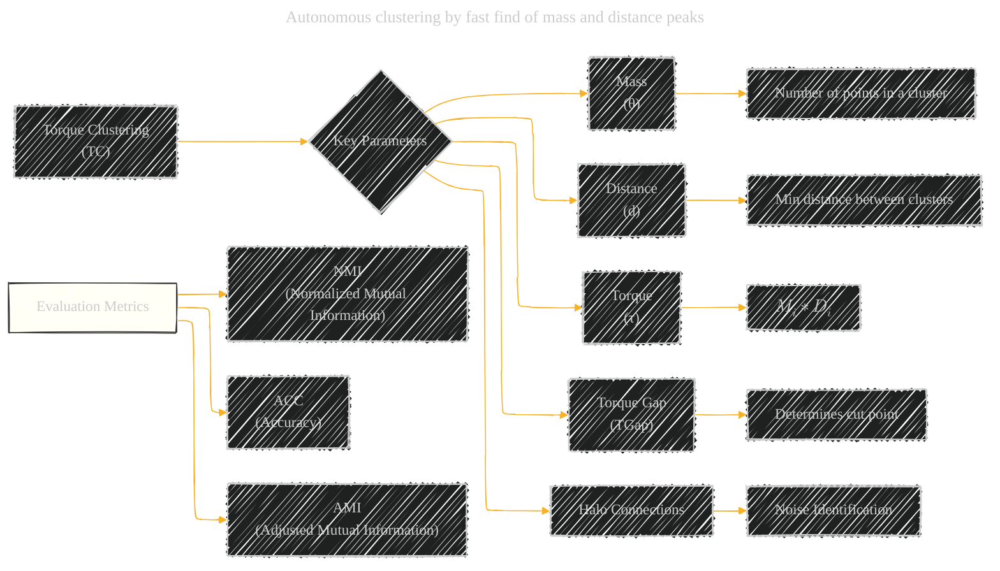
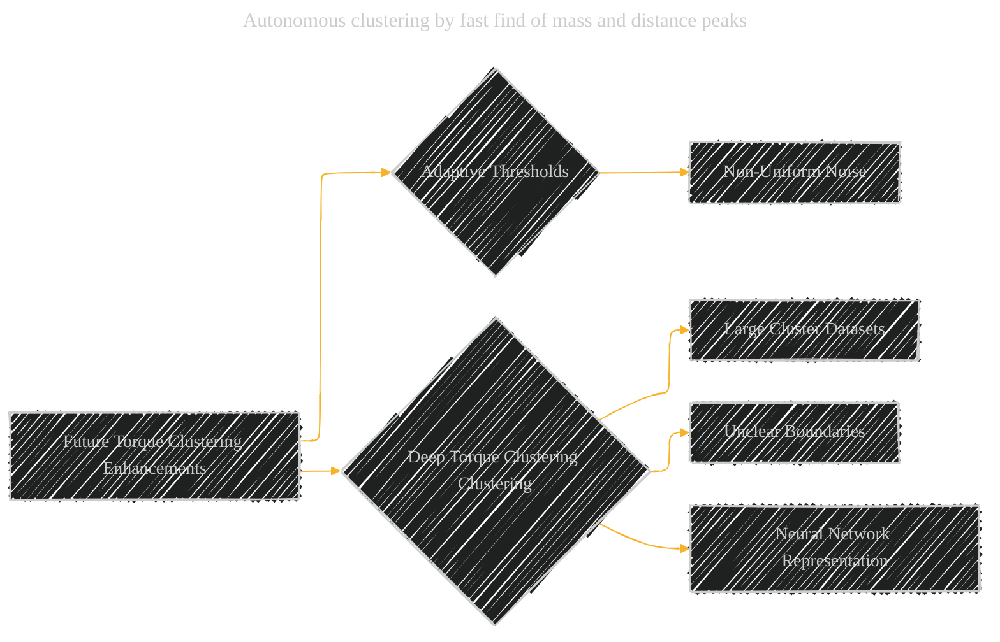

# Autonomous Clustering by Fast Find of Mass and Distance Peaks Paper Overview - Draft 1
> **Disclaimer:**
>
> This document contains my personal notes on the topic,
> compiled from publicly available documentation and various cited sources.
> The materials are intended for educational purposes, personal study, and reference.
> The content is dual-licensed:
> 1. **MIT License:** Applies to all code implementations (Swift, Mermaid, and other programming languages).
> 2. **Creative Commons Attribution 4.0 International License (CC BY 4.0):** Applies to all non-code content, including text, explanations, diagrams, and illustrations.
---

## Autonomous Clustering by Fast Find of Mass and Distance Peaks - A Diagram Structure

### 1. Torque Clustering (TC) Algorithm Overview

*   **Type:** Basic flowchart representing the TC process.
*   **Emphasis:** Flow of operations, highlighting key steps.
*   **Equations:** Separate subgraph focusing on equations, demonstrating how they influence "Identify abnormal Connections"

----

### 2. TC Parameters and Metrics

*   **Type:** Simple graph to show what metrics are important for TC.

----

### 3. Algorithm Comparison (Conceptual)

*   **Type:** Graph to summarize comparison.

----

### 4. Torque Clustering and DPC Differences

*   **Type:**  Comparison graph focusing on the core differences.

----

### 5. Torque Clustering Future Enhancements

*   **Type:** Simple listing of future work items.

---
**Licenses:**

- **MIT License:**   - Full text in [LICENSE](LICENSE) file.
- **Creative Commons Attribution 4.0 International:**  - Legal details in [LICENSE-CC-BY](LICENSE-CC-BY) and at [Creative Commons official site](http://creativecommons.org/licenses/by/4.0/).

---