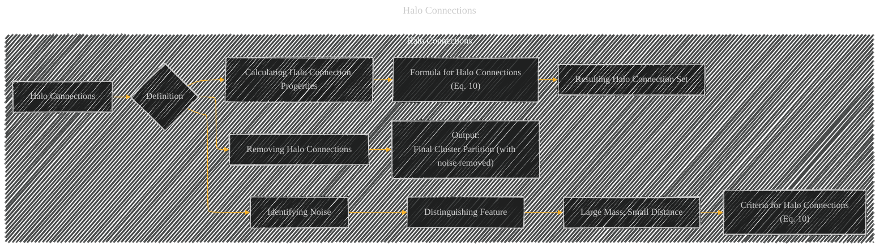

# Halo Connections
> **Disclaimer:**
>
> This document contains my personal notes on the topic,
> compiled from publicly available documentation and various cited sources.
> The materials are intended for educational purposes, personal study, and reference.
> The content is dual-licensed:
> 1. **MIT License:** Applies to all code implementations (Swift, Mermaid, and other programming languages).
> 2. **Creative Commons Attribution 4.0 International License (CC BY 4.0):** Applies to all non-code content, including text, explanations, diagrams, and illustrations.
---

## Halo Connections - A Diagram Structure

---

### Explanation of Halo Connections

Halo connections in the Torque Clustering (TC) algorithm are a mechanism for identifying and removing noise or outlier points that might not belong to any well-defined cluster. They're not part of the core cluster structure but are instead considered part of the cluster "halo."

**Key Characteristics of Halo Connections:**

*   **Large Mass (𝑀𝑀𝑖𝑖):**  Halo connections link clusters that have a relatively large mass, meaning they comprise a significant number of data points. This suggests that the points are clustered together in a somewhat dense region, even if they are not part of a core cluster.
*   **Small Distance (𝐷𝐷𝑖𝑖):**  Despite their large mass, the distance (𝐷𝐷𝑖𝑖) between the two clusters connected by a halo connection is relatively small. This indicates that the points are close to one another but do *not* exhibit the same strong, characteristic proximity relationships of points within a core cluster.

---

### The Halo Connection Criteria (Eq. 10)

The precise criteria for identifying halo connections are defined by the formula in Equation 10 of the original paper. This equation typically involves a comparison of the mass (𝑀𝑀𝑖𝑖) and distance (𝐷𝐷𝑖𝑖) of a connection to a threshold (e.g., the mean or some percentile of mass and distance values across all connections).  It's essential to consult the specific wording and values of the equation as outlined in the paper.

**Process of Removing Halo Connections:**

1.  **Calculation:** The algorithm calculates the properties for all connections that are identified in the steps from the previous section.

2.  **Filtering:**  Connections are filtered based on the criteria outlined in Eq. 10. Only connections that meet this criteria are considered halo connections.

3.  **Removal:** The halo connections are removed from the graph.

4.  **Final Partitioning:** The connected components remaining in the graph after removing abnormal and halo connections are considered the final clusters.  These are now "clean," with noise points removed.

**Key Idea:**

The halo connection identification method distinguishes between connections that represent points that are close to one another, but are not part of the core clusters and those points that are tightly clustered.  By removing these halo connections, the algorithm effectively isolates noise points and produces a more accurate and robust clustering result.

**Important Note:** The exact mathematical definition of Equation 10 needs to be included for a complete and practical understanding of how halo connections are identified.  Referencing the original paper's text for the specific formula is critical.

---
**Licenses:**

- **MIT License:**   - Full text in [LICENSE](LICENSE) file.
- **Creative Commons Attribution 4.0 International:**  - Legal details in [LICENSE-CC-BY](LICENSE-CC-BY) and at [Creative Commons official site](http://creativecommons.org/licenses/by/4.0/).

---