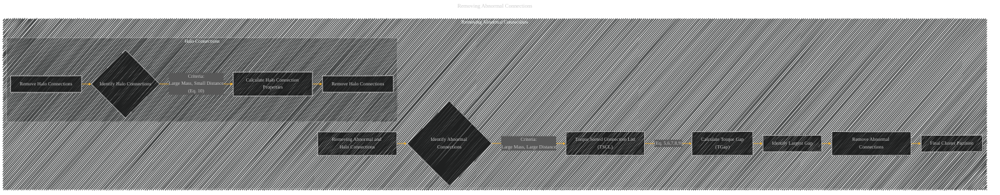

# Removing Abnormal and Halo Connections
> **Disclaimer:**
>
> This document contains my personal notes on the topic,
> compiled from publicly available documentation and various cited sources.
> The materials are intended for educational purposes, personal study, and reference.
> The content is dual-licensed:
> 1. **MIT License:** Applies to all code implementations (Swift, Mermaid, and other programming languages).
> 2. **Creative Commons Attribution 4.0 International License (CC BY 4.0):** Applies to all non-code content, including text, explanations, diagrams, and illustrations.
---

## Removing Abnormal and Halo Connections - A Diagram Structure

---

### Explanation of Removing Abnormal and Halo Connections

**Identifying Abnormal Connections (Torque Gap):**

1.  **Torque Sorted Connection List (TSCL):**  All connections between clusters are sorted in descending order based on their torque values (𝜏𝜏𝑖𝑖). Connections with the highest torque values are at the top of this list.

2.  **Calculate Torque Gap (TGap):**  For each consecutive pair of connections in the TSCL, calculate the torque gap (TGapi) using the formula provided in the original paper (Eq. 6).  This formula usually considers the difference in torque between consecutive connections, often with a weighting factor to account for uneven cluster distribution or imbalance (𝜔𝜔𝑖𝑖).

3.  **Identify Largest Gap:** Find the connection with the largest torque gap (TGapL) among all consecutive pairs in the TSCL.

4.  **Remove Abnormal Connections:**  The connections at the top of the TSCL, with torque values corresponding to the largest torque gap, are considered abnormal and removed from the connection graph.  This step effectively prunes the hierarchical tree by removing connections that do not represent a logical progression in the clustering process.

**Identifying Halo Connections (Noise):**

1.  **Calculate Halo Connection Properties:** Calculate properties for each remaining connection, likely using a similar method as the `Torque Sorted Connection List`, but with a different set of criteria for selecting "halo connections." The definition for halo connections is specified by equation 10 and will depend on the particular criteria defined in the paper.

2.  **Remove Halo Connections:** Connections that satisfy the criteria for halo connections are removed from the connection graph. These connections are typically characterized by relatively large masses, but a small distance between the connected clusters. This step isolates noise points and sub-clusters that don't fit the criteria for meaningful clusters.

**Final Cluster Partition:**

The remaining connections after removing abnormal and halo connections define the final cluster partitioning.  The algorithm proceeds to calculate the connected components of the graph, which forms the output of the clustering.

---

### Key Considerations

*   **Criteria:** The exact criteria for identifying abnormal and halo connections are crucial. They are defined by formulas within the paper.  The choice of these criteria directly impacts the accuracy and effectiveness of the algorithm on different datasets.
*   **Iteration:** The process of removing abnormal and halo connections may involve multiple iterations. In subsequent iterations, the connection properties (mass, distance, torque) are recalculated and re-evaluated.
*   **Hierarchical Tree Pruning:** The removal of connections is a crucial part of pruning the hierarchical tree representation of the clustering process, leading to a more refined and appropriate final partition.

This diagram and explanation illustrate the core steps involved in removing abnormal and halo connections.  Remember to replace the placeholder formulas with the actual definitions from the Torque Clustering algorithm paper.

---
**Licenses:**

- **MIT License:**   - Full text in [LICENSE](LICENSE) file.
- **Creative Commons Attribution 4.0 International:**  - Legal details in [LICENSE-CC-BY](LICENSE-CC-BY) and at [Creative Commons official site](http://creativecommons.org/licenses/by/4.0/).

---