# Torque Clustering Algorithm
> **Disclaimer:**
>
> This document contains my personal notes on the topic,
> compiled from publicly available documentation and various cited sources.
> The materials are intended for educational purposes, personal study, and reference.
> The content is dual-licensed:
> 1. **MIT License:** Applies to all code implementations (Swift, Mermaid, and other programming languages).
> 2. **Creative Commons Attribution 4.0 International License (CC BY 4.0):** Applies to all non-code content, including text, explanations, diagrams, and illustrations.
---

## Torque Clustering Algorithm - A Diagram Structure

```mermaid
---
title: Torque Clustering Algorithm
config:
  layout: elk
  look: handDrawn
  theme: dark
---
%%{
  init: {
    'fontFamily': 'verdana',
    'themeVariables': {
      'primaryColor': '#BB2528',
      'primaryTextColor': '#f529',
      'primaryBorderColor': '#7C0000',
      'lineColor': '#F8B229',
      'secondaryColor': '#006100',
      'tertiaryColor': '#fff'
    }
  }
}%%
graph LR
    subgraph Algorithm_Overview["Algorithm Overview"]
        A["Torque Clustering<br>(TC)"] --> B{Algorithm Steps}
        B --> C[Define Clusters and Connections]
        C --> D[Initial Clusters]
        D --> E(Each data point is a cluster with initial mass 1)
        C --> F[Forming Connections]
        F --> G["Nearest Neighbor Merging<br>(Eq. 1)"]
        G --> H[Iterative Merging]

        B --> I["Defining Connection Properties<br>(Mass and Distance)"]
        I --> J("Mass (𝑀𝑀𝑖𝑖) = product of cluster masses")
        I --> K("Distance (𝐷𝐷𝑖𝑖) = minimum distance between points in the two clusters")
        
        B --> L["Defining Torque<br>(𝜏𝜏𝑖𝑖)"]
        L --> M(𝜏𝜏𝑖𝑖 = 𝑀𝑀𝑖𝑖 × 𝐷𝐷𝑖𝑖^2)

        B --> N["Sorting Connections in Descending Order<br>(TSCL)"]
        N --> O["Identifying Abnormal Connections<br>(Torque Gap)"]
        O --> P["Identifying Halo Connections<br>(Noise)"]
        
        B --> Q[Removing Abnormal and Halo Connections]
        Q --> R[Final Cluster Partitioning]
    end
    
    subgraph Detailed_Steps["Detailed Steps"]
        S["Forming Connections<br>(Eq. 1)"] --> T["Calculate masses and distances"]
        T --> U["Create a connected graph"]
        U --> V["Update cluster set<br>(Eq. 2)"]
        V --> W["Repeat steps until a single cluster"]


        X["Defining Torque (𝜏𝜏𝑖𝑖)"] --> Y["Calculate 𝜏𝜏𝑖𝑖 for each connection"]
        Y --> Z["Sort connections in descending order<br>(TSCL)"]

        AA["Identifying Abnormal Connections<br>(Torque Gap)"] --> BB["Calculate Torque Gap<br>(TGap)"]
        BB --> CC[Identify largest gap]
        CC --> DD[Remove abnormal connections]

        EE["Identifying Halo Connections<br>(Noise)"] --> FF["Calculate halo connection properties<br>(Eq. 10)"]
        FF --> GG[Remove halo connections]

        HH[Final Cluster Partitioning] --> II[Output cluster partition]
    end
    
```

DOI:[10.13140/RG.2.2.10755.82729](http://dx.doi.org/10.13140/RG.2.2.10755.82729)

---

### Explanation of the Torque Clustering Algorithm (TC)

**1. Initial Clusters:** Each data point in the input dataset is treated as a separate cluster with an initial mass of 1.

**2. Forming Connections (Eq. 1):**  The algorithm iteratively identifies the nearest cluster to each current cluster with a higher mass. If such a neighbor is found, a connection is formed, effectively merging the clusters. This process constructs a connected graph (adjacency matrix).

**3. Defining Connection Properties:** For each connection, calculate:

   * **Mass (𝑀𝑀𝑖𝑖):** The product of the masses of the two connected clusters.
   * **Distance (𝐷𝐷𝑖𝑖):** The minimum distance between any point in one connected cluster and any point in the other cluster.

**4. Defining Torque (𝜏𝜏𝑖𝑖):** The torque of a connection is calculated as the product of its mass and the squared distance:  𝜏𝜏𝑖𝑖 = 𝑀𝑀𝑖𝑖 × 𝐷𝐷𝑖𝑖^2.  A high torque value suggests an abnormal connection.

**5. Sorting Connections:** All connections are sorted in descending order based on their torque values to create the Torque Sorted Connection List (TSCL).

**6. Identifying Abnormal Connections (Torque Gap):** The algorithm identifies abnormal connections by analyzing the torque gap (TGap) between consecutive connections in the TSCL.  A large torque gap signifies a likely transition point to a more appropriate clustering scheme.  Connections with the largest gaps are removed.

**7. Identifying Halo Connections (Noise):**  The algorithm defines "halo connections" based on a criteria that differentiates noise from actual cluster components.  These connections, characterized by a large mass but small distance, are also removed, effectively isolating the noise clusters.

**8. Final Cluster Partitioning:** The remaining connections define the final cluster partitioning, producing a hierarchical tree representation of the clusters.  This is the output of the algorithm.

----

### Key Considerations

*   **Iteration:** The algorithm iterates until a single, all-encompassing cluster is formed at the top of the hierarchical tree.  The iterative process gradually merges smaller clusters based on proximity and mass, reflecting a natural merging strategy.
*   **Torque Gap:** This metric is crucial for automatically determining the appropriate number of clusters or granularity levels by identifying transitions in the connection strengths.
*   **Halo Connections:** Halo connections are used to identify and isolate noise points, preventing these points from distorting the resulting clusters.

This detailed description, along with the Mermaid diagram, should provide a comprehensive understanding of the Torque Clustering Algorithm. Remember that the specific equations (Eq. 1, Eq. 2, Eq. 10) should be replaced with their actual mathematical definitions for a complete representation.

---
**Licenses:**

- **MIT License:**   - Full text in [LICENSE](LICENSE) file.
- **Creative Commons Attribution 4.0 International:**  - Legal details in [LICENSE-CC-BY](LICENSE-CC-BY) and at [Creative Commons official site](http://creativecommons.org/licenses/by/4.0/).

---