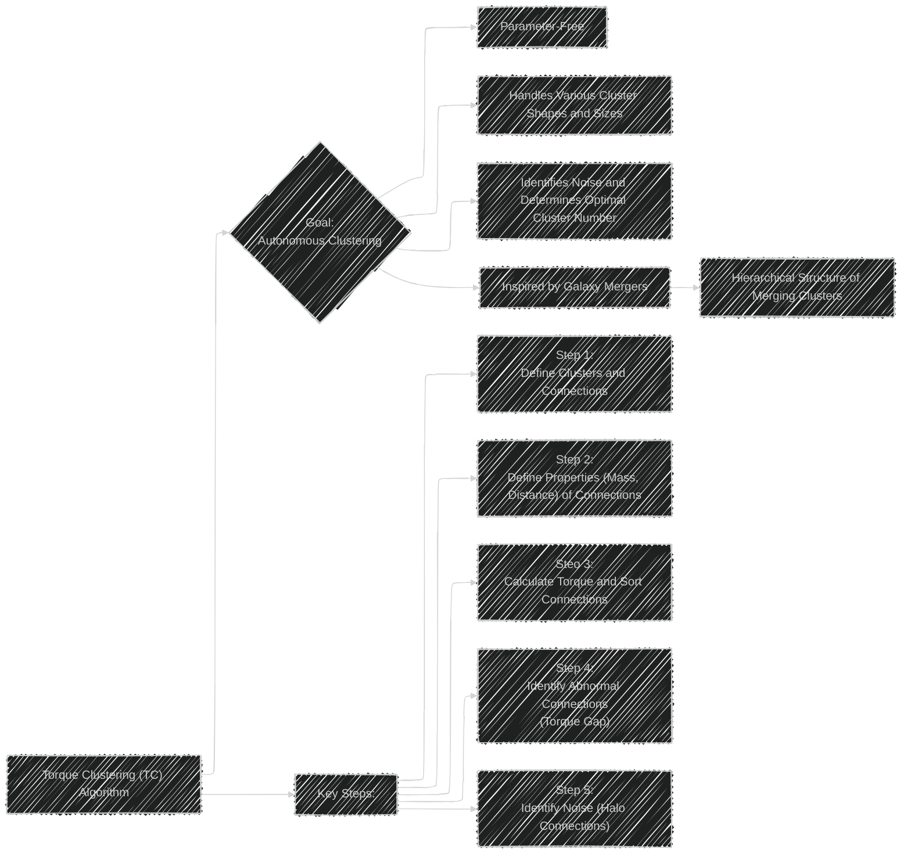
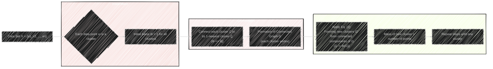
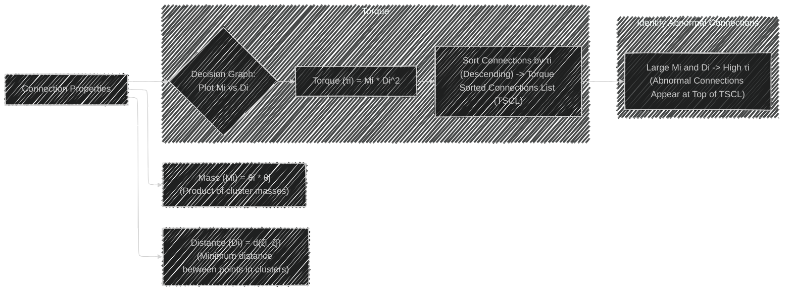
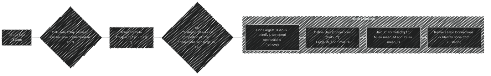
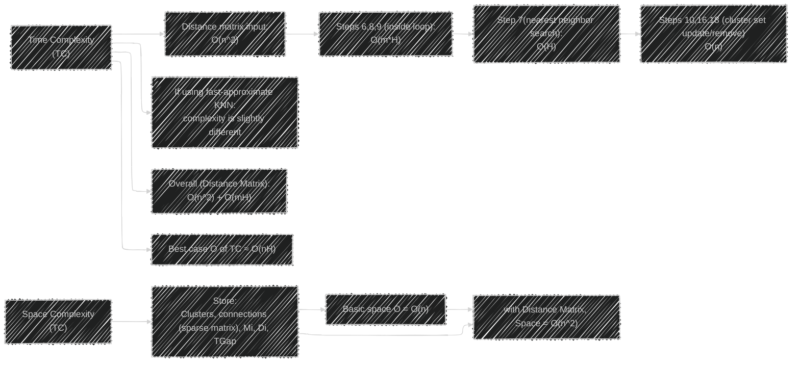
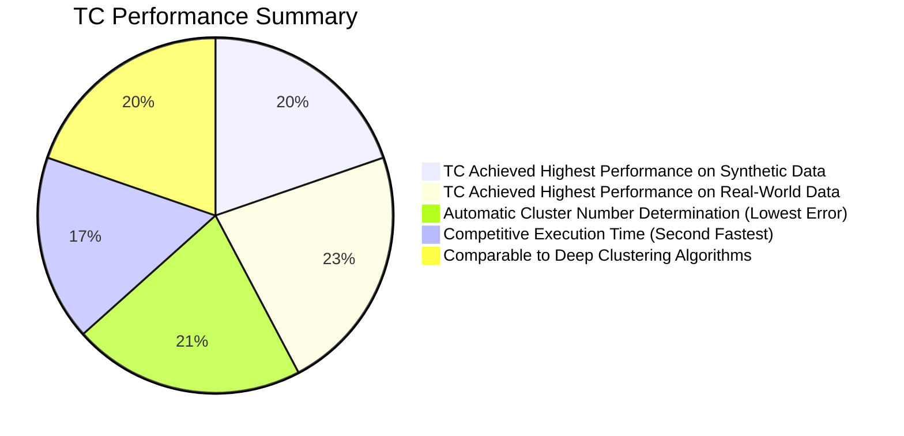
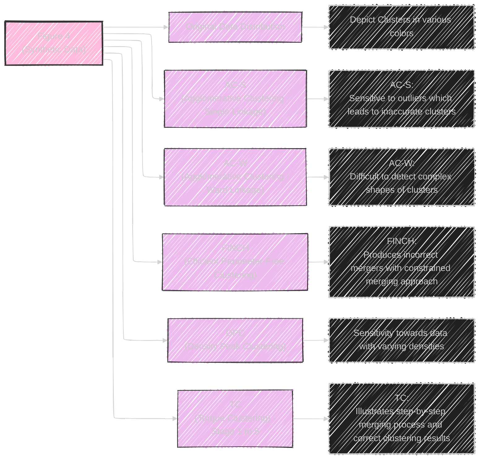
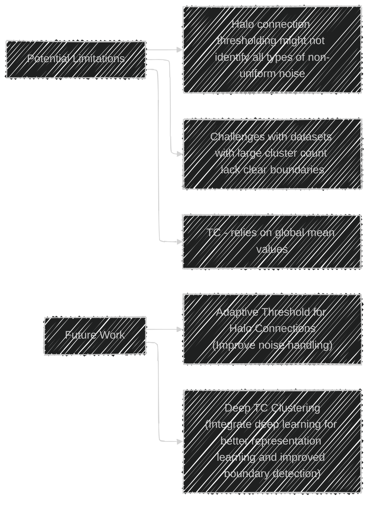

# Autonomous clustering by fast find of mass and distance peaks - Mermaid diagrams
> This content is dual-licensed under your choice of the following licenses:
> 1.  **MIT License:** For the code implementations in Swift and Mermaid provided in this document.
> 2.  **Creative Commons Attribution 4.0 International License (CC BY 4.0):** For all other content, including the text, explanations, and the Mermaid diagrams and illustrations.

---

## 1. Overview of the Torque Clustering (TC) Algorithm

**Explanation:** This diagram provides a high-level overview of the TC algorithm, its purpose, key features, and the main steps of the process.

---

## 2. Algorithm Details: Defining Clusters and Connections

**Explanation:** This diagram focuses on the initial steps of TC, including how clusters are defined, how connections are established based on nearest neighbors, and how the cluster set evolves through merging. Eq. (1) and Eq. (2) from the paper are referenced here implicitly.

---

## 3. Algorithm Details: Torque, Properties, and Decision Graph

**Explanation:** This diagram breaks down the calculation of torque and how connection properties (mass and distance) are used to construct a decision graph and identify potential abnormal connections. The sorting of connections based on torque is emphasized.

----

## 4. Algorithm Details: Torque Gap and Halo Connections

**Explanation:** This diagram describes how the Torque Gap is calculated to identify abnormal connections and how halo connections are defined and used for noise detection. The roles of ωi and the global means from the paper are visualized.

---

## 5. Algorithm Steps Illustrated with Figure 2

```mermaid
---
config:
  layout: elk
  look: handDrawn
  theme: dark
---
graph LR
    A["Fig 2. Step-by-Step Example"];
    B["Fig. 2A:<br>Initial Data, each point as a cluster"];
    C["Eq.(1) Connections, graph formation<br>(Fig. 2B)"];
    D["Apply Eq.(2) - Forming new clusters<br>(Fig. 2B)"];
    E["Fig. 2C, Fig. 2D:<br>Connections and Cluster properties"];
    F["Properties Table 1A, Table 1B"];
    G["Decision Graph (Fig. 2G): <br>Mi vs Di"];
    H["Abnormal Connections Removed<br>(Fig. 2H)"];
    I["Clustering Tree(Fig 2H), final partitioning<br>(Fig 2I)"];

    A --> B
    B --> C
    C --> D
    D --> E
    E --> F
    F --> G
    G --> H
    H --> I
```

**Explanation:** This diagram uses the visual example from Figure 2 in the paper to illustrate the step-by-step application of the TC algorithm.  It references figures and tables in the paper to make the process visual.

---

## 6. Time and Space Complexity

**Explanation:** This diagram presents  the time complexity of the TC process, the space complexity, in terms of Big O notation.

---

## 7. Performance Comparison Diagram

**Explanation:** A pie chart summarizing key performance highlights of TC, relative to other algorithms discussed in the paper. The percentages are approximate. The percentages reflect the quantitative performance compared to other algorithms as reported in the research.

---

## 8.  Visual Comparison of Clustering Algorithms (Figure 4)

**Explanation:** This graph represents the result comparisons in the paper, highlighting the advantages and disadvantages of each method and how accurately they cluster the synthetic data.

---

## 9. Limitations and Future Work

**Explanation:** This diagram highlights the limitations of the current TC algorithm and proposes future research directions.

---
**Licenses:**

- **MIT License:**   - Full text in [LICENSE](LICENSE) file.
- **Creative Commons Attribution 4.0 International:**  - Legal details in [LICENSE-CC-BY](LICENSE-CC-BY) and at [Creative Commons official site](http://creativecommons.org/licenses/by/4.0/).

---