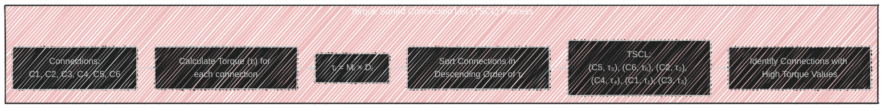
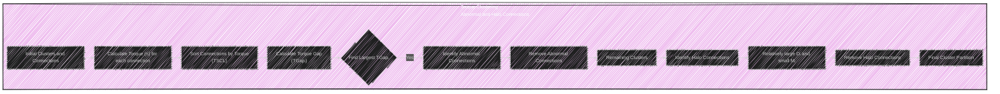
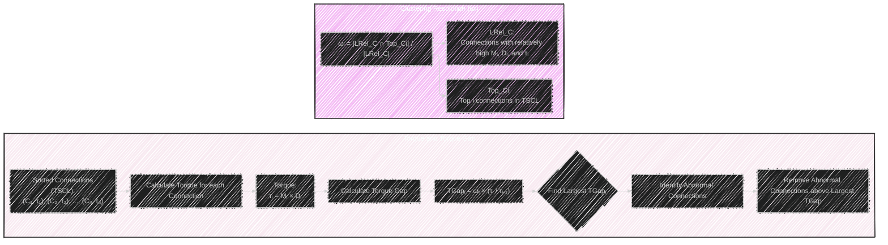
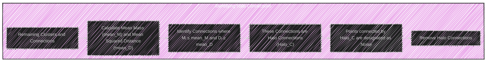
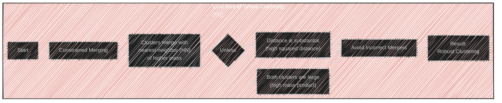
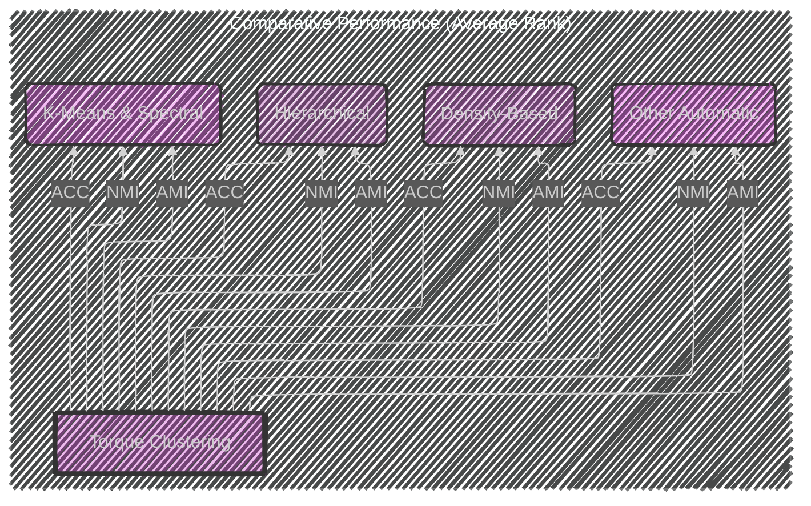
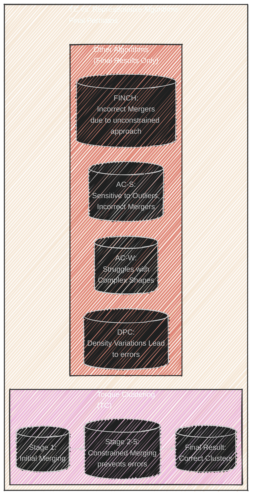

# Autonomous clustering by fast find of mass and distance peaks - Mermaid diagrams
> This content is dual-licensed under your choice of the following licenses:
> 1.  **MIT License:** For the code implementations in Swift and Mermaid provided in this document.
> 2.  **Creative Commons Attribution 4.0 International License (CC BY 4.0):** For all other content, including the text, explanations, and the Mermaid diagrams and illustrations.

---


Here's a breakdown of the diagrams and visualizations I'll produce, covering key aspects of the paper:

**1. Core Idea and Algorithm Overview**

*   **Mind Map: Overall Algorithm Concepts:** A hierarchical mind map summarizing the key ideas behind TC, its goals, and how it differs from other clustering approaches.  This will act as a high-level introduction.
*   **Flowchart:  TC Algorithm Steps:** A step-by-step flowchart detailing the main stages of the TC algorithm (as described in Section 2 and Algorithm 1).  This will visually represent the algorithm's procedural flow.
*   **Graph: Illustrative Example (Fig. 1 and 2 Adaptation):** I will create a visual representation to replace Fig 1 and Fig 2, combining them to clarify the algorithm's conceptual basis and operational flow.
* **Graph: Torque Sorted Connection List:** A Graph diagram explaining to how to obtain the TSCL, with torque values and connections.
*   **Graph: Abnormal and Halo Connections:**  A visual representation of how abnormal and halo connections are identified, adapting concepts from Figures 2 and 3.  This will highlight the key mechanisms for cluster determination and noise handling.

**2. Key Concepts and Definitions**

*   **Graph: Connection Properties:**  A graph visually defining *M<sub>i</sub>* (product of cluster masses) and *D<sub>i</sub>* (squared distance between clusters) and how they relate to connection properties.
* **Equation Visualization:** Visual representation of Equations 3 and 4.
*   **Graph: Torque and Torque Gap:** A graph diagram illustrating the concept of torque (*τ<sub>i</sub>*) and Torque Gap (TGap<sub>i</sub>) highlighting abnormal connection removal process.  This will show how these metrics prioritize connections for removal.
* **Equation Visualization:** Visual representation of Equations 5, 6-9.
*  **Graph: Halo Connections:** A Graph diagram explaining how to identify Halo_C.
* **Equation Visualization:** Visual representation of Equation 10 with key takeaways.
* **Graph: Core Idea of TC:** A Graph diagram explaining the core concept of TC.

**3. Comparative Analysis and Results**

*   **Table Summary: Performance Metrics:** A concise table summarizing the performance metrics used (AMI, NMI, ACC).
*   **Comparative Bar Charts (Simplified from Tables 3 & 4):**  Bar charts showing TC's average rank compared to groups of algorithms (e.g., hierarchical, density-based, deep clustering) across key metrics.  This will provide a high-level comparison without reproducing the large tables.
*   **Table: Cluster Number Determination Error (Table 5 Adaptation):** A simplified table comparing TC's mean error in determining the number of clusters against other automatic algorithms.
*   **Table: Execution Time Comparison (Table 6 Adaptation):**  A streamlined table showing TC's execution time ranking compared to other parameter-free algorithms.
*   **Comparative Visualization (Fig. 4 Adaptation):** A simplified version of Figure 4, comparing the stages of TC with the *final* results of a *few* representative algorithms (e.g., AC-S, AC-W, FINCH, DPC). This will show the advantage of TC's constrained merging.
* **Table: Comparison with Deep Clustering Algorithms:** A simplified version of Table 7, focusing on TC key takeaways.

**4. Discussion and Limitations**

*   **Mind Map: TC vs. Hierarchical Clustering:** A mind map highlighting the key differences between TC and traditional hierarchical clustering methods.
*   **Mind Map: TC vs. Density Peak Clustering (DPC):**  A mind map comparing TC and DPC, emphasizing the differences in density/mass estimation, parameter handling, and label assignment.
* **Graph: Limitation Visualization** A graph to visually show the potential limitations of TC that the original document indicates.


---

Now, let's begin with the diagrams and visualizations:

---


----

## 1. Core Idea and Algorithm Overview


----


---




```mermaid
---
config:
  layout: elk
  look: handDrawn
  theme: dark
---
graph LR
    %% Subgraph for Initial Data and Cluster Formation
    subgraph InitialState["Initial Data and Cluster Formation"]
    style InitialState fill:#f9f,stroke:#333,stroke-width:2px
    A[Data Points: x1 to x7]
    A --> B1[Initial Clusters: ζ1 to ζ7, Mass = 1]
    end
    %% Arrows to show initial one-to-one relationship
    B1 --> |Each point \n is a cluster| A

    %% Subgraph for First Merging Stage
    subgraph FirstMerging["First Merging Stage (Connections C1-C4)"]
    style FirstMerging fill:#ccf,stroke:#333,stroke-width:2px
        C1[Connect: ζ1 → ζ2]
        C2[Connect: ζ3 → ζ2]
        C3[Connect: ζ4 → ζ5]
        C4[Connect: ζ6 → ζ7]
       
        B1 --> C1
        B1 --> C2
        B1 --> C3
        B1 --> C4

        C1 --> NewPoints["New Clusters: \n{ζ1,ζ2,ζ3}, {ζ4,ζ5}, {ζ6,ζ7}"]
        C2 --> NewPoints
        C3 --> NewPoints
        C4 --> NewPoints
    end

    %% Subgraph for Decision Graph (C1-C4)
        subgraph DecisionGraphC1C4["Decision Graph (After C1-C4)"]
            style DecisionGraphC1C4 fill:#aaf,stroke:#333,stroke-width:2px
                DG1[("Mᵢ, Dᵢ for C1-C4")]
                DG1 --> DG11[("Relatively Lower Values")]
        end
    NewPoints --> DG1

    %% Subgraph for Second Merging Stage
    subgraph SecondMerging["Second Merging Stage (Connections C5-C6)"]
    style SecondMerging fill:#ddf,stroke:#333,stroke-width:2px
        C5["Connect: {ζ1,ζ2,ζ3} → {ζ4,ζ5}"]
        C6["Connect: {ζ1,ζ2,ζ3}→ {ζ6,ζ7}"]
     
        NewPoints --> C5
        NewPoints --> C6
        C5 --> BigCluster
        C6 --> BigCluster
        BigCluster[Single Cluster Formation]
    end
    %% Subgraph for Decision Graph (C5-C6)
        subgraph DecisionGraphC5C6["Decision Graph (After C5 - C6)"]
            style DecisionGraphC5C6 fill:#bbf,stroke:#333,stroke-width:2px
                DG2[("Mᵢ, Dᵢ for C5, C6")]
                DG2 --> DG22[("Relatively Higher Values")]
        end

    BigCluster --> DG2
    %% Subgraph for Final Partitioning
    subgraph FinalPartitioning["Final Partitioning and Hierarchical Tree"]
    style FinalPartitioning fill:#eef,stroke:#333,stroke-width:2px
          FP["Remove Abnormal Connections (C5, C6)"]
         BigCluster --> FP
    end

    %% Connections to Hierarchical Tree
    HierarchicalTree[("Hierarchical Tree \n (Dendrogram)")]
     FP --> HierarchicalTree
    %% Connections between the stages to show the process flow
    InitialState --> FirstMerging
    FirstMerging --> SecondMerging
    SecondMerging --> FinalPartitioning
    
```

Note: 

```mermaid
---
config:
  layout: elk
  look: handDrawn
  theme: default
---
graph LR
    %% Subgraph for Initial Data and Cluster Formation
    subgraph InitialState["Initial Data and Cluster Formation"]
    style InitialState fill:#f395,stroke:#333,stroke-width:2px
        A[Data Points:<br>x1 to x7]
        A --> B1[Initial Clusters:<br>ζ1 to ζ7, Mass = 1]
    end
    %% Arrows to show initial one-to-one relationship
    B1 --> |Each point<br>is a cluster| A

    %% Subgraph for First Merging Stage
    subgraph FirstMerging["First Merging Stage<br>(Connections C1-C4)"]
    style FirstMerging fill:#c3c5,stroke:#333,stroke-width:2px
        C1[Connect:<br>ζ1 → ζ2]
        C2[Connect:<br>ζ3 → ζ2]
        C3[Connect:<br>ζ4 → ζ5]
        C4[Connect:<br>ζ6 → ζ7]
       
        B1 --> C1
        B1 --> C2
        B1 --> C3
        B1 --> C4

        C1 --> NewPoints["New Clusters:<br>{ζ1,ζ2,ζ3}, {ζ4,ζ5}, {ζ6,ζ7}"]
        C2 --> NewPoints
        C3 --> NewPoints
        C4 --> NewPoints
    end

    %% Subgraph for Decision Graph (C1-C4)
        subgraph DecisionGraphC1C4["Decision Graph<br>(After C1-C4)"]
        style DecisionGraphC1C4 fill:#a3a5,stroke:#333,stroke-width:2px
            DG1[("Mᵢ, Dᵢ for C1-C4")]
            DG1 --> DG11[("Relatively Lower Values")]
        end
    NewPoints --> DG1

    %% Subgraph for Second Merging Stage
    subgraph SecondMerging["Second Merging Stage<br>(Connections C5-C6)"]
    style SecondMerging fill:#d3d5,stroke:#333,stroke-width:2px
        C5["Connect:<br>{ζ1,ζ2,ζ3} → {ζ4,ζ5}"]
        C6["Connect:<br>{ζ1,ζ2,ζ3}→ {ζ6,ζ7}"]
     
        NewPoints --> C5
        NewPoints --> C6
        C5 --> BigCluster
        C6 --> BigCluster
        BigCluster[Single Cluster Formation]
    end
    %% Subgraph for Decision Graph (C5-C6)
        subgraph DecisionGraphC5C6["Decision Graph<br>(After C5 - C6)"]
        style DecisionGraphC5C6 fill:#b3b5,stroke:#333,stroke-width:2px
            DG2[("Mᵢ, Dᵢ for C5, C6")]
            DG2 --> DG22[("Relatively Higher Values")]
        end

    BigCluster --> DG2
    %% Subgraph for Final Partitioning
    subgraph FinalPartitioning["Final Partitioning and Hierarchical Tree"]
    style FinalPartitioning fill:#e3e5,stroke:#333,stroke-width:2px
        FP["Remove Abnormal Connections<br>(C5, C6)"]
        BigCluster --> FP
    end

    %% Connections to Hierarchical Tree
    HierarchicalTree[("Hierarchical Tree<br>(Dendrogram)")]
    FP --> HierarchicalTree
    %% Connections between the stages to show the process flow
    InitialState --> FirstMerging
    FirstMerging --> SecondMerging
    SecondMerging --> FinalPartitioning
```



-----




---




-----

## 2. Key Concepts and Definitions


### Equation Visualization

#### Equation 3

```latex
Mᵢ = θᵢ × θⱼ
```

*   **M<sub>i</sub>:** The product of the masses of the two clusters connected by connection *i*.
*   **θ<sub>i</sub>:** The mass of cluster i.
*   **θ<sub>j</sub>:** The mass of cluster j (the nearest neighbor of cluster i, where the mass of cluster j is no less than the mass of cluster i).

#### Equation 4

```latex
Dᵢ = d²(ζᵢ, NN(ζᵢ))
```

* **Dᵢ:** The squared distance between two connected clusters.
  * **d²(ζᵢ, ζⱼ)**: Square of minimal distance from one cluster to the other cluster.




#### Equation 5


```latex
τᵢ = Mᵢ × Dᵢ
```

*   **τ<sub>i</sub>:** The torque of connection *i*.  Larger values indicate connections between massive and distant clusters.
*   **M<sub>i</sub>:** The product of the masses of the two clusters.
*   **D<sub>i</sub>:** The squared distance between the two clusters.

#### Equation 6-9


```latex
TGapᵢ = ωᵢ × (τᵢ / τᵢ₊₁) , τᵢ₊₁ ≠ 0
```
*   **TGap<sub>i</sub>:** The Torque Gap between consecutive connections *i* and *i+1* in the TSCL.
* **ω<sub>i</sub>:** A weight of Connection.
*   **τ<sub>i</sub>:** The torque of connection *i*.
*   **τ<sub>i+1</sub>:** The torque of the next connection in the sorted list.

#### Equation 7-8

```latex
LRel_C = {Ci | τᵢ ≥ mean_τ, Mi ≥ mean_M, and Dᵢ ≥ mean_D}
Top_Ci = {C'₁, C'₂, ..., C'ᵢ}
```

* **LRel_C**: The Set of connections connections with high, torque, mass, and distance properties.
*  **Top_Ci**: The set of connections that are in the top i connections of TSCL.

#### Equation 9


```latex
ωᵢ = |LRel_C ∩ Top_Ci| / |LRel_C|
```

* **LRel_C**: The Set of connections connections with high, torque, mass, and distance properties.
 *  **Top_Ci**: The set of connections that are in the top i connections of TSCL.
* **ω<sub>i</sub>**: A weight factor representing clustering resolution, accounting for uneven cluster distribution.



#### Equation 10


```latex
Halo_C = {Cᵢ | Mᵢ ≤ mean_M, and Dᵢ ≥ mean_D}
```

*   **Halo_C:** The set of halo connections.
*   **M<sub>i</sub>:** The product of the masses of the two clusters connected by connection *i*.
*   **mean_M:** The average value of the masses across the clustering process.
*   **D<sub>i</sub>:** The squared distance between the two clusters connected by connection *i*.
*  **mean_D:** The average value of the squared distances of across the clustering process.

#### Key Takeaways

*   Halo connections link points/small clusters that are far from other, more substantial clusters.
*   These points are considered noise.



---

## 3. Comparative Analysis and Results

```
| Metric        | Description                                                                          | Higher is Better |
|---------------|--------------------------------------------------------------------------------------|-----------------|
| NMI           | Normalized Mutual Information: Measures similarity between clusterings.             | Yes             |
| ACC           | Accuracy:  Proportion of correctly classified instances.                             | Yes             |
| AMI           | Adjusted Mutual Information:  NMI adjusted for chance.                             | Yes             |
```



#### Cluster Number Determination Error (Simplified Table 5): TC key takeaways


*   **TC Mean Error:** 3.67
*   **Finding:** TC has the *lowest* mean error in estimating the number of clusters compared to other automatic/parameter-free algorithms.

#### Execution Time Comparison (Simplified Table 6)


*   **TC Rank:** 2nd fastest among parameter-free algorithms.
*   **Fastest:** SMMP
*   **Note:**  TC outperforms SMMP in clustering quality (AMI scores) despite being slightly slower.




#### Comparison with Deep Clustering Algorithms: TC Key takeaways


* **TC Finding:** Competitive performance and is top performance in certain datasets, despite *not* using deep learning.
* **Deep Clustering Challenges:** Complex hyperparameter tuning, limited interpretability, high computational costs.


----

## 4. Discussion and Limitations


---
**Licenses:**

- **MIT License:**  [](LICENSE) - Full text in [LICENSE](LICENSE) file.
- **Creative Commons Attribution 4.0 International:** [](LICENSE-CC-BY) - Legal details in [LICENSE-CC-BY](LICENSE-CC-BY) and at [Creative Commons official site](http://creativecommons.org/licenses/by/4.0/).

---