# Attention Is All You Need
> **Disclaimer:**
>
> This document contains my personal notes on the topic,
> compiled from publicly available documentation and various cited sources.
> The materials are intended for educational purposes, personal study, and reference.
> The content is dual-licensed:
> 1. **MIT License:** Applies to all code implementations (Swift, Mermaid, and other programming languages).
> 2. **Creative Commons Attribution 4.0 International License (CC BY 4.0):** Applies to all non-code content, including text, explanations, diagrams, and illustrations.
---

## Attention Is All You Need - A Paper Overview

The Mermaid diagram below provides a high-level overview of the paper's key ideas, including the architectural components, attention mechanisms, training processes, results, and visual examples.

```mermaid
---
title: Attention Is All You Need
config:
  layout: elk
  look: handDrawn
  theme: dark
---
%%{
  init: {
    'fontFamily': 'verdana',
    'themeVariables': {
      'primaryColor': '#BB2528',
      'primaryTextColor': '#f529',
      'primaryBorderColor': '#7C0000',
      'lineColor': '#F8B229',
      'secondaryColor': '#006100',
      'tertiaryColor': '#fff'
    }
  }
}%%
graph LR
    subgraph Transformer_Architecture
        A[Input Sequence] --> B{Input Embeddings}
        B --> C[Positional Encodings]
        C --> D["Encoder Stack<br>(N layers)"]
        
        subgraph Encoder_Layer
            E[Multi-Head Self-Attention] --> F(Scaled Dot-Product Attention)
            F --> G[Output]
            G --> H[Layer Normalization]
            H --> I[Position-wise Feed-Forward Network]
            I --> H
        end
        
        D --> J["Decoder Stack<br>(N layers)"]
        
        subgraph Decoder_Layer
            K["Multi-Head Self-Attention (Masked)"] --> L[Output]
            L --> M[Layer Normalization]
            M --> N[Encoder-Decoder Attention]
            N --> M
            M --> O[Position-wise Feed-Forward Network]
            O --> M
        end
        
        J --> P[Output Sequence]
        D --> Q[Output Embeddings]
        Q --> R[Softmax Layer]
    end
    
    subgraph Attention_Mechanisms
        S[Scaled Dot-Product Attention] --> T(Query, Key, Value)
        T -- QK<sup>T</sup>/√d<sub>k</sub> --> U(Weights)
        U --> V[Softmax]
        V --> W(Output)
        T --> X(Values)
        
        S1[Multi-Head Attention] --> Y(Queries, Keys, Values)
        Y -- W<sub>Q</sub>, W<sub>K</sub>, W<sub>V</sub> --> Z[Scaled Dot-Product Attention]
        Z --> AA[Output]
    end
    
    subgraph Training_Data_and_Batching
        AB[Training Data] --> AC[Sentence Pairs]
        AC --> AD[Batches]
        AD --> AE[Parallel Processing]
    end
    
    subgraph Training_and_Evaluation
        AF[Training Regime] --> AG(Hardware)
        AG --> AH(Optimizer)
        AH --> AI(Learning Rate Schedule)
        AF --> AJ(Model Variations)
        AJ --> AK(BLEU Scores)
        AJ --> AL(Perplexity)
        AG --> AM["Regularization<br>(Dropout, Label Smoothing)"]
    end

    subgraph Results_and_Comparisons
        AN[Results] --> AO(Table 2)
        AO --> AP[BLEU Scores]
        AP --> AQ[Training Costs]
        AN --> AR(Table 3)
        AR --> AS[Model Variations]
        AN --> AT[English Constituency Parsing]
    end
    
    subgraph Visualizations
        AU[Attention Visualizations] --> AV(Figure 3)
        AV --> AW[Long-range Dependencies]
        AV --> AX[Attention Heads]
        
        AU --> AY(Figure 4)
        AY --> AZ[Anaphora Resolution]
        
        AU --> BA(Figure 5)
        BA --> BB[Syntactic and Semantic Structure]
    end
    
```

---

### Explanation and Diagram Structure

*   **Nested Subgraphs:**  The structure uses nested subgraphs to clearly delineate the various components of the Transformer architecture (e.g., Encoder Layer, Decoder Layer).  This improves readability and comprehension of the complex relationships.
*   **Clear Node Labels:** Each node represents a key concept, like "Input Sequence," "Positional Encodings," "Multi-Head Attention," etc.
*   **Relationship Connections:** Arrows (-->) show the flow of data and operations between the different components.
*   **Subgraph for Attention Mechanisms:** Illustrates the core workings of attention separately from the overall architecture.
*   **Visualizations Subgraph:**  Explicitly links the Figures (3-5) from the paper to their corresponding concepts.
*   **Training and Evaluation Subgraph:**  Groups the training process, hardware, optimizer, and model variations into a logical structure.
*   **Results and Comparisons Subgraph:**  Groups the results tables (2 and 3) with their corresponding concepts, facilitating comparison.

---
**Licenses:**

- **MIT License:**   - Full text in [LICENSE](LICENSE) file.
- **Creative Commons Attribution 4.0 International:**  - Legal details in [LICENSE-CC-BY](LICENSE-CC-BY) and at [Creative Commons official site](http://creativecommons.org/licenses/by/4.0/).

---