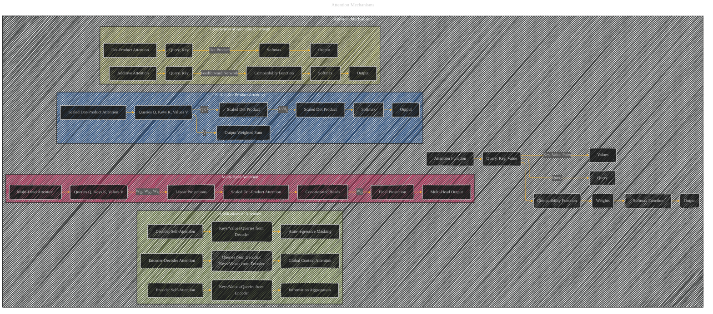

# Attention Mechanisms
> **Disclaimer:**
>
> This document contains my personal notes on the topic,
> compiled from publicly available documentation and various cited sources.
> The materials are intended for educational purposes, personal study, and reference.
> The content is dual-licensed:
> 1. **MIT License:** Applies to all code implementations (Swift, Mermaid, and other programming languages).
> 2. **Creative Commons Attribution 4.0 International License (CC BY 4.0):** Applies to all non-code content, including text, explanations, diagrams, and illustrations.
---

----

### Explanation

*   **Overall Structure:** The main subgraph "Attention Mechanisms" now encompasses various types and aspects of attention.
*   **Scaled Dot-Product Attention:** This section is clearly depicted as a subgraph, illustrating the core components: Queries, Keys, Values, scaled dot product, and softmax.  Critically, it highlights the scaling factor 1/√dk.
*   **Multi-Head Attention:**  A subgraph dedicated to multi-head attention, emphasizing the parallel processing of multiple attention heads through linear projections (WQ, WK, WV) and concatenation.  The final projection (WO) is also shown.
*   **Comparison of Attention Functions:** A subgraph that contrasts scaled dot-product attention with additive attention, highlighting the computational benefits of the dot-product approach (speed and space efficiency).
*   **Applications of Attention:** This crucial section is now clearly visualized, with subgraphs for encoder-decoder attention, encoder self-attention, and decoder self-attention, showing how attention is used in different parts of the Transformer architecture, including auto-regressive masking in the decoder.

---
**Licenses:**

- **MIT License:**   - Full text in [LICENSE](LICENSE) file.
- **Creative Commons Attribution 4.0 International:**  - Legal details in [LICENSE-CC-BY](LICENSE-CC-BY) and at [Creative Commons official site](http://creativecommons.org/licenses/by/4.0/).

---