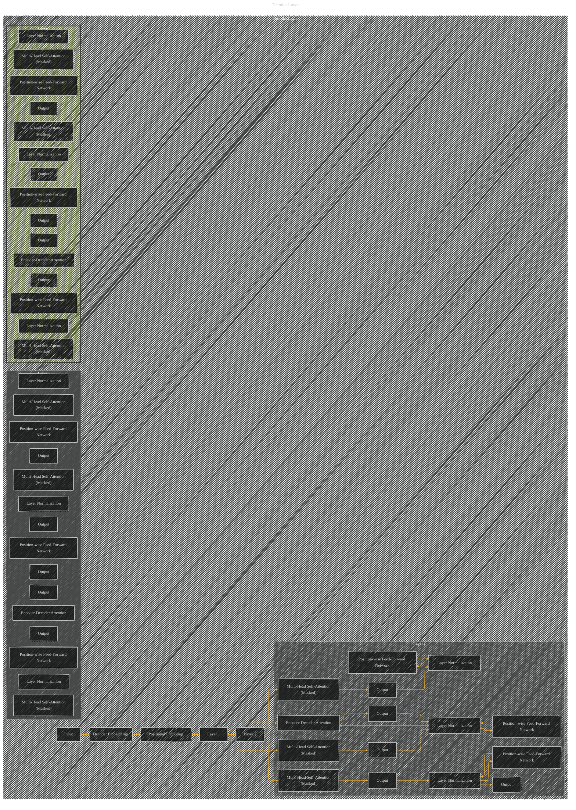

# Decoder Layer
> **Disclaimer:**
>
> This document contains my personal notes on the topic,
> compiled from publicly available documentation and various cited sources.
> The materials are intended for educational purposes, personal study, and reference.
> The content is dual-licensed:
> 1. **MIT License:** Applies to all code implementations (Swift, Mermaid, and other programming languages).
> 2. **Creative Commons Attribution 4.0 International License (CC BY 4.0):** Applies to all non-code content, including text, explanations, diagrams, and illustrations.
---

Note: FIX_ME_LATER

----

### Explanation

*   **Input:** The input to the decoder layer is the output of the previous layer in the decoder stack (or the initial input embeddings if it's the first layer).
*   **Positional Encodings:** As in the encoder, positional encodings are added to the decoder embeddings for positional information.
*   **Multi-Head Self-Attention (Masked):** Critically, the self-attention in the decoder is masked.  The `Masked` label signifies that connections to *future* positions in the output sequence are blocked (i.e., positions to the right).  This is essential to preserve the auto-regressive nature of the decoder.  This is *very* important, and often missed in visualizations.
*   **Encoder-Decoder Attention:** This attention mechanism allows the decoder to attend to the output of the entire encoder stack.
*   **Position-wise Feed-Forward Network:** The same structure as in the encoder.
*   **Layer Normalization:**  Applied after each sub-layer.
*   **Repeated Layers (Ellipsis):**  The `...` indicates that identical layers are repeated for each decoder layer.  The key takeaway here is that the layers are functionally equivalent.

---
**Licenses:**

- **MIT License:**   - Full text in [LICENSE](LICENSE) file.
- **Creative Commons Attribution 4.0 International:**  - Legal details in [LICENSE-CC-BY](LICENSE-CC-BY) and at [Creative Commons official site](http://creativecommons.org/licenses/by/4.0/).

---