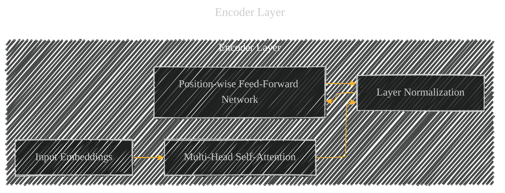

# Encoder Layer
> **Disclaimer:**
>
> This document contains my personal notes on the topic,
> compiled from publicly available documentation and various cited sources.
> The materials are intended for educational purposes, personal study, and reference.
> The content is dual-licensed:
> 1. **MIT License:** Applies to all code implementations (Swift, Mermaid, and other programming languages).
> 2. **Creative Commons Attribution 4.0 International License (CC BY 4.0):** Applies to all non-code content, including text, explanations, diagrams, and illustrations.
---

---

### Explanation and Context

This diagram specifically represents the structure of a single encoder layer within the Transformer architecture.  The original source text describes each layer having two sub-layers: multi-head self-attention and a position-wise feed-forward network.

*   **Input Embeddings (A):**  These represent the input sequence elements (e.g., words) embedded into a vector space.  They're the starting point for processing within the encoder layer.

*   **Multi-Head Self-Attention (B):** This component allows each position in the input sequence to attend to all other positions within the same sequence.  This is crucial for capturing dependencies and relationships between different parts of the input.

*   **Layer Normalization (C):** A normalization layer applied after the self-attention sub-layer. This stabilizes the training process and improves the model's ability to learn complex patterns.

*   **Position-wise Feed-Forward Network (D):** This is a fully connected feed-forward network applied separately and identically to each position in the input sequence. It allows the model to learn complex, position-independent transformations on the input representations.  It's another crucial component for capturing higher-level features.

The arrow connecting D back to C signifies that the output of the feed-forward network is also normalized.  This structure is repeated `N` times (as specified in the original paper) within the encoder stack.  The arrows in the subgraph visually represent the flow of information between these components.

---
**Licenses:**

- **MIT License:**   - Full text in [LICENSE](LICENSE) file.
- **Creative Commons Attribution 4.0 International:**  - Legal details in [LICENSE-CC-BY](LICENSE-CC-BY) and at [Creative Commons official site](http://creativecommons.org/licenses/by/4.0/).

---