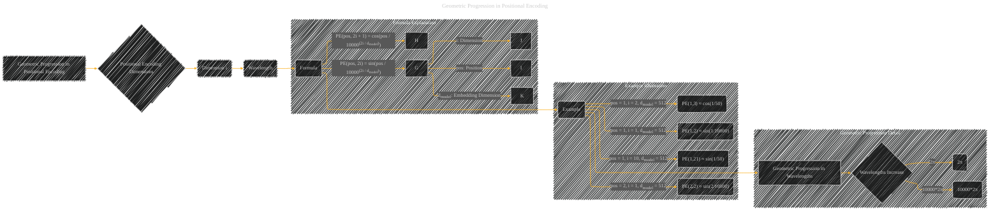

# Geometric Progression
> **Disclaimer:**
>
> This document contains my personal notes on the topic,
> compiled from publicly available documentation and various cited sources.
> The materials are intended for educational purposes, personal study, and reference.
> The content is dual-licensed:
> 1. **MIT License:** Applies to all code implementations (Swift, Mermaid, and other programming languages).
> 2. **Creative Commons Attribution 4.0 International License (CC BY 4.0):** Applies to all non-code content, including text, explanations, diagrams, and illustrations.
---

The diagram below clarifies the mathematical construction of the positional encoding scheme. The geometric progression of wavelengths is a key factor that helps the model distinguish different positions in the input sequence.  Critically, it explains how different dimensions of the positional encoding correspond to different frequencies, which are crucial to the model's ability to learn relationships between positions.

----

### Explanation 

* **Clear Node Labels:** Each node represents a specific element in the geometric progression formula and concept.
* **Formula Explanation Subgraph:** This section focuses on the formula itself, explaining the variables (pos, i, dmodel) and their roles in the calculation of positional encodings.
* **Example Illustration Subgraph:**  Illustrates how different values for position (pos), dimension (i), and embedding dimension (dmodel) lead to different sine/cosine values.
* **Geometric Progression Detail Subgraph:**  Focuses on the geometric progression aspect of the wavelengths.  The wavelength is increasing exponentially, allowing the model to distinguish different positions.
* **Connections:** Arrows show the relationships between the concepts.

---
**Licenses:**

- **MIT License:**   - Full text in [LICENSE](LICENSE) file.
- **Creative Commons Attribution 4.0 International:**  - Legal details in [LICENSE-CC-BY](LICENSE-CC-BY) and at [Creative Commons official site](http://creativecommons.org/licenses/by/4.0/).

---