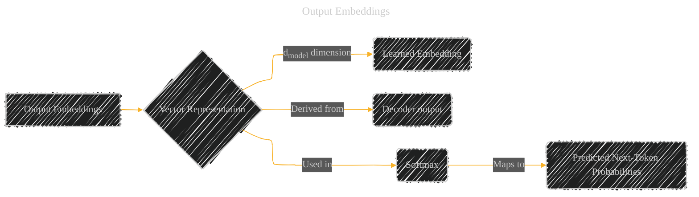

# Output Embeddings
> **Disclaimer:**
>
> This document contains my personal notes on the topic,
> compiled from publicly available documentation and various cited sources.
> The materials are intended for educational purposes, personal study, and reference.
> The content is dual-licensed:
> 1. **MIT License:** Applies to all code implementations (Swift, Mermaid, and other programming languages).
> 2. **Creative Commons Attribution 4.0 International License (CC BY 4.0):** Applies to all non-code content, including text, explanations, diagrams, and illustrations.
---

Below is a simplified diagram focuses on the core aspects of output embeddings. 

----

### Explanation

* **Output Embeddings (A):** These are the vector representations of the predicted output tokens.

* **Vector Representation (B):**  Each output embedding is a vector of a fixed dimension (dmodel), as learned during the training process.  The specific dimension is often 512, but can vary depending on the model configuration.

* **Learned Embedding (C):**  The values in the output embedding vector are learned during training of the model using the training data.  This learning process effectively represents the meaning and relationships of the output tokens.

* **Decoder output (D):** The output embeddings are derived from the final state of the decoder, which is the result of the various layers in the decoder stack, including the multi-head attention layers and feed-forward networks.

* **Softmax Layer (E):**  The output embeddings are then processed by a softmax layer.  This layer maps the vector representations into probabilities for each possible next token in the vocabulary.

* **Predicted Next-Token Probabilities (F):**  The result of the softmax layer is a distribution of probabilities across the vocabulary.  This distribution shows the model's confidence in predicting each possible next token in the sequence.

----

### Important Considerations

*   **Context:** Output embeddings are crucial for the model to generate the predicted output sequence.  They act as the intermediary step between the decoder's internal state and the final predicted probabilities.
*   **Shared Weights:** The paper often mentions shared weight matrices between embedding layers and the pre-softmax linear transformation. This is an optimization technique to reduce the number of parameters.

---
**Licenses:**

- **MIT License:**   - Full text in [LICENSE](LICENSE) file.
- **Creative Commons Attribution 4.0 International:**  - Legal details in [LICENSE-CC-BY](LICENSE-CC-BY) and at [Creative Commons official site](http://creativecommons.org/licenses/by/4.0/).

---