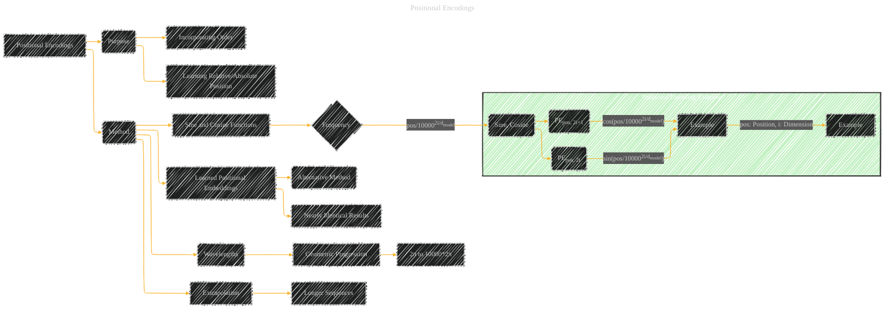

# Positional Encodings
> **Disclaimer:**
>
> This document contains my personal notes on the topic,
> compiled from publicly available documentation and various cited sources.
> The materials are intended for educational purposes, personal study, and reference.
> The content is dual-licensed:
> 1. **MIT License:** Applies to all code implementations (Swift, Mermaid, and other programming languages).
> 2. **Creative Commons Attribution 4.0 International License (CC BY 4.0):** Applies to all non-code content, including text, explanations, diagrams, and illustrations.
---

The diagram below captures the essence of the positional encoding scheme, emphasizing the key elements of the method and their relationships. It's vital to remember that this is a simplified visual representation. The actual implementation involves embedding vectors, summing them with positional encoding vectors, and applying this to the input sequences.

----

### Explanation

* **Purpose (B):**  Positional encodings are crucial because the Transformer architecture lacks recurrence and convolution.  They provide the model with information about the order and relative position of tokens in the input sequence.
* **Method (E):** The method used in the paper is a learned positional embedding based on sine and cosine functions of different frequencies.
* **Sine and Cosine Functions (F):** The positional encoding for each position and dimension (i) is calculated using sine and cosine functions.
* **Frequency (G):** The frequency of the sinusoid in each dimension increases in a geometric progression, creating unique encoding for different positions.
* **Positional Encoding Example (Subgraph):**  This subgraph illustrates the calculation for PEpos, 2i and PEpos, 2i+1.  It shows that the position and dimension (i) are input parameters, and the calculated PE values are outputs.
* **Learned Positional Embeddings (M):** This provides an alternative method that learned position embeddings directly instead of using sinusoids.
* **Wavelengths (P):** The wavelengths form a geometric progression.
* **Extrapolation (S):**  The use of sine/cosine allows the model to potentially extrapolate to sequence lengths beyond those seen during training.

---
**Licenses:**

- **MIT License:**   - Full text in [LICENSE](LICENSE) file.
- **Creative Commons Attribution 4.0 International:**  - Legal details in [LICENSE-CC-BY](LICENSE-CC-BY) and at [Creative Commons official site](http://creativecommons.org/licenses/by/4.0/).

---