# Softmax Layer
> **Disclaimer:**
>
> This document contains my personal notes on the topic,
> compiled from publicly available documentation and various cited sources.
> The materials are intended for educational purposes, personal study, and reference.
> The content is dual-licensed:
> 1. **MIT License:** Applies to all code implementations (Swift, Mermaid, and other programming languages).
> 2. **Creative Commons Attribution 4.0 International License (CC BY 4.0):** Applies to all non-code content, including text, explanations, diagrams, and illustrations.
---

The diagram below illustrates the calculation steps involved in the softmax layer, emphasizing the normalization aspect and the exponentiation of input values. 

```mermaid
---
title: Softmax Layer
config:
  layout: elk
  look: handDrawn
  theme: dark
---
%%{
  init: {
    'fontFamily': 'verdana',
    'themeVariables': {
      'primaryColor': '#BB2528',
      'primaryTextColor': '#f529',
      'primaryBorderColor': '#7C0000',
      'lineColor': '#F8B229',
      'secondaryColor': '#006100',
      'tertiaryColor': '#fff'
    }
  }
}%%
graph LR
    A["Softmax Layer"] --> B{Input}
    B -- (d<sub>model</sub>-dimensional vector) --> C(z<sub>1</sub>, z<sub>2</sub>, ..., z<sub>n</sub>)
    C --> D[e<sup>z<sub>1</sub></sup>, e<sup>z<sub>2</sub></sup>, ..., e<sup>z<sub>n</sub></sup>]
    D --> E["Sum(e<sup>z<sub>1</sub></sup>, e<sup>z<sub>2</sub></sup>, ..., e<sup>z<sub>n</sub></sup>) = S"]
    E --> F[Output]
    F -- p<sub>1</sub>, p<sub>2</sub>, ..., p<sub>n</sub> --> G(Probabilities)
    F -- (Σp<sub>i</sub> = 1) --> H(Normalized Probabilities)
    
    style A fill:#f9f5,stroke:#333,stroke-width:2px;

```

---

### Explanation

* **Input (B):** The input to the softmax layer is a vector of `dmodel` dimensions, representing the output of the previous layer in the decoder.  This is often the result of a linear transformation.  The vector is labeled as 'z1', 'z2', ..., 'zn' to represent the individual values.

* **Exponentiation (D):**  Each element `zi` in the input vector is individually exponentiated (ezi). This ensures all values are positive, which is important for the subsequent calculation.

* **Summation (E):** All the exponentiated values are summed together, resulting in a single scalar value 'S'.

* **Output (F):** The output of the softmax layer is a vector of `dmodel` probabilities ('p1', 'p2', ..., 'pn').  Each probability `pi` is calculated as `pi = ezi / S`.

* **Normalization (H):** The key property of the softmax function is that it normalizes the output probabilities such that their sum equals 1. This is a crucial characteristic for representing probabilities in machine learning models.

---
**Licenses:**

- **MIT License:**   - Full text in [LICENSE](LICENSE) file.
- **Creative Commons Attribution 4.0 International:**  - Legal details in [LICENSE-CC-BY](LICENSE-CC-BY) and at [Creative Commons official site](http://creativecommons.org/licenses/by/4.0/).

---