```mermaid
---
title: Transformer Architecture
config:
  layout: elk
  look: handDrawn
  theme: dark
---
%%{
  init: {
    'fontFamily': 'verdana',
    'themeVariables': {
      'primaryColor': '#BB2528',
      'primaryTextColor': '#f529',
      'primaryBorderColor': '#7C0000',
      'lineColor': '#F8B229',
      'secondaryColor': '#006100',
      'tertiaryColor': '#fff'
    }
  }
}%%
graph LR
    subgraph Transformer_Architecture["Transformer Architecture"]
    style Transformer_Architecture fill:#11c2,stroke:#333,stroke-width:2px
        A["Input Sequence<br>(x<sub>1</sub>, ..., x<sub>n</sub>)"] --> B{"Input Embeddings (x<sub>i</sub>)"}
        B --> C["Positional Encoding<br>(PE<sub>i</sub>)"]
        C --> D["Encoder Stack<br>(N layers)"]
        
        subgraph Encoder_Layer["Encoder Layer"]
        style Encoder_Layer fill:#2ff4,stroke:#333,stroke-width:2px
            E["Multi-Head Self-Attention<br>(Attention(Q, K, V))"] --> F("Attention Output")
            F --> G["Layer Normalization<br>(LayerNorm)"]
            G --> H["Residual Connection<br>(x + Sublayer(x))"]
            H --> I["Position-wise Feed-Forward Network (FFN)"]
            I --> G
        end
        
        D --> J["Decoder Stack<br>(N layers)"]
        
        subgraph Decoder_Layer["Decoder Layer"]
        style Decoder_Layer fill:#cc24,stroke:#333,stroke-width:2px
            K["Multi-Head Self-Attention<br>(Masked Attention(Q, K, V))"] --> L[Attention Output]
            L --> M["Layer Normalization<br>(LayerNorm)"]
            M --> N["Residual Connection<br>(x + Sublayer(x))"]
            N --> O["Position-wise Feed-Forward Network<br>(FFN)"]
            O --> M
            M --> P["Encoder-Decoder Attention<br>(Attention(Q, K, V))"]
            P --> M
        end

        J --> Q["Output Sequence<br>(y<sub>1</sub>, ..., y<sub>m</sub>)"]
        D --> R["Encoder Output<br>(z<sub>1</sub>, ..., z<sub>n</sub>)"]
        R --> P
        Q --> S["Output Embeddings<br>(y<sub>i</sub>)"]
        S --> T[Softmax Layer]
    end
    
```

# Transformer Architecture
> **Disclaimer:**
>
> This document contains my personal notes on the topic,
> compiled from publicly available documentation and various cited sources.
> The materials are intended for educational purposes, personal study, and reference.
> The content is dual-licensed:
> 1. **MIT License:** Applies to all code implementations (Swift, Mermaid, and other programming languages).
> 2. **Creative Commons Attribution 4.0 International License (CC BY 4.0):** Applies to all non-code content, including text, explanations, diagrams, and illustrations.
---

---

### Explanation with Reference to the Original Source

* **Input Sequence (x1, ..., xn):**  The input to the Transformer is a sequence of tokens, represented as indices.
* **Input Embeddings (xi):** Learned embeddings convert these indices into vector representations.
* **Positional Encoding (PEi):** A crucial component; this adds information about the position of each token in the sequence. The original paper describes a sinusoidal positional encoding.
* **Encoder Stack (N layers):**  A stack of identical layers. Each layer contains two sub-layers.
    * **Multi-Head Self-Attention:**  The model attends to different parts of the input sequence to understand the relationships between them.
    * **Position-wise Feed-Forward Network (FFN):**  A fully connected feed-forward network that processes each position independently.  The original paper states that it consists of two linear transformations with a ReLU activation in between.
    * **Layer Normalization (LayerNorm):** Normalizes the output of each sub-layer to improve training stability.
    * **Residual Connection (x + Sublayer(x)):**  This allows the model to learn more complex features and avoid vanishing gradients.
* **Decoder Stack (N layers):** Similar to the encoder, but with an extra sub-layer.
    * **Multi-Head Self-Attention (Masked):**  Similar to the encoder's self-attention but with a mask to prevent attending to future tokens in the output sequence (crucial for auto-regressive generation).
    * **Encoder-Decoder Attention:** This mechanism allows the decoder to attend to the entire input sequence (z1, ..., zn) when generating each output token (yi).
* **Output Sequence (y1, ..., ym):** The generated output sequence.
* **Output Embeddings (yi):**  Vector representations of the predicted output tokens.
* **Softmax Layer:** Converts output embeddings into probabilities for each possible output token at each step.

---
**Licenses:**

- **MIT License:**   - Full text in [LICENSE](LICENSE) file.
- **Creative Commons Attribution 4.0 International:**  - Legal details in [LICENSE-CC-BY](LICENSE-CC-BY) and at [Creative Commons official site](http://creativecommons.org/licenses/by/4.0/).

---