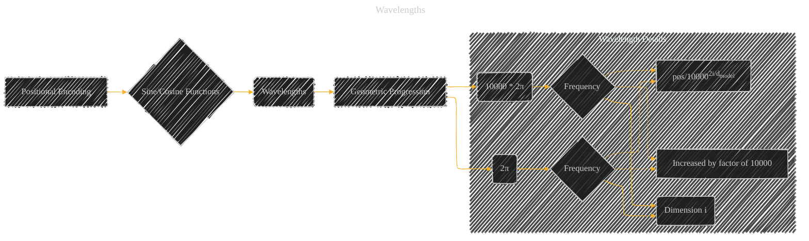

# Wavelength
> **Disclaimer:**
>
> This document contains my personal notes on the topic,
> compiled from publicly available documentation and various cited sources.
> The materials are intended for educational purposes, personal study, and reference.
> The content is dual-licensed:
> 1. **MIT License:** Applies to all code implementations (Swift, Mermaid, and other programming languages).
> 2. **Creative Commons Attribution 4.0 International License (CC BY 4.0):** Applies to all non-code content, including text, explanations, diagrams, and illustrations.
---

The diagram below visually summarizes the crucial aspect of wavelength in the Transformer's positional encoding:  a carefully chosen geometric progression of frequencies to encode both absolute and relative positions in the sequence.

----

### Explanation

The positional encoding in the Transformer uses sine and cosine functions with a specific pattern of increasing frequencies.  The diagram represents this as follows:

* **Positional Encoding:**  The starting point; it's the overall concept requiring positional information.
* **Sine/Cosine Functions:**  The mechanism used to embed positional information.
* **Wavelengths (Geometric Progression):**  The key characteristic highlighted; the frequencies of the sinusoids form a geometric progression.
* **2π, 10000 * 2π:**  These are the lower and upper bounds of the wavelengths, marking the beginning and end of the progression.
* **Frequency (Increased by Factor of 10000):** The diagram emphasizes that the frequency of the sine/cosine function in each dimension (i) increases exponentially.  This is crucial for the model to distinguish different positions in the sequence.
* **Dimension i:**  Each dimension of the positional encoding corresponds to a different frequency/wavelength.
* **Formula (pos/100002i/dmodel):** The formula for calculating the argument (angle) of the sine and cosine functions in each dimension (i) shows the geometric progression.  The `pos` represents the position of the token. `i` is the current dimension, and `dmodel` is the embedding dimension.

---
**Licenses:**

- **MIT License:**   - Full text in [LICENSE](LICENSE) file.
- **Creative Commons Attribution 4.0 International:**  - Legal details in [LICENSE-CC-BY](LICENSE-CC-BY) and at [Creative Commons official site](http://creativecommons.org/licenses/by/4.0/).

---