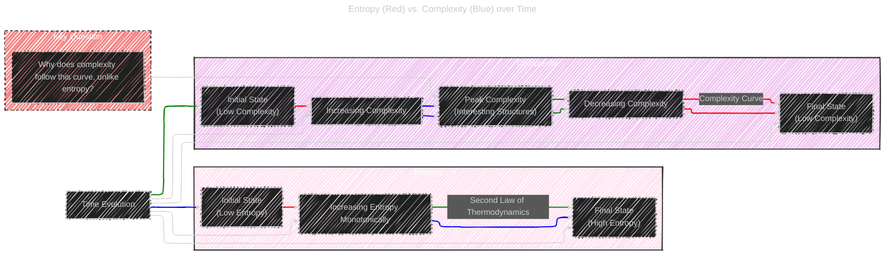
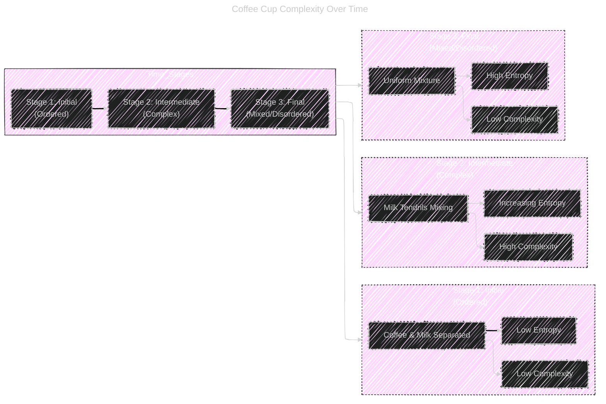

# The First Law of Complexodynamics
> This content is dual-licensed under your choice of the following licenses:
> 1.  **MIT License:** For the code implementations in Swift and Mermaid provided in this document.
> 2.  **Creative Commons Attribution 4.0 International License (CC BY 4.0):** For all other content, including the text, explanations, and the Mermaid diagrams and illustrations.

---

## 1. The Paradox: Entropy vs. Complexity

The blog post starts by highlighting a paradox related to the Second Law of Thermodynamics and our intuitive understanding of complexity.

### Diagram 1: Entropy and Complexity over Time

#### Explanation

*   **Entropy (Red Line):** Starts low and increases continuously over time, as dictated by the Second Law of Thermodynamics.
*   **Complexity (Blue Line):** Starts low, increases to a peak at an intermediate stage (where "interesting structures" emerge), and then decreases back to a low level in the final, equilibrium state.
*   **Key Question:** The central puzzle is to explain this non-monotonic behavior of complexity in contrast to entropy.

---

# 2. The Coffee Cup Analogy

Sean Carroll illustrated this concept with the coffee cup example, showing milk mixing into coffee over time.

## Diagram 2: Coffee Cup Complexity Evolution

### Explanation

*   **Stage 1 (Initial):** Coffee and milk are separate - ordered, low entropy, low complexity.
*   **Stage 2 (Intermediate):** Milk starts mixing, forming intricate tendrils - increasing entropy, high complexity (visually interesting).
*   **Stage 3 (Final):** Uniform mixture of coffee and milk - high entropy, low complexity (homogeneous, less interesting).

---
**Licenses:**

- **MIT License:**   - Full text in [LICENSE](LICENSE) file.
- **Creative Commons Attribution 4.0 International:**  - Legal details in [LICENSE-CC-BY](LICENSE-CC-BY) and at [Creative Commons official site](http://creativecommons.org/licenses/by/4.0/).

---