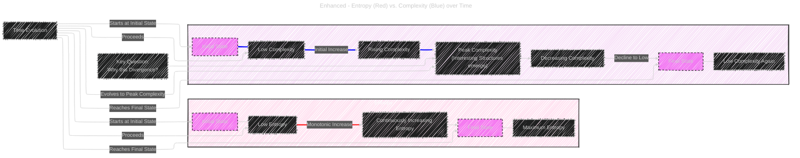

# The First Law of Complexodynamics
> This content is dual-licensed under your choice of the following licenses:
> 1.  **MIT License:** For the code implementations in Swift and Mermaid provided in this document.
> 2.  **Creative Commons Attribution 4.0 International License (CC BY 4.0):** For all other content, including the text, explanations, and the Mermaid diagrams and illustrations.

---

Below is the 2nd version of [this documentation](/Ilya_Sutskever_Readings/The_First_Law_of_Complexodynamics/The_First_Law_of_Complexodynamics_V1.md).

## 1. The Paradox: Entropy vs. Complexity

The blog post starts by highlighting a paradox related to the Second Law of Thermodynamics and our intuitive understanding of complexity.

### Diagram 1: Entropy and Complexity over Time



#### Explanation

*   **Entropy (Red Line):** Starts low and increases continuously over time, as dictated by the Second Law of Thermodynamics.
*   **Complexity (Blue Line):** Starts low, increases to a peak at an intermediate stage (where "interesting structures" emerge), and then decreases back to a low level in the final, equilibrium state.
*   **Key Question:** The central puzzle is to explain this non-monotonic behavior of complexity in contrast to entropy.

---

## 2. The Coffee Cup Analogy

Sean Carroll illustrated this concept with the coffee cup example, showing milk mixing into coffee over time.

### Diagram 2: Coffee Cup Complexity Evolution

```mermaid
CHANGE_ME

```

#### Explanation

*   **Stage 1 (Initial):** Coffee and milk are separate - ordered, low entropy, low complexity.
*   **Stage 2 (Intermediate):** Milk starts mixing, forming intricate tendrils - increasing entropy, high complexity (visually interesting).
*   **Stage 3 (Final):** Uniform mixture of coffee and milk - high entropy, low complexity (homogeneous, less interesting).


## 3. Kolmogorov Complexity and Entropy

The blog post discusses using Kolmogorov Complexity to formalize these ideas.

### Diagram 3: Kolmogorov Complexity (KC) as Entropy?

```mermaid
CHANGE_ME

```

#### Explanation

*   **Kolmogorov Complexity (KC):** Defined as the length of the shortest program to describe a string.  It’s considered a measure of randomness and information content.
*   **Initial Thought:**  Could KC be used as a formal measure of entropy?
*   **Problem with Deterministic Systems:** In deterministic systems, the state at time `t` can be described by the initial state and `t`. This means KC only increases logarithmically with time (`log(t)`), which is too slow to represent the expected linear/polynomial increase in entropy.
*   **Solutions:**
    *   **Probabilistic Systems:** KC can increase more rapidly in probabilistic systems.
    *   **Resource-Bounded KC:**  Limit the computational resources (e.g., time) for the program. This forces program size to increase more significantly with time, better reflecting entropy.


## 4. Sophistication: Capturing "Interesting" Complexity

To capture the "interesting" complexity, the blog post introduces the concept of "sophistication."

### Diagram 4: Definition of Sophistication

```mermaid
---
CHANGE_ME
```

#### Explanation

*   **Sophistication (Soph(x)) Goal:** To formalize a measure of "interesting" complexity, differentiating it from simple randomness.
*   **Definition:**  Find the smallest program size `K(S)` for a set `S` that satisfies two conditions:
    1.  `x` must be a member of `S`.
    2.  The conditional Kolmogorov Complexity of `x` given `S` (`K(x|S)`) must be close to the information content expected for a random element of `S` (at least `log<sub>2</sub>(|S|) - c`). This means knowing `S` essentially captures all the "non-random" information about `x`.
*   **Intuition:** Sophistication is the length of the shortest description of a set where `x` appears to be a typical, "random" member.
*   **Properties:**
    *   Low for strings with simply describable structures (low KC).
    *   Low for uniformly random strings (describable as "random n-bit string").
    *   Potentially high for strings that are neither simple nor completely random – the "interesting" cases.


---

## 5. Resource-Bounded Complextropy: Addressing Time Evolution

Sophistication, as initially defined, still has issues when applied to systems evolving over time.  The solution proposed is **Resource-Bounded Complextropy**.

### Diagram 5: Resource-Bounded Complextropy

```mermaid
CHANGE_ME
```

#### Explanation

*   **Problem with Sophistication over Time:** Similar to the issue with Kolmogorov Complexity and deterministic systems, sophistication alone might not capture the complexity changes in evolving systems effectively. Sophistication might also be limited by `log(t) + C`.
*   **Resource-Bounded Complextropy Definition:** Define complextropy using resource-bounded computation in two key places:
    1.  **Efficient Sampling:** The program to describe `S` must run within a given time limit (e.g., `n log(n)`). It outputs a near-uniform sample from `S`.
    2.  **Inefficient Reconstruction (given S sample):**  Any program that tries to reconstruct `x` within the same resource bound, given access to samples from `S`, must still be complex (at least  `log<sub>2</sub>(|S|) - c` bits).
*   **Dual Efficiency Constraints:**  It's crucial to have efficiency constraints on *both* the sampling algorithm (for defining S) and the reconstruction algorithm (for recovering x from S). This dual constraint is the key innovation to capture the desired "complextropy" behavior.

---


## 6. Conjecture and Proposed Experiment: "First Law of Complexodynamics"

The blog post conjectures that this Resource-Bounded Complextropy will exhibit the desired "small-large-small" behavior over time.

### Diagram 6: "First Law of Complexodynamics" Conjecture

```mermaid
CHANGE_ME
```


#### Explanation

*   **Conjecture:**  Resource-Bounded Complextropy is conjectured to behave as Sean Carroll described for complexity – low initially, high at intermediate stages, and low again in equilibrium. This is termed the "First Law of Complexodynamics."
*   **Proposed Experiment: Discrete Coffee Cup:** Simulate a 2D grid representing coffee and milk. Start with separated regions and apply random mixing over time.
*   **Expected Outcome:** Plot the complextropy (or an approximation like gzip compression size) over time.  Expect to see the "small-large-small" curve, supporting the conjecture.
*   **Challenges:**
    *   Complextropy is likely computationally intractable.
    *   Use approximations (like gzip compression) as a practical substitute for empirical investigation.
    *   Focus on empirical validation by plotting the approximate complextropy in simulations.

---

## 7. Summary Diagram: The Flow of Ideas

### Diagram 7:  Overall Conceptual Flow

```mermaid
CHANGE_ME
```

#### Explanation

*   This diagram provides a bird's-eye view of the entire blog post's argument, showing the logical flow and connections between different concepts.
*   It starts with the initial question, moves through the challenges and proposed solutions, and ends with the conjecture and open problems.


---


**Licenses:**

- **MIT License:**  [](LICENSE) - Full text in [LICENSE](LICENSE) file.
- **Creative Commons Attribution 4.0 International:** [](LICENSE-CC-BY) - Legal details in [LICENSE-CC-BY](LICENSE-CC-BY) and at [Creative Commons official site](http://creativecommons.org/licenses/by/4.0/).

---