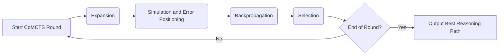

# Collective Monte Carlo Tree Search (CoMCTS) Algorithm
> This content is dual-licensed under your choice of the following licenses:
> 1.  **MIT License:** For the code implementations in Swift and Mermaid provided in this document.
> 2.  **Creative Commons Attribution 4.0 International License (CC BY 4.0):** For all other content, including the text, explanations, and the Mermaid diagrams and illustrations.

---

The core idea of CoMCTS is to leverage collective knowledge from multiple Multimodal Large Language Models (MLLMs) to collaboratively conjecture, search, and identify effective reasoning paths that lead to correct answers. It performs this iteratively.

**Input:**

*   A set of policy models from multiple MLLMs: $\{\pi_1, \pi_2, ..., \pi_K\}$
*   A multimodal question $Q = (I, T)$, where $I$ is the input (e.g., image), and $T$ is the text task instruction.

**Output:**

*   The most promising reasoning path towards the final answer.

The CoMCTS algorithm operates in rounds, with each round comprising four key operations:

## 1. Expansion

The goal of Expansion is to expand the current reasoning path by integrating new reasoning nodes.

*   **Operation:** When the current node in the search tree is a leaf node (i.e., not a terminal node), CoMCTS integrates new reasoning steps. Given the current leaf node $s_m$, the node selected for expansion, a group of MLLMs $\{\pi_1, \pi_2, ..., \pi_K\}$ is prompted in parallel to generate candidate reasoning steps.
*   **Collective Complementarity:** The candidate reasoning steps from all MLLMs are combined to form the candidate set $\mathcal{S}_{\text{candidate}}$:

    $$
    \mathcal{S}_{\text{candidate}} = \bigcup_{k=1}^{K} \mathcal{S}_{\text{candidate}}^k
    $$

    where $\mathcal{S}_{\text{candidate}}^k = \{s' | \pi_k(s_m) \xrightarrow{\text{generate}} s' \}$. Here, $\pi_k(s_m)$ denotes a reasoning node generation request using the prompt $p_{\text{eval}}$.
*   **Thresholding:**  To evaluate the candidate reasoning node $s'$, a threshold $\tau$ is used to filter out automatically discontinued reasoning nodes due to error removal (explained later in Simulation and Error Positioning).

## 2. Simulation and Error Positioning

This operation aims to estimate the value of candidate reasoning paths and identify erroneous reasoning nodes.

*   **Operation:** CoMCTS utilizes collective knowledge from multiple MLLMs to jointly evaluate the potential value of child nodes. It assigns scores to candidate reasoning nodes and prunes those with low scores as erroneous.
*   **Scoring Function:** The score for a candidate reasoning node $s'$ is calculated as:

    $$
    r(s') = \frac{1}{K} \sum_{k=1}^{K} I(\text{prompt}_{\text{eval}}, Q, \text{Parent}(s'), s')
    $$

    where $I(\cdot)$ is an indicator function that evaluates whether the MLLM considers the reasoning step $s'$ as valid given the question $Q$ and the parent reasoning step.
*   **Error Positioning:**  Reasoning nodes with low scores are considered potentially erroneous and may be removed from further consideration.

## 3. Backpropagation

After the Simulation and Error Positioning step, the results are propagated back up the search tree.

*   **Operation:** The newly generated tree is evaluated, and the statistics are updated from the newly expanded parts back to the root node. Each node $s$ along the reasoning path stores the number of visits $N(s)$ and the value $V(s)$.
*   **Update Rules:**

    $$
    N(s) \leftarrow N(s) + \sum_{s' \in \text{Children}(s)} N(s')
    $$

    $$
    V(s) \leftarrow V(s) + r(S_{\text{best}})
    $$

    where $\text{Children}(s)$ represents all the child nodes of $s$, and  $r(S_{\text{best}})$ is the reward (e.g., correctness of the final answer) obtained from the best reasoning path through the children of $s$.

## 4. Selection

Selection determines which node to explore further in the next iteration based on the tree's statistics.

*   **Operation:** Following operations (a), (b), and (c), CoMCTS traverses the search tree to select the next node for broadening exploration. This selection is guided by the Upper Confidence Bound (UCB) value, which balances exploration and exploitation.
*   **UCB Value:** The UCB value for a node $s'$ is calculated as:

    $$
    \text{UCB}(s') = V(s') + c \cdot \sqrt{\frac{\log N(s)}{N(s')}}
    $$

    where:
    *   $V(s')$ is the estimated value of node $s'$.
    *   $N(s)$ is the number of times the parent of $s'$ has been visited.
    *   $N(s')$ is the number of times node $s'$ has been visited.
    *   $c$ is a constant that controls the level of exploration.
*   **Next Node Selection:** Among the candidate nodes in $\mathcal{S}_{\text{candidate}}$, the one with the highest UCB value is chosen as the starting node $s_m$ for the next iteration.

$$
s_m = \arg \max_{s' \in \mathcal{S}_{\text{candidate}}} \left( V(s') + c \cdot \sqrt{\frac{\log N(s)}{N(s')}} \right)
$$

---

# CoMCTS for Reflective Reasoning

CoMCTS is extended for reflective reasoning by incorporating mechanisms to identify and integrate negative sibling nodes into effective reasoning paths to build the reflective reasoning path.

*   **Identifying Negative Sibling Node:** Given the effective reasoning path for step $m-1$, the negative sibling node $s_{\text{neg}}$ for reasoning node $s_m$ is identified using UCB values of siblings:
$$
s_{\text{neg}} = \arg \max_{s_{\text{sibling}} \in \text{Sibling}(s_m)} \text{UCB}(s_{\text{sibling}})
$$

    where $\text{Sibling}(s_m)$ returns all sibling nodes at the same level under the same parent node as $s_m$.
*   **Constructing Reflective Reasoning Path:** A reflective reasoning node $y_{\text{reflect}}$ is constructed with information from the effective reasoning step and its negative counterpart:

    $$
    y_{\text{reflect}} = \text{Replace}(Y, \{s_{\text{neg}}, \text{prompt}_{\text{reflect}}\}, s_m)
    $$

    where $\text{Replace}(\cdot)$ denotes the operation of replacing the previous incorrect step with the correct one.
*   **Reflective Data Tuple:**  The reflective reasoning information is integrated into a data tuple for training: $(Q, Y, y_{\text{reflect}})$.

---

# Algorithm 1: Training Mulberry with CoMCTS

The paper describes how CoMCTS is used to train the Mulberry model.

**Input:**

*   A set of policy models $\{\pi_1, \pi_2, ..., \pi_K\}$ initialized by pre-trained MLLMs.
*   A Multimodal Question Answering dataset $\mathcal{D}_Q$.

**Procedure:**

1. **Reasoning Tree Search:**
    *   For each question $(Q, Y, S)$ in $\mathcal{D}_Q$:
        *   Perform CoMCTS tree search from $S$ to find $Y_{\text{reflect}}$.

2. **Model Training with CoMCTS Reasoning Trees:**
    *   For $k = 1$ to $K$:
        *   For each question $(Q, Y, S)$ in $\mathcal{D}$:
            *   If CoMCTS found an effective reasoning path then:
                *   Model training with CoMCTS Reasoning Trees:
                    *   For $(Q, Y_{\text{reflect}}, S) \in \mathcal{D}$:
                        *   Optimize $\pi_k$ via $\mathcal{L}_{\text{CoSFT}}(\pi_k)$ and $\mathcal{L}_{\text{CoSFT\_Reflect}}(\pi_k)$.

**Output:**

*   Trained policy models $\{\pi_1, \pi_2, ..., \pi_K\}$.

---

# Loss Functions

The training process involves two main loss functions:

*   **Cooperative Step-by-Step Fine-Tuning Loss ($\mathcal{L}_{\text{CoSFT}}$):** This loss maximizes the log probability of the effective reasoning path given the question:

    $$
    \mathcal{L}_{\text{CoSFT}}(\pi_k) = - \mathbb{E}_{(Q, Y) \in \mathcal{D}} \left[ \log P(Y|Q) \right]
    $$

    where $Y = (s_1, s_2, ..., s_m)$ denotes the effective reasoning sequence.
*   **CoSFT for Reflective Reasoning Loss ($\mathcal{L}_{\text{CoSFT\_Reflect}}$):** This loss leverages the reflective reasoning data to calibrate negative reasoning paths:

    $$
    \mathcal{L}_{\text{CoSFT\_Reflect}}(\pi_k) = - \mathbb{E}_{(Q, Y, y_{\text{reflect}}) \in \mathcal{D}} \left[ \log P(Y_{\text{reflect}}|Q) \right]
    $$

    where $Y_{\text{reflect}}$ includes the additional step reflective reasoning path.

---
**Licenses:**

- **MIT License:**   - Full text in [LICENSE](LICENSE) file.
- **Creative Commons Attribution 4.0 International:**  - Legal details in [LICENSE-CC-BY](LICENSE-CC-BY) and at [Creative Commons official site](http://creativecommons.org/licenses/by/4.0/).

---