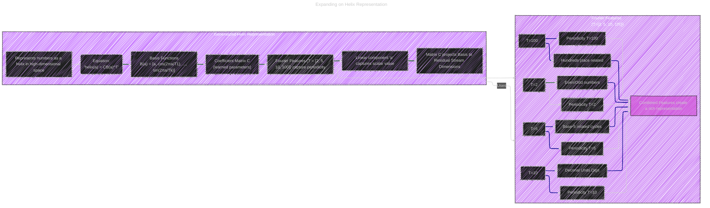

# Language Models Use Trigonometry to Do Addition
> This content is dual-licensed under your choice of the following licenses:
> 1.  **MIT License:** For the code implementations in Swift and Mermaid provided in this document.
> 2.  **Creative Commons Attribution 4.0 International License (CC BY 4.0):** For all other content, including the text, explanations, and the Mermaid diagrams and illustrations.

---

Below is a collection of Mermaid diagrams and illustrations aiming to systematically break down the complex white paper into digestible visual components, addressing different levels of detail and targeting various aspects of the research. 

While Mermaid has limitations for complex data visualizations, it's effective for illustrating conceptual flows, architectures, and relationships in a text-based format.

For actual publications, generating more sophisticated charts with plotting libraries would be essential to represent the quantitative data precisely.

----

# 1. The Core Concept: Clock Algorithm and Helix Representation

First, let's illustrate the central idea - the "Clock Algorithm" and "Helix Representation."

```mermaid
---
title: The Core Concept - Clock Algorithm and Helix Representation
config:
  layout: elk
  look: handDrawn
  theme: dark
---
flowchart LR
    HR1["Numbers a and b represented as Helices"];
    HR2("Mathematical Parameterization using Fourier features:<br>T=[2, 5, 10, 100]");
    HR3["Generalized Helix:<br>B(a) = C * [a, cos(2πa/T1), ..., sin(2πa/Tk)]^T"];
    HR4["Captures both Linear and Periodic Structure"];

    CA1["Step 1:<br>Embed a & b as Helices on tokens"];
    CA2["Step 2:<br>Attention Heads (Layers 9-14) Move Helices to Last Token"];
    CA3["Step 3:<br>MLPs (Layers 14-18) Manipulate Helices to Create helix(a + b)"];
    CA4["Step 4:<br>MLPs (Layers 19-27) & Attention Heads 'Read' helix(a + b) and Output to Logits"];
    CA5["Answer Logits for a + b"];

    subgraph Helix_Representation["Helix Representation of Numbers"]
    style Helix_Representation fill:#f399,stroke:#333,stroke-width:1px
        HR1 --> HR2
        HR2 --> HR3
        HR3 --> HR4
    end

    subgraph Clock_Algorithm ["Clock Algorithm for Addition<br>(a + b)"]
    style Clock_Algorithm fill:#e3e9,stroke:#333,stroke-width:1px
        CA1 --> CA2
        CA2 --> CA3
        CA3 --> CA4
        CA4 --> CA5
    end

    Helix_Representation --> Clock_Algorithm
    HR4 --> CA1

    linkStyle 0,5,6,7 stroke-width:2px,stroke:green;
    linkStyle 1,2,3,4 stroke-width:2px,stroke:blue;
    
```



## Explanation of Diagram 1

*   **Purpose:** To provide a high-level overview of the main concepts: Helix Representation and Clock Algorithm, and how they relate to each other in the LLM's addition process.
*   **Diagram Type:** Flowchart (using `flowchart LR`) to show a process flow and relationships.
*   **Helix Representation Subgraph:**  Details how numbers are encoded as helices, emphasizing the mathematical formulation using Fourier features (T=[2, 5, 10, 100]) and the generalized helix equation.  It highlights that this representation captures both linear and periodic properties of numbers.
*   **Clock Algorithm Subgraph:** Outlines the four key steps of the Clock Algorithm as proposed by the paper. It shows the progression from embedding helices to manipulating them via attention and MLPs to finally outputting the answer logits.
*   **Linking:** An arrow connects "Helix Representation" to "Clock Algorithm," indicating that the algorithm operates on the helical representations.
*   **Styling:** Subgraphs are used to visually group related concepts with distinct background colors.  Green links highlight the Helix representation, blue links the Clock Algorithm steps.
*   **Focus:** This diagram targets a beginner to intermediate audience, providing a conceptual framework before diving into details.


---

# 2. Expanding on Helix Representation

Let's detail the Helix Representation itself, focusing on the mathematical formulation:



## Explanation of Diagram 2

*   **Purpose:** To zoom in on the "Helix Representation," detailing its equation and the role of Fourier features.
*   **Diagram Type:** Graph (using `graph LR`) with subgraphs for "Generalized Helix" and "Fourier Features".
*   **Generalized Helix Subgraph:**  Breaks down the equation `helix(a) = CB(a)^T`, explaining each component: basis functions `B(a)`, coefficient matrix `C`, and how they combine to form the helix. It highlights that matrix C is learned and projects the basis to the residual stream space.
*   **Fourier Features Subgraph:**  Explains the significance of each Fourier feature period (T=2, 5, 10, 100), and how they contribute to capturing different periodicities in numbers (even/odd, base-related, decimal digits, etc.). It emphasizes that these features are combined for a richer numerical representation.
*   **Linking:** An arrow connects "Generalized Helix" to "Fourier Features," indicating the dependency and how Fourier Features are used within the Helix equation.
*   **Styling:** Different shades of green and blue are used to visually separate the two subgraphs. Darker green links highlight the Helix equation breakdown, darker blue links highlight the Fourier features explanation.
*   **Mathematical Focus:** Explicitly shows the equation and explains the mathematical components, catering to a more technical audience (students, researchers).

---

# 3. Clock Algorithm Steps in Detail

Now, let’s visualize the 4 steps of the Clock Algorithm as a sequence of operations and components:


## Explanation of Diagram 3

*   **Purpose:**  To illustrate the Clock Algorithm's step-by-step process as a sequence of actions within the LLM architecture. It shows the flow of information and the components involved in each step.
*   **Diagram Type:** Sequence Diagram (using `sequenceDiagram`) to clearly depict the order of operations and interactions between different parts of the model.
*   **Participants:**  Defines the key components and data inputs involved: token inputs ('a', 'b'), embedding layer, different MLP and Attention Head layers (grouped based on their function as described in the paper), and the final Logits output.
*   **Messages:**  Arrows with descriptions show the flow of data and the action performed at each step.  The steps of the Clock Algorithm from Diagram 1 are explicitly mapped to these interactions.
*   **Annotations:** `Note over ...` is used to group Steps 1 & 2 and Steps 3 & 4 to provide a higher-level grouping of operations (Representation & Movement, and Manipulation & Readout).
*   **Focus:**  Implementation-focused, showing the algorithm in the context of the model's layers. Useful for developers, researchers wanting to understand the procedural aspect of the algorithm inside the LLM.

----

# 4. Component Roles: Attention Heads and MLPs


Let's categorize the roles of Attention Heads and MLPs:

```mermaid
---
title: Clock Algorithm Steps in Detail
config:
  layout: elk
  look: handDrawn
  theme: dark
---
mindmap
  root(("Component Roles in Clock Algorithm"))
    Attention_Heads["Attention Heads"]
      a_b_Heads("a, b Heads (11/20) - Layers 9-14")
        Role["Role:<br>Move helix(a), helix(b) to last token"]
        Input["Input:<br>Tokens 'a', 'b'"]
        Output["Output:<br>helix(a), helix(b) to downstream MLPs"]
        Layer_Range["Layer_Range:<br>Layers 9-14 (+ 2 in 16, 18)"]
      a_plus_b_Heads("a+b Heads (5/20) - Layers 24-26")
        Role["Role:<br>Read helix(a+b) and output to logits"]
        Input["Input:<br>Preceding MLPs (helix(a+b))"]
        Output["Output:<br>helix(a+b) to Logits"]
        Layer_Range["Layer_Range:<br>Layers 24-26 (+ 1 in 19)"]
      Mixed_Heads("Mixed Heads (4/20) - Layers 15-18")
        Role["Role:<br>Potentially involved in creating helix(a+b)"]
        Input["Input:<br>a, b Attention Heads, Previous MLPs"]
        Output["Output:<br>helix(a), helix(b), helix(a+b) to downstream MLPs"]
        Layer_Range["Layer_Range:<br>Layers 15-18"]
      Key_Function["Key_Function:<br>Primarily for moving and outputting helical representations"]
      Influence["Influence:<br>Less direct effect compared to MLPs, more indirect effect on downstream components"]

    MLPs
      MLPs_14_18("MLPs 14-18")
        Role["Role:<br>Construct helix(a+b) from helix(a), helix(b)"]
        Input["Input:<br>helix(a), helix(b) (from attention heads)"]
        Output["Output:<br>helix(a+b)"]
        Key_Property["Key_Property:<br>Outputs well-modeled by helix(a+b), mostly indirect effect"]
      MLPs_19_27("MLPs 19-27")
        Role["Role:<br>Read helix(a+b) and translate to answer logits"]
        Input["Input:<br>helix(a+b) (from MLPs 14-18)"]
        Output["Output:<br>Answer Logits"]
        Key_Property["Key_Property:<br>Higher direct effect, reads helix(a+b) to logits"]
      Key_Function["Key_Function:<br>Primarily for manipulating and reading helical representations to compute and output the answer"]
      Influence["Influence:<br>Dominant direct effect on logits, drive computation of a + b"]

    Overall_Function["Overall_Function:<br>Attention Heads and MLPs work in concert to implement the Clock Algorithm, with MLPs playing a more central role in computation and transformation of representations"]
    
```

## Explanation of Diagram 4

*   **Purpose:** To summarize the distinct roles of Attention Heads and MLPs in implementing the Clock Algorithm, as identified in the paper's analysis.
*   **Diagram Type:** Mindmap (using `mindmap`) to organize hierarchical information clearly and show relationships between components and their attributes.
*   **Nodes:**  Main branches for "Attention Heads" and "MLPs", further broken down into specific types (a,b heads, a+b heads, mixed heads for attention; MLP groups 14-18 and 19-27).
*   **Details within Nodes:** For each component type, key details are provided: Role, Input, Output, Layer Range (for attention heads), and Key Properties (for MLPs).  These details are directly extracted from my understanding of the paper's findings.
*   **Overall Function Node:** Summarizes the combined function of attention and MLPs in the Clock Algorithm.
*   **Influence Nodes:**  Highlights the relative influence of attention heads (indirect) and MLPs (dominant direct) on the computation.
*   **Styling:** Light gray links for general structure, dark blue for attention-related nodes, and dark green for MLP-related nodes to visually distinguish the component types.  Bold node labels for emphasis.
*   **Target Audience:**  Researchers, developers - anyone who needs a concise overview of the functional roles of different model components in the addition process.

---

# 5.  Visualizing Experimental Results (Conceptual)

While Mermaid is less suited for complex data plots, we can conceptually represent the key experimental findings. For instance, to convey the causal intervention results (Figure 4 in the paper), we can use a bar chart-like representation:


## Explanation of Diagram 5 (Conceptual)

*   **Purpose:** To provide a simplified visual representation of the quantitative results from the paper, specifically the causal intervention experiments and neuron fitting quality.  These aren't *exact* charts but convey the *relative* performance.
*   **Diagram Type:** Pie Charts (using `pie`) even though bar charts might be more conventional. Pie charts provide a quick, visual comparison of relative magnitudes.
*   **Helix Causal Intervention Pie:**  Represents the "Logit Difference" achieved by different patching methods (Layer Patching, PCA, Helix Fit, Circle Fit, Polynomial Fit) at Layer 0.  The slice sizes *conceptually* reflect the relative performance observed in Figure 4 of the paper (Helix and Circle fits being close to Layer Patch and outperforming PCA, Polynomial being much lower).  The actual numerical values are illustrative to show relative size, not exact data points.
*   **Neuron Preactivation Fitting Pie:** Represents the accuracy of the model when patching fitted neuron preactivations versus actual preactivations, and in comparison to ablating other neurons. Again, the slice sizes are conceptual relative to Figure 9 of the paper, showing the fitted neurons perform close to actual neurons (at least in terms of relative performance in this simplified diagram).
*   **Limitations:** Mermaid Pie charts are very basic. For truly accurate and detailed representation of the experimental data, actual plotting libraries (like Matplotlib in Python) would be needed to generate graphs and include them as images, or data tables would be more precise.  These diagrams are for *conceptual* understanding when directly in markdown.

---

# 6. Illustrative Graph for Fourier Analysis (Description, No Diagram - Mermaid limitation)

Mermaid is not well-suited for displaying frequency domain plots. However, we can describe a graph conceptually to visualize Figure 2 (Fourier Decomposition):

## Conceptual Graph Description (for Fourier Decomposition - Figure 2)

*   **Type:**  Line graph (imagine two subplots, one above the other)
*   **X-axis (both subplots):** Frequency (or Period).  Label key periods T=[2, 5, 10, 100].
*   **Y-axis (both subplots):** Magnitude of Fourier Transform
*   **Top Subplot:**  "Fourier Decomposition - Range 0-360". Plot lines representing different Fourier components.  Visually show high magnitude spikes at frequencies corresponding to periods T=[2, 5, 10, 100].  Make it "sparse" i.e., magnitudes mostly low except at these key frequency regions to convey sparseness in the Fourier domain.
*   **Bottom Subplot:**  "First PCA Component - Range 0-99". Plot a line showing the first Principal Component (PC1) value against the number 'a' (0-99 on x-axis, PC1 value on y-axis).  Visually show a line with a roughly positive slope to indicate a linear relationship between PC1 and 'a'.

**In Text:**  "Figure X (Conceptual Visualization of Fourier Analysis):  Shows two plots.  The top plot (Fourier Decomposition) illustrates that the residual stream in Layer 0 exhibits a sparse Fourier domain with high magnitude components at periods of approximately 2, 5, 10, and 100. The bottom plot (First PCA Component) shows the first principal component is approximately linear with respect to the number 'a' in the range [0-99]. This combined plot visually supports the idea that the number representations in LLMs have both periodic and linear structures, motivating the Helix representation."

---


# 7. Illustrative Diagram for Neuron Preactivation Fits (Description, No Diagram - Mermaid limitation)

Similarly, for Figure 8 (Neuron Preactivations), we'd conceptually describe a set of heatmaps arranged in a grid.  Mermaid heatmaps are also too limited for this purpose.

## Conceptual Heatmap Grid Description (for Neuron Preactivations - Figure 8)

*   **Layout:** Imagine a 2x2 grid of heatmaps. Each heatmap represents the preactivation of a "top neuron."
*   **Axes (each heatmap):**
    *   X-axis: Input 'a' (range maybe 0-80)
    *   Y-axis: Input 'b' (range maybe 0-80)
    *   Color Intensity: Representing the preactivation value N^l_n(a, b). Higher value = more intense color.
*   **Titles (for each heatmap):**  "# Neuron index. Layer Ln Nnnnn. TE: value. Fit description (e.g., -5.0cos(2/2(a+b+83.0))). NRMSE: value"  (Use example titles from Figure 8's subplots).
*   **Visual Features:**  Describe that the heatmaps visually show "clear periodicity" as patterns/bands that repeat in a and b directions suggesting preactivations are periodic in inputs and often related to (a+b).

**In Text:**  "Figure Y (Conceptual Visualization of Neuron Preactivations):  A 2x2 grid of heatmaps, each corresponding to a top neuron.  Axes of each heatmap represent inputs 'a' and 'b', and color intensity represents the neuron's preactivation value for the given (a, b) pair.  Visual inspection reveals that the preactivations demonstrate clear periodicity as a function of inputs, often appearing to be periodic functions of (a+b), which is further quantified by the fitted trigonometric expressions provided in the titles of each heatmap."

---

# Summary of Diagrams & Visualizations

*   **Diagram 1 (Flowchart):** High-level overview of Clock Algorithm and Helix Representation.
*   **Diagram 2 (Graph):** Detailed breakdown of Helix Representation and Fourier Features.
*   **Diagram 3 (Sequence Diagram):** Step-by-step process of the Clock Algorithm within the LLM architecture.
*   **Diagram 4 (Mindmap):** Roles of Attention Heads and MLPs in the algorithm.
*   **Diagram 5 (Pie Charts - Conceptual):** Simplified visualization of causal intervention and neuron fitting experiment results (relative performance).
*   **Conceptual Graph Description (Fourier Analysis):** Textual description of a graph visualizing sparse Fourier domain and linear PCA component.
*   **Conceptual Heatmap Grid Description (Neuron Preactivations):** Textual description of a heatmap grid visualizing periodic neuron preactivations.


---
**Licenses:**

- **MIT License:**  [](LICENSE) - Full text in [LICENSE](LICENSE) file.
- **Creative Commons Attribution 4.0 International:** [](LICENSE-CC-BY) - Legal details in [LICENSE-CC-BY](LICENSE-CC-BY) and at [Creative Commons official site](http://creativecommons.org/licenses/by/4.0/).

---