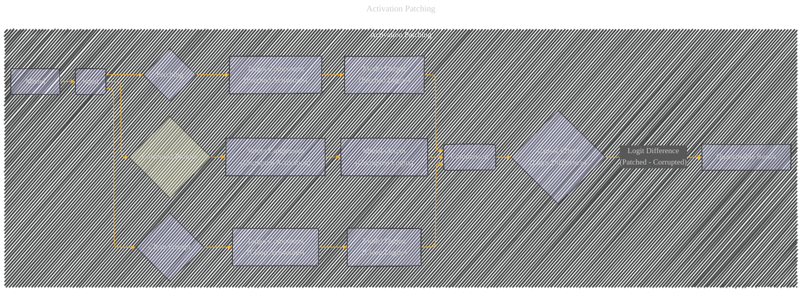

# Activation Patching
> **Disclaimer:**
>
> This document contains my personal notes on the topic,
> compiled from publicly available documentation and various cited sources.
> The materials are intended for educational purposes, personal study, and reference.
> The content is dual-licensed:
> 1. **MIT License:** Applies to all code implementations (Swift, Mermaid, and other programming languages).
> 2. **Creative Commons Attribution 4.0 International License (CC BY 4.0):** Applies to all non-code content, including text, explanations, diagrams, and illustrations.
---

## Analysis of the Activation Patching Technique

Activation patching is a technique used to isolate the contribution of specific model components (attention heads, MLPs, neurons) to a model's overall behavior.  It's a crucial tool for mechanistic interpretability, helping to understand *how* a model makes decisions, rather than just *what* decisions it makes.

Here's a breakdown of the activation patching technique, along with potential Mermaid diagrams to illustrate it:

---

### Core Idea

Activation patching works by selectively modifying the activation values of a particular component (e.g., a neuron, an attention head, or an MLP output) and then measuring the impact of this modification on the model's overall output.  The change in the output is the measure of the component's causal effect.  Crucially, this is compared to a baseline (no change) to quantify the impact.

---

### Detailed Steps (and potential diagram elements)

1. **Baseline Run:** The model is run on a given input with a "clean" prompt. The activation values for the target component (e.g., neuron preactivations, attention head outputs, or MLP outputs) are recorded.  These are the *clean* activations.

    *   **Mermaid:** A node labeled "Clean Prompt" connected to a node labeled "Target Component" (with clean activations). An edge leading to a node labeled "Model Output."

2. **Corrupted Run:** The model is run again on the same input but with a "corrupted" prompt. This corrupted input is similar to the clean input, but it's designed to be different *only* in a specific way, e.g., by intentionally altering the input's data structure. The activation values of the target component are recorded for this run.

    *   **Mermaid:** A node labeled "Corrupted Prompt" connected to a node labeled "Target Component" (with corrupted activations). An edge leading to a node labeled "Model Output (corrupted)."

3. **Patching:** The *clean* activation values are replaced with the *corrupted* values for the target component, while the rest of the activations and model parameters are held constant.  The model is run on the *corrupted* input with this patched component. The output logit values are recorded for this patched run.

    *   **Mermaid:** A node labeled "Patching" (using the clean activation values into the corrupted prompt).  An edge from this node to a node labeled "Target Component (Patched)."  An edge from the patched component to "Model Output (Patched)."

4. **Comparison:** The output logits are compared between the clean run, the corrupted run, and the patched run.  The difference in the output logits is taken as a measure of the target component's causal effect.

    *   **Mermaid:** A comparison node ("Comparison") comparing the "Model Output (clean)", "Model Output (corrupted)", and "Model Output (Patched)."

**Key Considerations for Diagrams:**

*   **Directionality:** Use arrows to clearly indicate the flow of information: prompt to model component, model component to output.
*   **Model Components:**  Represent the model's layers (attention, MLPs, etc.) and the target component clearly.
*   **Quantifiable Results:** Include a node for a comparison of logit differences or other quantitative metrics demonstrating the effects of the patching.
*   **Conditional Logic:**  Show how the model output (logit) is a function of the patched components and the input.

**Mathematical Notation:**

*   Let `logit_clean(a+b)` be the logit output for the clean prompt.
*   Let `logit_corrupted(a+b)` be the logit output for the corrupted prompt.
*   Let `logit_patched(a+b)` be the logit output for the patched prompt.
*   The causal effect (impact of the patch) is `logit_patched(a+b) - logit_corrupted(a+b)`.

Using activation patching, the paper aims to determine which parts of the LLM are essential for performing a task.  This technique provides causal evidence about the model's computation process.

----

## A Diagram for Activation Patching

---

### Explanation of the Diagram

*   **Subgraph:** The diagram is organized into a subgraph called "Activation Patching" for clarity.
*   **Nodes:** Each step of the process is represented by a node.  Crucially, the nodes `D`, `G`, and `J` represent the *activations* of the target component in different phases.
*   **Arrows (edges):** The arrows indicate the flow of information.  For instance, the input (`Input`) is processed by the `Model`, which results in `Clean Logits`, `Corrupted Logits`, and `Patched Logits`.
*   **Comparison:** The `Comparison` node explicitly indicates that the results from different runs are compared to determine the causal effect.
*   **Quantifiable Result:** The `Quantifiable Result` node signifies that the difference in logits is the measure of the causal effect.
*   **Colors:** The use of different colors for the "clean," "corrupted," and "patched" inputs helps distinguish these conditions visually.
*   **Styling:** A `classDef` is used to ensure consistent styling for nodes representing critical steps or outputs (e.g., the `Comparison`, `Causal Effect`, etc.).

This Mermaid diagram effectively illustrates the activation patching process, highlighting the crucial role of comparing activation values across different input conditions to isolate the causal impact of a particular component within the model.  It's a clear and concise visualization of the method. Remember to replace the generic labels (e.g., `Target Component`, `Model Output`) with more specific names (e.g., `Attention Head 1`, `Output Logit for Token 'answer'`) to create a more context-specific illustration.

---
**Licenses:**

- **MIT License:**   - Full text in [LICENSE](LICENSE) file.
- **Creative Commons Attribution 4.0 International:**  - Legal details in [LICENSE-CC-BY](LICENSE-CC-BY) and at [Creative Commons official site](http://creativecommons.org/licenses/by/4.0/).

---