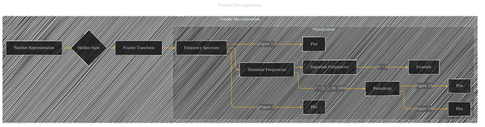

# Fourier Decomposition
> **Disclaimer:**
>
> This document contains my personal notes on the topic,
> compiled from publicly available documentation and various cited sources.
> The materials are intended for educational purposes, personal study, and reference.
> The content is dual-licensed:
> 1. **MIT License:** Applies to all code implementations (Swift, Mermaid, and other programming languages).
> 2. **Creative Commons Attribution 4.0 International License (CC BY 4.0):** Applies to all non-code content, including text, explanations, diagrams, and illustrations.
---


## Fourier Decomposition - A Diagram Structure




----

```latex
\begin{itemize}
    \item \textbf{Fourier Transform (C)}: The Fourier transform decomposes the hidden state (e.g., $h_0^{360}$) into its constituent frequencies.  Mathematically, it's expressed as:
        \[
        X(f) = \int_{-\infty}^{\infty} x(t) e^{-i2\pi ft} dt
        \]
        where $x(t)$ is the time-domain signal (hidden state) and $X(f)$ is the frequency-domain representation.  In the context of the paper, this is applied to the hidden state vectors as a function of the number being represented.
        
    \item \textbf{Frequency Spectrum (D)}: The result of the Fourier transform is a frequency spectrum, which shows the magnitude of each frequency component.  This is visualized in figures such as Figure 2 and Figure 12, showing the magnitude of Fourier components at different frequencies/periods (T values).
    
    \item \textbf{Dominant Frequencies (E)}:  The paper highlights specific frequencies (e.g., T = [2, 5, 10, 100]) as significant because they have high magnitudes in the Fourier spectrum, implying that the LLM uses these frequencies to encode numerical information.
    
    \item \textbf{Periodicity (F)}: The presence of these dominant frequencies suggests periodicity in the number representations.  This periodicity is visually demonstrated in figures like Figure 13 and Figure 14, where the Euclidean distance or cosine similarity between representations shows clear periodic patterns, reflecting the inherent structure of numbers in base 10.  Visuals of this periodicity are shown in Figure 13, 14, and others.
\end{itemize}
```

---

### Explanation and Diagram Enhancements

*   **Clearer Structure:** The diagram explicitly shows the steps involved in Fourier decomposition and the relationship to the visualizations in the paper.
*   **Specific Figure References:** Each visualization (plots) from the paper is explicitly linked to the diagram, enhancing clarity and comprehension.
*   **Mathematical Context (LaTeX):** The LaTeX code provides a concise mathematical definition of the Fourier transform.
*   **Emphasis on Significance:** The diagram highlights the importance of the dominant frequencies (T values) and the inferred periodicity, which is a crucial element of the paper's argument.

This improved structure and presentation effectively conveys the concept of Fourier decomposition within the context of the paper.  To create the specific plots, you would need the data to perform the Fourier transform and create the visualizations.  The provided diagram is a blueprint to visualize these concepts for the paper.


---
**Licenses:**

- **MIT License:**  [](LICENSE) - Full text in [LICENSE](LICENSE) file.
- **Creative Commons Attribution 4.0 International:** [](LICENSE-CC-BY) - Legal details in [LICENSE-CC-BY](LICENSE-CC-BY) and at [Creative Commons official site](http://creativecommons.org/licenses/by/4.0/).

---