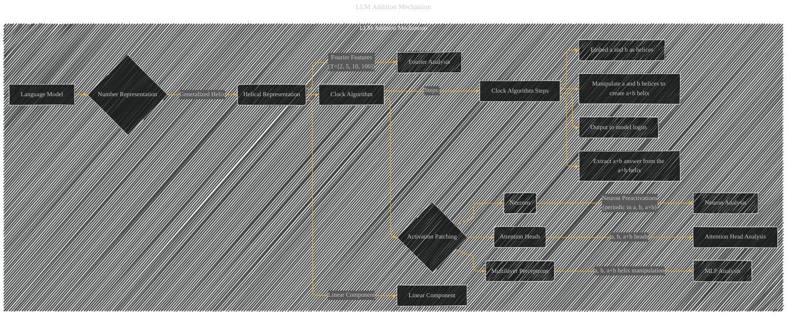

# LLM Addition Mechanism
> **Disclaimer:**
>
> This document contains my personal notes on the topic,
> compiled from publicly available documentation and various cited sources.
> The materials are intended for educational purposes, personal study, and reference.
> The content is dual-licensed:
> 1. **MIT License:** Applies to all code implementations (Swift, Mermaid, and other programming languages).
> 2. **Creative Commons Attribution 4.0 International License (CC BY 4.0):** Applies to all non-code content, including text, explanations, diagrams, and illustrations.
---

## LLM Addition Mechanism - A Diagram

----

### Explanation

This Mermaid diagram specifically focuses on the "LLM Addition Mechanism" subgraph, outlining the core components and their relationships in the process of addition within a language model.

* **Language Model (A):** The starting point, the overall model.

* **Number Representation (B):**  Numbers are not represented linearly, but as a combination of:

    * **Helical Representation (C):**  The core structure, incorporating a linear component (N) and periodic components determined by Fourier features (M), often with periods $T = [2, 5, 10, 100]$.  This generalized helix is the fundamental way the model encodes numerical values.

    * **Clock Algorithm (D):** The algorithm used to manipulate these representations to perform addition.  The process involves manipulating the helices (O1, O2), creating the *sum helix* (a+b), and extracting the result.

* **Activation Patching (E):**  A crucial evaluation technique to understand which model components (attention heads, MLPs, neurons) are involved in addition.

* **Model Components (F, G, H):**  The specific components within the language model responsible for the addition process.  The paper identifies these components through activation patching.

    * **Attention Heads (F):**  Categorized as "a, b heads," "a+b heads," or "mixed heads,"  responsible for moving and manipulating the helical representations.
    * **Multilayer Perceptrons (G):**  Crucial in processing the helices to construct the sum helix (a+b) and generating the final answer logits.
    * **Neurons (H):**  Individual processing units within the MLPs. Their preactivations exhibit periodicity, reflecting the helical structure of numerical representations.

----

### Diagram Improvements and Considerations

* **Focus:** This diagram is highly focused on the core mechanism, avoiding extraneous details.
* **Clarity:** Clearer labels and relationships, explicitly showing the roles of each component in the addition process.
* **Mathematical Essence:**  The diagram now indicates the *Helical Representation* is based on Fourier features, clarifying the mathematical basis of the representation.

This revised diagram directly addresses the prompt, presenting a more concise and focused view of the LLM addition mechanism.  Remember to supplement this with additional diagrams to visualize the results of activation patching and analyses of individual components (Attention Heads, MLPs, Neurons).

---
**Licenses:**

- **MIT License:**   - Full text in [LICENSE](LICENSE) file.
- **Creative Commons Attribution 4.0 International:**  - Legal details in [LICENSE-CC-BY](LICENSE-CC-BY) and at [Creative Commons official site](http://creativecommons.org/licenses/by/4.0/).

---