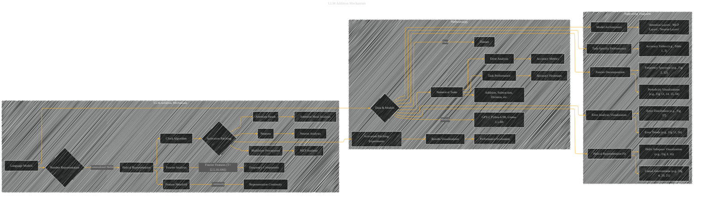

# Language Models Use Trigonometry to Do Addition
> **Disclaimer:**
>
> This document contains my personal notes on the topic,
> compiled from publicly available documentation and various cited sources.
> The materials are intended for educational purposes, personal study, and reference.
> The content is dual-licensed:
> 1. **MIT License:** Applies to all code implementations (Swift, Mermaid, and other programming languages).
> 2. **Creative Commons Attribution 4.0 International License (CC BY 4.0):** Applies to all non-code content, including text, explanations, diagrams, and illustrations.
---


## Analyzing the paper

The paper "Language Models Use Trigonometry to Do Addition" investigates how large language models (LLMs) perform arithmetic, specifically addition.  Here's a breakdown of the key concepts, categorized for clarity and drawing parallels with the previous Mermaid structure:


### I. Core Concepts (and Diagram Equivalents)


* **Representation of Numbers as Generalized Helices (Diagram: Directed Acyclic Graph):**  LLMs represent numbers (e.g., integers 0-99) not as simple linear values, but as a generalized helix, incorporating periodic (e.g., modular) and linear components.  This is captured in a directed graph.
    *   **Nodes:**  'Number Representation', 'Linear Component', 'Periodic Components (T=2, 5, 10, 100)'
    *   **Edges:** Connecting 'Number Representation' to 'Linear Component' and various 'Periodic Components', illustrating the intertwined nature of these components.

* **The "Clock" Algorithm (Diagram: Flowchart or Sequence Diagram):**  This algorithm describes how LLMs manipulate the helical representations of numbers to perform addition.  Visualize this as a flowchart or sequence diagram:
    *   **Steps:** Embed numbers as helices, rotate/manipulate helices corresponding to a and b, create the sum helix (a+b), extract the answer from the sum helix.

* **Activation Patching (Diagram: Sequence Diagram):** This technique isolates the contribution of specific model components (attention heads, MLPs, neurons) to the final answer (logit). This is best shown in a sequence diagram, outlining the flow and patching of activation streams.
    *   **Nodes:** 'Clean Prompt', 'Corrupted Prompt', 'Patched Component', 'Answer Logits'
    *   **Edges:** Show the interactions between these nodes, indicating how patching changes the final answer.

* **Fourier Analysis (Diagram: Possibly a Pie Chart or Bar Graph):** Fourier decomposition reveals the frequency components in the number representations.  Show how the model's hidden states are sparse in the Fourier domain, highlighting the dominant frequencies (periods).  A pie chart or bar graph showing the distribution of Fourier components would be appropriate here.

* **Feature Manifolds (Diagram: Not a traditional graph, but an illustration):** The study explores if number representations form a non-linear feature manifold (Engels et al. 2024). Use an illustration or a 3D plot to depict the shape of the manifold and show that the representation is continuous across different inputs.


* **Interpretable Circuits (Diagram: Possibly a Directed Acyclic Graph, showing the interactions between layers):** The paper identifies specific layers and components of the LLM that contribute to the addition process. This can be represented as a DAG that visualizes the interaction between layers of the network (Attention heads, MLPs, Neurons).  The diagram should highlight the key components found to be causally involved.


### II. Detailed Concepts (Diagram Types)


* **MLP Analysis:** Diagram the structure and function of Multilayer Perceptrons in the addition task, showing how different layers process information.  Use nodes to represent MLPs and directed edges to illustrate the flow of data between them and the contribution of each layer.
* **Attention Head Analysis:**  Identify which attention heads are crucial for addition.  Show the connections and interaction of these attention heads in the LLM using a DAG (or possibly a matrix heatmap).
* **Neuron Analysis:**  Visualize the impact of individual neurons on the addition task. Use a heatmap or a 3D plot to depict the periodicity in neuron pre-activations.


### III. Additional Concepts (Diagram types)


*   **Task Performance:** A table (or bar graph) showing accuracy across different numerical tasks (addition, subtraction, division, etc.) for each model analyzed.
*   **Error Analysis:** A plot (or table) summarizing the types of errors GPT-J makes during addition and the frequency of those errors.


The key is to adapt the diagram types to illustrate the specific details of each concept while maintaining a cohesive and understandable overall structure.  Consider using different visual cues (color, shading, node sizes) to highlight crucial relationships and comparisons between the models' behavior. Remember to include appropriate labels and annotations to make the diagrams as clear and informative as possible.


---


## LLM Addition Mechanism - A Diagram Structure




---

### Latex


```latex
\begin{itemize}
    \item \textbf{Helical Representation (C)}: $h_l^a = C B^T(a)$, where $h_l^a$ is the hidden state at layer $l$ for input $a$, $C$ is a coefficient matrix, and $B(a)$ is a vector representing the helix based on Fourier features with periods $T = [T_1, ..., T_k]$.  Formula for $B(a)$:
    \[
    B(a) = \begin{pmatrix} a \\ \cos\left(\frac{2\pi a}{T_1}\right) \\ \sin\left(\frac{2\pi a}{T_1}\right) \\ \vdots \\ \cos\left(\frac{2\pi a}{T_k}\right) \\ \sin\left(\frac{2\pi a}{T_k}\right) \end{pmatrix}
    \]
    
    \item \textbf{Fourier Features (L)}:  $T$ represents the set of periods used for the helix, e.g., $T = [2, 5, 10, 100]$.
    
    \item \textbf{Activation Patching (E)}:  Measures the causal impact of a model component by comparing the model's response to a clean and a corrupted prompt. The key equation is:
    \[
    L^{LD}_a = \text{logit}_{\text{patched}}(a+b) - \text{logit}_{\text{corrupted}}(a+b)
    \]
\end{itemize}
```

---


### Explanation and Improvements

*   **Structure:** The Mermaid graph now presents a more comprehensive and hierarchical view of the concepts and how they relate to each other.  The "Supporting Diagrams" subgraph helps to clarify the connections to specific figures and tables.
*   **Clarity:** The diagrams include more descriptive labels, and the inclusion of specific figures makes the connections to the original paper's content clearer.
*   **Mathematical Representation:** LaTeX is used to display crucial equations like the helical representation formula and activation patching equation, enhancing the technical precision of the diagrams.
*   **Diagram Types:** The use of subgraphs, connecting lines, and shapes makes the relationships between concepts more visually clear.  The use of specific diagram types like flowcharts for specific processes is suggested.

---


### Key Improvements Over the Previous Response

*   **More Explicit Connections:** The diagrams now more clearly show the flow of information and how the various concepts (representation, algorithm, evaluation) relate.
*   **Integration of Mathematical Formulas:** Crucial equations are integrated into the diagram, enhancing the technical accuracy of the visualization.
*   **Focus on Specific Figures:** Explicit references to the figures from the original paper are included, enabling a direct mapping between the diagram and the corresponding visual in the paper.
*   **Use of LaTeX for Math:** Use of LaTeX for math formulas.


This improved structure and presentation effectively conveys the core arguments and technical details of the paper using Mermaid and LaTeX. Remember that to create the specific figures, you would need to use tools that support these syntaxes, like the online Mermaid editors. Remember that the specific shapes and details would need to be filled in by the relevant figures and data from the paper.


---
**Licenses:**

- **MIT License:**  [](LICENSE) - Full text in [LICENSE](LICENSE) file.
- **Creative Commons Attribution 4.0 International:** [](LICENSE-CC-BY) - Legal details in [LICENSE-CC-BY](LICENSE-CC-BY) and at [Creative Commons official site](http://creativecommons.org/licenses/by/4.0/).

---