# Language Models Use Trigonometry to Do Addition - V2
> This content is dual-licensed under your choice of the following licenses:
> 1.  **MIT License:** For the code implementations in Swift and Mermaid provided in this document.
> 2.  **Creative Commons Attribution 4.0 International License (CC BY 4.0):** For all other content, including the text, explanations, and the Mermaid diagrams and illustrations.

---

Below is a collection of 2nd version of diagrams and illustrations of [this documentation](/Latest_Algorithms/Language_Models_Use_Trigonometry_to_Do_Addition/Language_Models_Use_Trigonometry_to_Do_Addition_V1.md).

## 1. Enhanced Core Concept: Clock Algorithm and Helix Representation

```mermaid
---
title: Enhanced Core Concept - Clock Algorithm & Helix Representation
config:
  layout: elk
  look: handDrawn
  theme: dark
---
flowchart LR
    subgraph Helix_Representation["Helix Representation of Numbers"]
    style Helix_Representation fill:#f39d,stroke:#333,stroke-width:1.2px
        HR1["Numbers 'a' & 'b'<br>as Generalized Helices"];
        HR2["Mathematical Basis:<br>Fourier Features T=[2, 5, 10, 100]"];
        HR3["Generalized Helix Equation:<br><code>helix(a) = CB(a)^T</code>"];
        HR4["Captures:<br>- Periodic Numerical Structure<br>- Linear Semantic Progression"];
        HR1 --- HR2 --- HR3 --- HR4
    end

    subgraph Clock_Algorithm ["Clock Algorithm for Addition<br>(a + b)"]
    style Clock_Algorithm fill:#d9f7,stroke:#333,stroke-width:1.2px
        CA1["Step 1:<br>Embedding<br>Embed <code>helix(a)</code> & <code>helix(b)</code><br>on Input Tokens"];
        CA2["Step 2:<br>Helix Movement<br>Attention Heads (L9-14)<br>Move <code>helix(a)</code> & <code>helix(b)</code><br>to <b>Last Token</b>"];
        CA3["Step 3:<br>Helix Manipulation<br>MLPs (L14-18)<br>Manipulate & Combine<br><code>helix(a)</code> & <code>helix(b)</code><br>to create <code>helix(a+b)</code>"];
        CA4["Step 4:<br>Readout to Logits<br>MLPs (L19-27) & Attn Heads<br>'Read' <code>helix(a+b)</code><br>Translate to <b>Answer Logits</b>"];
        CA5["<b>Answer Logits</b><br>for 'a + b'"];

        CA1 --> CA2 --> CA3 --> CA4 --> CA5
    end

    Helix_Representation -- Encodes Numbers --> Clock_Algorithm
    HR4 --> CA1

    %% linkStyle 0,1,2,3,4 stroke-width:2px,stroke:#558B2F;
    %% linkStyle 5,6,7,8,9 stroke-width:2px,stroke:#3498DB;
    %% linkStyle 10 stroke-width:1.5px,stroke:black,style:dashed;
    
```




### Enhanced Explanation of Diagram 1

*   **Purpose:** Provides a clearer and visually distinct high-level overview of the Helix Representation and Clock Algorithm as the core mechanisms for addition in LLMs. Emphasizes their relationship and sequential application.
*   **Diagram Type:** Flowchart (`flowchart LR`) maintained for process flow. Subgraphs visually separate and group core concepts.
*   **Helix Representation Subgraph (Enhanced Style & Detail):**
    *   Label changed to "Helix Representation of Numbers" for clarity.
    *   Background fill and border style enhanced for better visual appeal.
    *   Node labels refined to be more descriptive (e.g., "Generalized Helices", "Mathematical Basis", "Generalized Helix Equation", "Captures").
    *   Equation node uses `<code>` for better code-like presentation of  `helix(a) = CB(a)^T`.
    *   "Captures" node explicitly lists "Periodic Numerical Structure" and "Linear Semantic Progression," directly reflecting key findings.
    *   Internal nodes within subgraph linked using clearer arrows `---`.
*   **Clock Algorithm Subgraph (Enhanced Clarity & Flow):**
    *   Label refined to "Clock Algorithm for Addition (a + b)".
    *   Background fill and border style enhanced to contrast with Helix subgraph.
    *   Step descriptions in nodes made more action-oriented (e.g., "Embedding," "Helix Movement," "Helix Manipulation," "Readout to Logits").
    *   Layer ranges (L9-14, L14-18, L19-27, L24-26) are now included within the step descriptions for immediate context. Key locations like "Last Token" and "Answer Logits" are **bolded**.
    *   Steps now linked using right-pointing arrows `-->` to visually emphasize the sequential nature of the algorithm.
    *   Step number prefixes (Step 1:, Step 2:, etc.) added within nodes for direct step identification.
*   **Linking & Styling (Improved Visual Hierarchy):**
    *   The connecting arrow between "Helix Representation" and "Clock Algorithm" is now labeled "Encodes Numbers" and uses a dashed style (`style:dashed`) for a softer visual link, recognizing it's a conceptual dependency rather than a strict process flow.
    *   Link styles refined for both subgraphs: Darker green `#558B2F` for Helix Representation links, and more vibrant blue `#3498DB` for Clock Algorithm links to enhance visual separation between the two core concepts.
*   **Focus:**  Improved visual clarity and information hierarchy to better convey the core concepts to a beginner to intermediate audience. Enhanced use of text formatting (bolding, code style) for better readability within diagram nodes.

---

## 2. Enhanced Expanding on Helix Representation

```mermaid
---
title: Enhanced Expanding on Helix Representation
config:
  layout: elk
  look: handDrawn
  theme: dark
---
graph LR
    subgraph Generalized_Helix["Generalized Helix Representation"]
    style Generalized_Helix fill:#d7f3,stroke:#333,stroke-width:1.2px
        GH1["Represents Numbers<br>in High-Dimensional Space"];
        GH2["<b>Equation:</b><br><code>helix(a) = CB(a)^T</code>"];
        GH_Basis["<b>Basis Functions B(a):</b>"];
        GH3["<code>B(a) = [a,<br>cos(2πa/T<sub>1</sub>), sin(2πa/T<sub>1</sub>),<br>...,<br>cos(2πa/T<sub>k</sub>), sin(2πa/T<sub>k</sub>)]</code>"];
        GH_Matrix["<b>Coefficient Matrix C:</b>"];
        GH4["Learned Parameters<br>Projects Basis to<br>Residual Stream Dimensions"];
        GH5["Fourier Features<br>T = [2, 5, 10, 100]<br>Capture Periodicity"];
        GH6["Linear Component 'a'<br>Captures Scalar Value"];

        GH1 --> GH2 --> GH_Basis --> GH3 --> GH_Matrix --> GH4 --> GH5 --> GH6
    end

    subgraph Fourier_Features["Fourier Features (T=[2, 5, 10, 100]) & Periodicity"]
    style Fourier_Features fill:#e39d,stroke:#333,stroke-width:1.2px
        FF_T2["<b>T=2</b>"];
        FF2["Even/Odd Numbers<br>Low Frequency"];
        FFA["<b>Periodicity:</b> Even/Odd Cycle"];

        FF_T5["<b>T=5</b>"];
        FF4["Base-5 Related Cycles<br>Mid Frequency"];
        FFB["<b>Periodicity:</b> Base-5 Cycle"];

        FF_T10["<b>T=10</b>"];
        FF7["Decimal Units Digit<br>High Frequency"];
        FFC["<b>Periodicity:</b> Decimal Cycle"];

        FF_T100["<b>T=100</b>"];
        FF9["Hundreds Place<br>Lowest Frequency"];
        FFD["<b>Periodicity:</b> Base-100 Cycle"];

        FF_Combined["<b>Combined Features</b><br>Create Rich Numerical<br>Representation"];

        FF_T2 --> FF2 --> FFA --> FF_Combined
        FF_T5 --> FF4 --> FFB --> FF_Combined
        FF_T10 --> FF7 --> FFC --> FF_Combined
        FF_T100 --> FF9 --> FFD --> FF_Combined

        style FF_Combined fill:#c914,stroke:#333,stroke-width:1px
    end

    Generalized_Helix -- Utilizes --> Fourier_Features
    GH5 --> Fourier_Features


    %% linkStyle 1,3,5,7,9,11 stroke-width:2px,stroke:#008080;
    %% linkStyle 13,14,15,16,17,18,19,20,21,22 stroke-width:2px,stroke:#006400;
    %% linkStyle 23 stroke-width:1.5px,stroke:black,style:dashed;

```




### Enhanced Explanation of Diagram 2

*   **Purpose:** Provides a more detailed and structured breakdown of the Helix Representation, focusing on its mathematical formulation and the significance of each Fourier feature and their periodic contributions.
*   **Diagram Type:** Graph (`graph LR`) maintained for structural breakdown with subgraphs for "Generalized Helix" and "Fourier Features & Periodicity".
*   **Generalized Helix Subgraph (Improved Structure & Formatting):**
    *   Background fill and border updated for visual distinction.
    *   Sub-nodes for "Basis Functions B(a):" (`GH_Basis`) and "Coefficient Matrix C:" (`GH_Matrix`) added as intermediate nodes to improve structural hierarchy and readability, acting as titles for the equations/descriptions below them.
    *   Equation node `GH2` and basis function node `GH3` use `<code>` and `<sub>` tags for enhanced mathematical notation within labels. "Equation:" and labels for basis functions & matrix are **bolded** for emphasis.
    *   Label descriptions within "Generalized Helix" subgraph refined to be more precise and concise.
*   **Fourier Features Subgraph (Enhanced Feature Descriptions):**
    *   Label updated to "Fourier Features (T=[2, 5, 10, 100]) & Periodicity" to emphasize the key concept of periodicity.
    *   Background fill and border updated for visual harmony.
    *   For each period (T=2, 5, 10, 100), dedicated nodes (e.g., `FF_T2`, `FF_T5` etc.) are introduced with **bolded** "T=X" labels for quick identification.
    *   Descriptive nodes (e.g., `FF2`, `FF4`, `FF7`, `FF9`) now include brief explanations like "Even/Odd Numbers," "Base-5 Related Cycles," "Decimal Units Digit," "Hundreds Place" along with notes on frequency characteristics ("Low Frequency", "Mid Frequency", "High Frequency", "Lowest Frequency").
    *   Periodicity nodes (e.g., `FFA`, `FFB`, `FFC`, `FFD`) are added, **bolded** with "Periodicity: [Cycle Description]", explicitly linking periods to their cyclic interpretation.
    *   A "Combined Features" node `FF_Combined` (styled with different fill) summarizes the collective impact of these features creating a "Rich Numerical Representation."
    *   Clearer upward arrows `-->` now link each period-feature-periodicity set to the "Combined Features" node, showing how individual features contribute to the richer representation.
*   **Linking & Styling (Refined Visual Connections):**
    *   The link from "Generalized Helix" to "Fourier Features" is now labeled "Utilizes" and uses a dashed style (`style:dashed`) to indicate dependency and utilization.
    *   Link styles are updated: Teal `#008080` for "Generalized Helix" links, Dark Green `#006400` for "Fourier Features" links to further visually segment the information.
*   **Mathematical Focus:** More visually present and structured mathematical details with improved use of formatting for equations and key terms. Descriptions are more directly linked to the numerical and periodic interpretations of the Fourier features. Enhanced structure and clarity for a more technical audience.

---

## 3. Enhanced Clock Algorithm Steps in Detail


### Enhanced Explanation of Diagram 3

*   **Purpose:** Enhanced sequence diagram to provide a more detailed and functionally descriptive view of the Clock Algorithm within the LLM's layers, emphasizing data transformation and flow between specific components.
*   **Diagram Type:** Sequence Diagram (`sequenceDiagram`) maintained, as it's optimal for depicting step-by-step process flow through components.
*   **Participants (Functionally Descriptive):**
    *   Participant labels refined to be more descriptive, including layer ranges and key functions in parentheses (e.g., "Attention Heads (L9-14)\<br/>(Helix Movement)", "MLPs (L14-18)\<br/>(Helix Construction)"). `Input_Token_a`, `Input_Token_b` and `Logits_Output` prefixes added for clarity.
    *   "Last Token" is now explicitly represented as a participant (`Last_Token`) with a distinct background fill (`#FFFFE0`) to visually highlight its central role as the aggregation point.
*   **Messages (Enhanced Step Descriptions & Code Formatting):**
    *   Step descriptions within message arrows are significantly enhanced, using `<code>` tags to format `helix(a)`, `helix(b)`, `helix(a+b)` equations for better code-related context.
    *   Step 3 description now explicitly mentions "Construct `helix(a+b)` from `helix(a) + helix(b)`," clarifying the manipulation step.
    *   Step 4 now clarifies "Output to **Logits** for 'a + b' Answer", bolding "Logits".
    *   Input locations like "(Tokens 'a', 'b')" and "(Last Token)" are added in parentheses to message descriptions for context on where helices are processed.
*   **Annotations (Improved Grouping & Context):**
    *   `Note over` annotations for "Steps 1 & 2: Representation & Movement" and "Steps 3 & 4: Manipulation & Readout" are maintained but descriptions are kept concise.
*   **Iterative Processing Loop (Visualizing Hidden State Flow):**
    *   A `loop Iterative Processing within Layers` is introduced to visually represent the continuous flow of hidden states between Attention and MLP layers, indicated by dashed arrows `-->>` labeled "...Hidden State Flow...". This acknowledges the iterative nature of transformer processing within these broad step categorizations.
*   **Focus:** More implementation-oriented, with a clearer depiction of functional roles of layers, enhanced step descriptions, and visualization of hidden state flow. Improved clarity for developers and researchers interested in the procedural aspects of the algorithm within the model architecture.

---

## 4. Enhanced Component Roles: Attention Heads and MLPs

```mermaid
---
title: Enhanced Component Roles in Clock Algorithm
config:
  layout: elk
  look: handDrawn
  theme: dark
---
mindmap
  root(("Component Roles in Clock Algorithm"))
    Attention_Heads["Attention Heads"]
      a_b_Heads["a, b Heads (11/20) -<br> Layers 9-14"]
        Role["Role:<br> Move helix(a) , helix(b) <br>to Last Token"]
        Input["Input:<br>Tokens 'a', 'b' Representations"]
        Output["Output:<br>helix(a), helix(b) <br> to Downstream MLPs"]
        Layer_Range["Layer Range:<br>Layers 9-14<br>(+ 2 Heads in L16, 18)"]
      a_plus_b_Heads["a+b Heads (5/20) -<br> Layers 24-26"]
        Role["Role:<br>Read helix(a+b)<br>and Output to Logits"]
        Input["Input:<br>Preceding MLPs<br>(helix(a+b))"]
        Output["Output:<br>helix(a+b)<br>to Logits<br>(Answer)"]
        Layer_Range["Layer Range:<br>Layers 24-26<br>(+ 1 Head in L19)"]
      Mixed_Heads["Mixed Heads (4/20) -<br> Layers 15-18"]
        Role["Role:<br>Create helix(a+b)<br>from Intermediate Reps"]
        Input[Input:<br>a, b Heads, Previous MLPs, Tokens 'a', 'b', Last Token]
        Output["Output:<br>helix(a), helix(b),<br>helix(a+b) to MLPs"]
        Layer_Range["Layer Range:<br>Layers 15-18"]
      Key_Function["Key Function:<br> Moving & Routing<br>Helical Representations"]
      Influence["Influence:<br> Indirect Effect<br>Facilitate MLP Computations"]

    MLPs["MLPs"]
      MLPs_14_18["MLPs 14-18<br>(Helix Constructors)"]
        Role["Role:<br>Construct helix(a+b)<br>from helix(a) and helix(b)"]
        Input["Input:<br>helix(a), helix(b)<br>(from Attention Heads)"]
        Output["Output:<br>helix(a+b)<br>for Downstream MLPs/Heads"]
        Key_Property["Key Property:<br>Outputs Well-Modeled<br>by helix(a+b),<br>Indirect Effect"]
      MLPs_19_27["MLPs(19-27)<br>(Logits Readout)"]
        Role["Role:<br>Read helix(a+b)<br>Translate to Answer Logits"]
        Input["Input:<br>helix(a+b)<br>(from MLPs 14-18)"]
        Output["Output:<br>Answer Logits<br>for 'a + b'"]
        Key_Property["Key Property:<br>Higher Direct Effect<br>Reads helix(a+b) for Output"]
      Key_Function["Key Function:<br>Core Computation<br>Manipulation and Readout<br>of Helical Representations"]
      Influence["Influence:<br>Dominant Direct Effect<br>Drive Computation of 'a + b'"]

    Overall_Function["Overall Function:<br>Attention Heads and MLPs<br>Work in Concert to Implement<br>Clock Algorithm, MLPs are Central"]

```

### Enhanced Explanation of Diagram 4

*   **Purpose:** Provides a more structured, visually organized, and information-rich mindmap summarizing the distinct roles of different types of Attention Heads and MLPs in the Clock Algorithm. Enhanced detail within each component's role, inputs, outputs, and key properties.
*   **Diagram Type:** Mindmap (`mindmap`) maintained for hierarchical organization.
*   **Root Node & Styling:** Root node styled with a light gray fill (`#f0f0f0`) for a cleaner central focus.
*   **Main Branches & Styling:** "Attention Heads" and "MLPs" are now **bolded** and styled with light background fills (`#e0e8f0` and `#e0f0e8` respectively) to visually differentiate the two main component types.
*   **Sub-Nodes for Component Types & Enhanced Details:**
    *   Sub-nodes for "a, b Heads," "a+b Heads," "Mixed Heads" under "Attention Heads," and "MLPs 14-18," "MLPs 19-27" under "MLPs" are now **bolded** and include layer ranges in their labels for quick context. Sub-node styling (`#f8f8ff` fill) creates visual grouping.
    *   Within each component type's sub-nodes (e.g., within "a, b Heads"):
        *   "Role," "Input," "Output," "Layer Range," "Key Property" (where applicable) are now **bolded** as titles within nodes.
        *   Role descriptions are more action-oriented and use `<code>` tags for `helix(a)`, `helix(b)`, `helix(a+b)` equations, and **bolding** for key locations like "Last Token" and "Logits."
        *   Input and Output descriptions are more informative, specifying "Representations," "Downstream MLPs," "Preceding MLPs," and "Answer Logits".
        *   "Layer Range" is explicitly included for attention heads, with "+ X Heads in LY, LZ" notation to specify minor deviations in layer ranges.
        *   "Key Property" is added for MLPs to concisely summarize their core characteristics (e.g.,  "Outputs Well-Modeled by `helix(a+b)`", "Higher Direct Effect").
*   **Key Function & Influence Nodes (Summary Points):**
    *   "Key Function" nodes for both "Attention Heads" and "MLPs" are added to summarize their primary functional roles in the algorithm (e.g., "Moving & Routing", "Core Computation"). **Bolded** labels enhance prominence.
    *   "Influence" nodes are added to highlight their relative influence (e.g., "Indirect Effect," "Dominant Direct Effect"), also with **bolded** labels.
*   **Overall Function Node (Algorithm Context):**
    *   "Overall Function" node, **bolded**, is added at the root level to summarize the collaborative function of Attention Heads and MLPs in implementing the "Clock Algorithm," emphasizing MLPs' central role.
*   **Linking & Styling (Visual Relationships):**
    *   A dashed link with label "Facilitate" is added from "Attention_Heads" to "MLPs" (`Attention_Heads -- Facilitate --> MLPs`) to visually represent the supportive but less dominant role of attention heads relative to MLPs in computation.
*   **Focus:** Significantly enhanced clarity, detail, and hierarchical structure in the mindmap to provide a comprehensive overview of component roles. More informative labels and strategic use of formatting make the diagram more effective for researchers and developers needing a detailed understanding of the model's functional component breakdown.

---

## 5. Enhanced Visualizing Experimental Results (Conceptual)


---

## 6. Enhanced Illustrative Graph for Fourier Analysis (More Vivid Description)

TBD


---

## 7. Enhanced Illustrative Diagram for Neuron Preactivation Fits (More Detailed Description)

### Enhanced Conceptual Heatmap Grid Description (for Neuron Preactivations - Figure 8)

**Figure Y: Conceptual Heatmap Grid - Visualizing Periodic Neuron Preactivations**

**(Imagine a 2x2 grid of heatmaps, each a distinct subplot):**

**[Heatmap 1 (Top Left): Neuron #0.L20N7741 - Periodicity Dominated by T=2]**

*   **Title:** "Neuron #0.L20N7741. TE: 0.24 -5.0cos(2/2(a+b+83.0)). NRMSE: 0.06" (Example title from Figure 8 subplot)
*   **Axes:**
    *   **X-axis:** Input 'a' (approx. range 0-80, visualize as a gradient from left to right) labelled "Input 'a'".
    *   **Y-axis:** Input 'b' (approx. range 0-80, visualize as gradient from bottom to top) labelled "Input 'b'".
*   **Color Intensity:**  Represent preactivation value N<sup>l</sup><sub>n</sub>(a, b). Use a **gradient color scale**; e.g., from light yellow (low preactivation) to deep red (high preactivation).
*   **Visual Pattern:** Describe as showing prominent **vertical and horizontal banding patterns**, visually dominated by a **T=2 (two-cycle) periodicity**.  Bands should alternate intensity, indicating peaks and troughs in preactivation roughly every ~2 units along 'a' or 'b' axis. High intensity regions may suggest cosine function peak alignment.
*   **Interpretation Notes:** "This heatmap visually reveals a neuron strongly modulated by a **T=2 cycle**, apparent in the alternating band intensity. The fitted cosine term '-5.0cos(2/2(a+b+83.0))' in the title further quantifies this **T=2 periodicity** in relation to (a+b)."

**(Repeat the structure for Heatmap 2, 3, and 4 - Top Right, Bottom Left, Bottom Right -  mimicking the visual patterns and titles of the Neuron #7, #4, and #10 examples in Figure 8, and highlight the dominant periodicities seen in each, e.g., T=10 & T=5 for #7, T=100 for #4, Linear for #10):**

**[Heatmap 2 (Top Right): Neuron #7.L21N13478 - Mixed Periodicity T=10 & T=5]**
... (Describe patterns, mentioning mixed periodicities, reference title fit: "-4.4cos(2/10(a+b-1.7))+-3.8cos(2/5(a+b+0.9))") ...

**[Heatmap 3 (Bottom Left): Neuron #4.L22N12504 - Dominant Periodicity T=100]**
... (Describe pattern, highlighting dominant low-frequency T=100 periodicity,  reference title fit: "1.7cos(2/100(a+b+11.6))") ...

**[Heatmap 4 (Bottom Right): Neuron #10.L22N9339 - Linear Trend & 'b' Sensitivity]**
... (Describe pattern, noting a less distinctly periodic pattern but more of a directional gradient linked to 'b' input perhaps and a "linear trend" influence, reference title fit: "1.31b+1.18a") ...

**Overall Figure Caption:** "Figure Y (Conceptual Heatmap Grid - Visualizing Periodic Neuron Preactivations): This 2x2 grid conceptually displays neuron preactivation patterns as heatmaps. Each heatmap corresponds to a **'top neuron'**, with intensity representing preactivation values for varying inputs 'a' and 'b'. Visual inspection reveals **clear periodicity** across neurons, with patterns exhibiting modulations related to **periods T=2, T=5, T=10, and T=100,** and in some cases, linear trends. The overlaid neuron index, Total Effect (TE), fitted trigonometric expression, and Normalized Root Mean Square Error (NRMSE) (example data taken from Figure 8 titles) provide quantitative context for each neuron's behavior and fit quality."


### Enhanced Explanation of Diagram 7

*   **Purpose:** To create a more detailed and visually descriptive conceptualization of Figure 8's Neuron Preactivation Heatmaps, as Mermaid is unable to generate actual heatmaps. The enhanced description focuses on guiding the reader to imagine the visual patterns and link them to the paper's findings about neuron periodicity.
*   **Structure:** Description now structured as:
    *   A clear **Figure Title:** "Figure Y: Conceptual Heatmap Grid - Visualizing Periodic Neuron Preactivations."
    *   Explicit **Heatmap Subplot Headings:** "[Heatmap 1 (Top Left): ...]", "[Heatmap 2 (Top Right): ...]", etc., for each of the 2x2 grid positions, directly corresponding to the example neurons discussed in Figure 8.
    *   For each Heatmap Description follow a consistent format: "**Title:**", "**Axes:**", "**Color Intensity:**", "**Visual Pattern:**", "**Interpretation Notes:**"
*   **Visual Pattern Descriptions (Detailed & Evocative Language):**
    *   For each heatmap, the "**Visual Pattern:**" section is crucial. It now uses more descriptive language to guide the reader's imagination:
        *   For T=2 neuron: "**vertical and horizontal banding patterns**, visually dominated by a **T=2 (two-cycle) periodicity**. Bands should **alternate intensity**..."
        *   For T=10 & T=5 mixed neuron: "**more complex interference pattern**...reflecting a **superposition of periodicities**," mentioning both T=10 and T=5.
        *   For T=100 neuron: "**gradual, low-frequency modulations**, consistent with a **long-period T=100 cycle**," emphasizing low-frequency change and long period cycles.
        *   For Linear neuron: "**less distinctly periodic pattern** but more of a **directional gradient linked to 'b' input perhaps** and a 'linear trend' influence." Acknowledges deviation from pure periodicity.
*   **Interpretation Notes (Linking Patterns to Periodicity & Fits):**
    *   "**Interpretation Notes:**" added for each heatmap description to explicitly link the observed visual patterns to the concept of periodicity and the fitted trigonometric expressions mentioned in the (conceptual) titles, referencing the cosine terms and periods in the example title fits.
*   **Overall Figure Caption (Context and Data Summary):**
    *   A comprehensive **Overall Figure Caption** is included to summarize the entire figure, emphasizing that it's a "2x2 grid conceptually displaying neuron preactivation patterns as heatmaps," highlighting the "<b>'top neuron'</b>" focus, and reiterating the core finding of "**clear periodicity** across neurons" and their relation to periods "T=2, T=5, T=10, and T=100," and some instances of "linear trends." It also explains that example titles are inspired from Figure 8, providing context for the included quantitative data.
*   **Focus:**  Significant enhancement in descriptive detail to compensate for the lack of a visual Mermaid heatmap, aiming to guide the reader to visualize the *patterns* described in the paper's Figure 8. The descriptions systematically address each heatmap's title, axes, color interpretation, pattern, and link the patterns back to the paper's core findings about neuron periodicity and functional fitting. The more vivid and detailed descriptions are intended to be considerably more informative for a reader relying on the textual descriptions.


---
**Licenses:**

- **MIT License:**  [](LICENSE) - Full text in [LICENSE](LICENSE) file.
- **Creative Commons Attribution 4.0 International:** [](LICENSE-CC-BY) - Legal details in [LICENSE-CC-BY](LICENSE-CC-BY) and at [Creative Commons official site](http://creativecommons.org/licenses/by/4.0/).

---