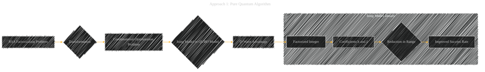
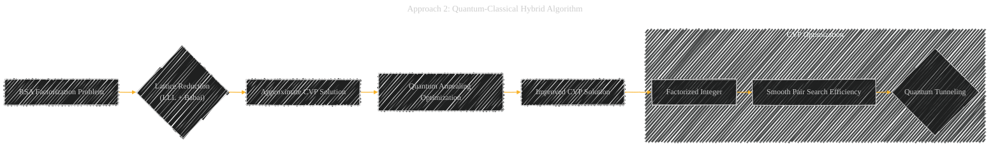
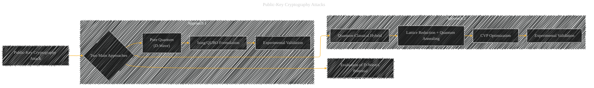

# Quantum Annealing Public Key Cryptographic Attack Algorithm Based on D-Wave Advantage
> **Disclaimer:**
>
> This document contains my personal notes on the topic,
> compiled from publicly available documentation and various cited sources.
> The materials are intended for educational purposes, personal study, and reference.
> The content is dual-licensed:
> 1. **MIT License:** Applies to all code implementations (Swift, Mermaid, and other programming languages).
> 2. **Creative Commons Attribution 4.0 International License (CC BY 4.0):** Applies to all non-code content, including text, explanations, diagrams, and illustrations.
---

## A Diagrammatic Guide 

Based on the provided Chinese research white paper, here's a breakdown of the document's main concepts, structured for visualization:

---

### I. Overall Structure

The paper explores two main technical approaches for attacking RSA public-key cryptography using quantum annealing, both leveraging the D-Wave quantum computer:

- **Approach 1: Pure Quantum Algorithm:** Convert the cryptographic attack into a combinatorial optimization problem suitable for D-Wave's architecture.
- **Approach 2: Quantum-Classical Hybrid Algorithm:** Augment a classical lattice reduction algorithm with quantum annealing for enhanced CVP (Closest Vector Problem) solving.

----

### II. Approach 1: Pure Quantum Algorithm

**A. Core Idea:**  Transform the RSA factorization problem into a form that the D-Wave computer can directly optimize.

**B. Mathematical Model:** Uses either the Ising model or the QUBO (Quadratic Unconstrained Binary Optimization) model.

**B.1  High-Level Optimization Model**:
*   Description: Multiplication table model to solve Large Integer Factorization.
*   Optimization: high-level optimization model for multiplication tables to minimize the Ising model coefficients range and improves stability.

**B.2  Dimensionality Reduction**:
*   Description: Establishes new dimensionality reduction formula
*   Goal: Reduce qubits resources and improves the stability of Ising Model.

**C. Experimental Validation:**
*   Platform: D-Wave Advantage quantum computer.
*   Result: Factorization of the 22-bit integer 2269753. Significantly exceeds previous experimental results from Purdue University, Lockheed Martin, and Fujitsu.
*  Improvements: Reduction of the Ising model coefficient *h* range by 84% and coefficient *J* range by 80%.

**D. Graphical Model Representation (Illustrative):**

---

### III. Approach 2: Quantum-Classical Hybrid Algorithm

**A. Core Idea:**  Enhance a classical lattice reduction technique (LLL algorithm with Babai's Nearest Plane algorithm) by using quantum annealing to solve a key sub-problem.

**B. Optimization Problem:**  Optimize the CVP (Closest Vector Problem) solution.

*   Improvement: Quantum tunneling effect is used to obtain vectors closer than Babai's algorithm.
*   Description: Using the quantum annealing algorithm fused with mathematical methods of cryptographic attacks to optimize the attacks on cryptographic components. The classical lattice reduction algorithm is synergistically integrated with the Schnorr algorithm.
*   Technique: Quantum annealing is used to optimize the solution of the CVP problem, improving the search efficiency of smooth pairs.

**C. Experimental Validation:**
*   Platform: D-Wave Advantage.
*   Result:  First 50-bit RSA integer factorization achieved.

**D. Advantages:**  Quantum annealing does not have the barren plateaus problem that affects VQA algorithms on NISQ computers.

**E. Graphical Model Representation (Illustrative):**

---

### IV. Key Themes and Overall Implications

**A. D-Wave's Potential:** D-Wave quantum annealers demonstrate a promising path for attacking public-key cryptography, especially given the slow progress in universal quantum computers.

**B. Hybrid Approaches:**  Combining quantum annealing with classical algorithms is a viable strategy for enhancing cryptographic attacks.

**C. Barren Plateaus:** Quantum annealing avoids the barren plateaus problem, which makes it a more stable and scalable approach than VQA algorithms.

**D. Graphical Model Representation (Overall Strategy)**:

----

### V. Caveats and Points for Future Research

The paper also alludes to the following limitations that are worth noting in any further visualisations:

- Quantum Annealing's Parameter Sensitivity: Like other intelligent algorithms, quantum annealing is affected by the choice of parameters.
- Low-Temperature Requirements: Maintaining the required low temperatures is a major challenge.
- Hardware Limitations:  The range of coefficients in the Ising model can impact the success rate of annealing.
- Future Scope: This work shows that with increasing scale and bit-stability D-Wave is expected to scale and show more attack capabilities to RSA.

**General Notes for Visualization:**

- Translate the Chinese terminology into appropriate English equivalents for broader understanding.
- When visualizing algorithms or processes, use flowcharts or state diagrams to represent the steps involved.
- When presenting experimental results, use charts and graphs to illustrate the performance improvements achieved by the proposed techniques.

---
**Licenses:**

- **MIT License:**   - Full text in [LICENSE](LICENSE) file.
- **Creative Commons Attribution 4.0 International:**  - Legal details in [LICENSE-CC-BY](LICENSE-CC-BY) and at [Creative Commons official site](http://creativecommons.org/licenses/by/4.0/).

---