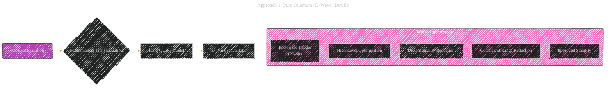
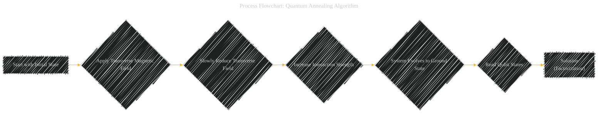
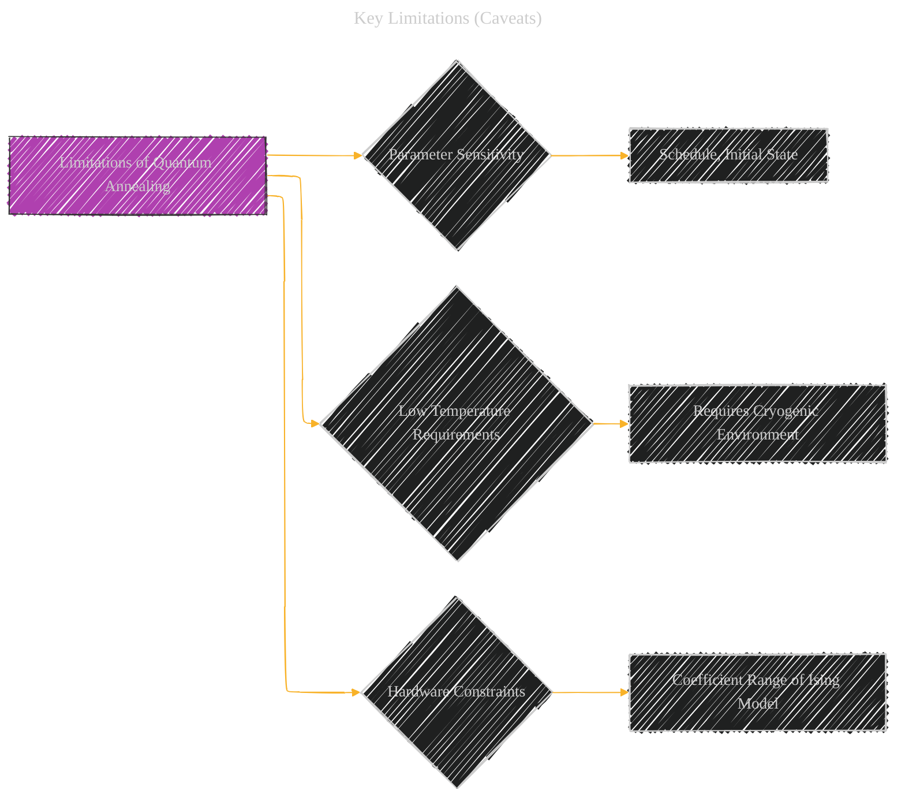
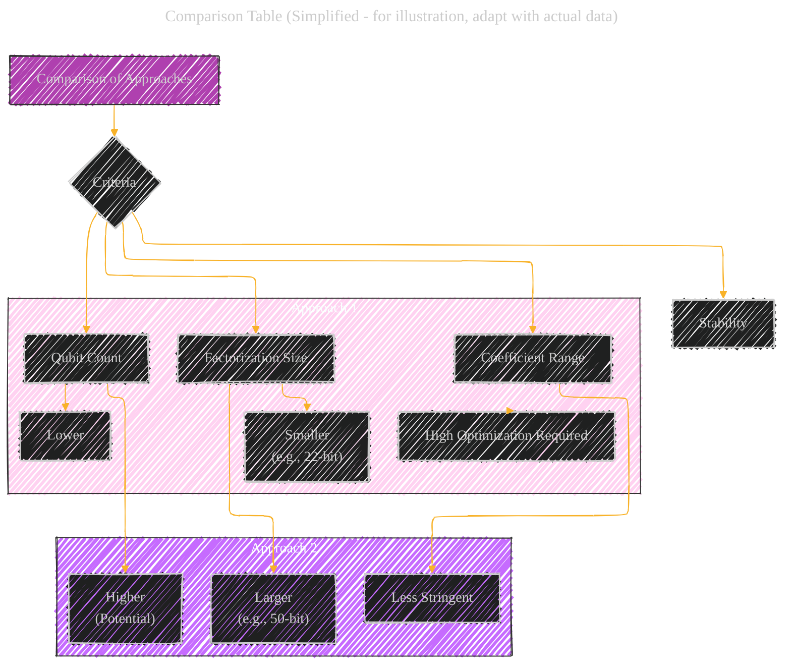

# Quantum Annealing Public Key Cryptographic Attack Algorithm Based on D-Wave Advantage
> **Disclaimer:**
>
> This document contains my personal notes on the topic,
> compiled from publicly available documentation and various cited sources.
> The materials are intended for educational purposes, personal study, and reference.
> The content is dual-licensed:
> 1. **MIT License:** Applies to all code implementations (Swift, Mermaid, and other programming languages).
> 2. **Creative Commons Attribution 4.0 International License (CC BY 4.0):** Applies to all non-code content, including text, explanations, diagrams, and illustrations.
---

## A Diagrammatic Guide 

Here's the Mermaid syntax for creating diagrams based on the conceptual structure outlined in the previous response. I've focused on providing a variety of diagram types to represent the different aspects of the research.

### 1. Overall Strategy Diagram (Combined Approaches)

**Explanation:**

*   Shows the two main approaches in parallel.
*   Highlights the key steps within each approach.
*   Emphasizes D-Wave's role and the final result (factorization).

---

### 2. Approach 1: Pure Quantum (D-Wave) Details

**Explanation:**

*   Focuses on the steps specific to the pure quantum approach.
*   Shows the transformation and optimization process.

---

### 3. Approach 2: Quantum-Classical Hybrid Details

**Explanation:**

*   Details the steps involved in the hybrid approach.
*   Emphasizes the use of quantum annealing for CVP optimization.

---

### 4. Process Flowchart: Quantum Annealing Algorithm

**Explanation:**

*   A high-level view of the quantum annealing process.
*   Suitable for illustrating the core principle of quantum annealing.

----

### 5. Key Limitations (Caveats)

**Explanation:**

*   Highlights the challenges associated with quantum annealing.

----

### 6. Comparison Table (Simplified - for illustration, adapt with actual data)

**Explanation:**

*   Provides a structured comparison of the two approaches.
*   Use actual numerical data from the paper to populate the table.

----

### Important Considerations

*   **Translations:** Ensure accurate translations of technical terms from Chinese to English.
*   **Data:** Replace the placeholder information with the *actual* data from the original research paper.
*   **Level of Detail:** Adapt the level of detail in each diagram to suit your specific needs.
*   **Context:** Use captions and annotations to provide context for each diagram.

---
**Licenses:**

- **MIT License:**   - Full text in [LICENSE](LICENSE) file.
- **Creative Commons Attribution 4.0 International:**  - Legal details in [LICENSE-CC-BY](LICENSE-CC-BY) and at [Creative Commons official site](http://creativecommons.org/licenses/by/4.0/).

---