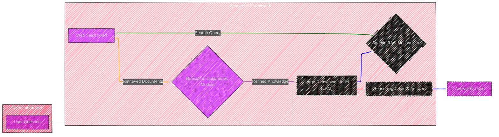
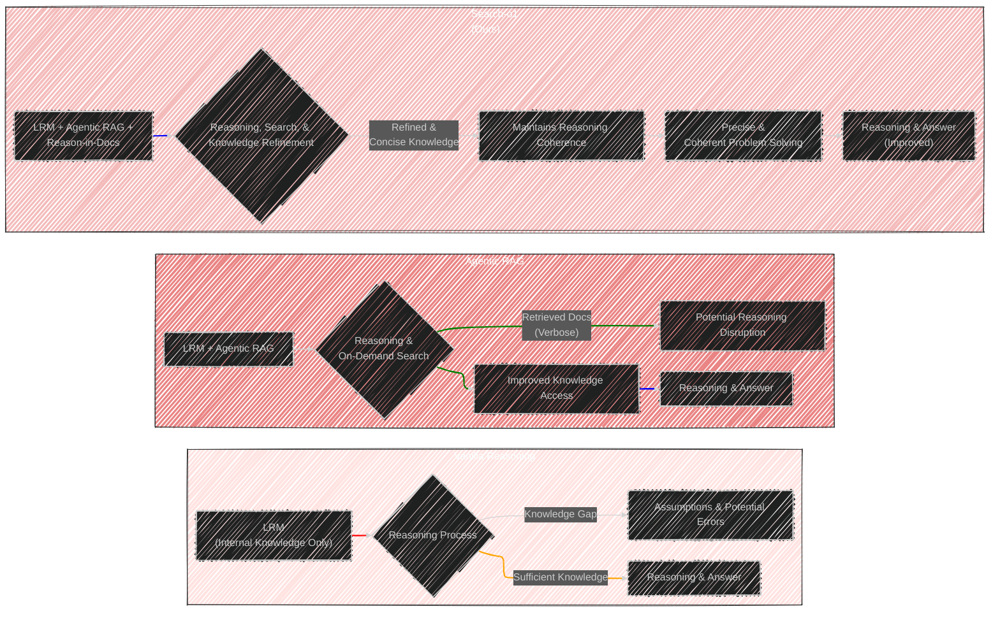
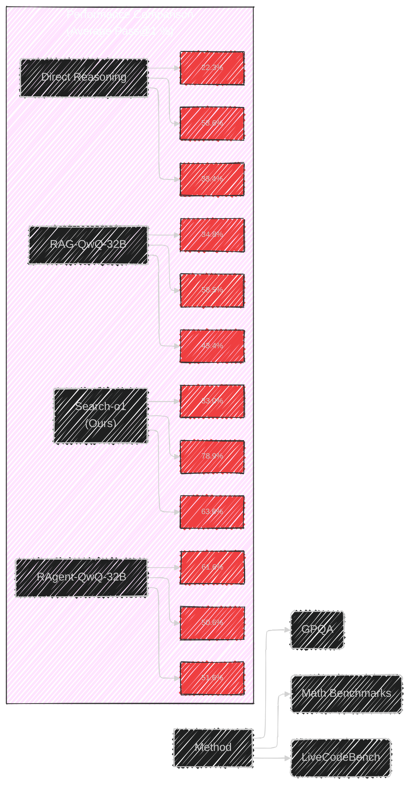
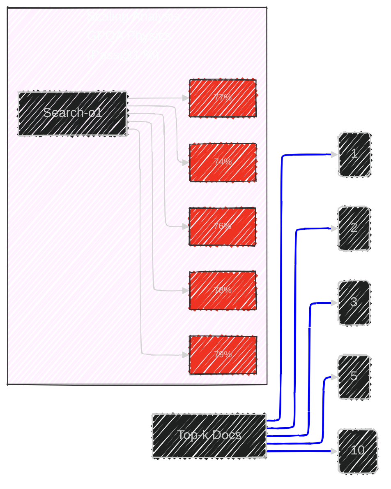

# Search-o1: Agentic Search-Enhanced Large Reasoning Models
> This content is dual-licensed under your choice of the following licenses:
> 1.  **MIT License:** For the code implementations in Swift and Mermaid provided in this document.
> 2.  **Creative Commons Attribution 4.0 International License (CC BY 4.0):** For all other content, including the text, explanations, and the Mermaid diagrams and illustrations.

---

Based on my understanding, I create a series of Mermaid diagrams and illustrations to visually represent the core concepts of Search-o1 framework from the original white paper at this [link](https://arxiv.org/pdf/2501.05366).

Below is the collection of diagrams and illustrations in Mermaid syntax which cover the architecture, the agentic RAG and Reason-in-Documents mechanisms, the inference process, comparative approaches, and simplified representations of the experimental results.

I have aimed for a balance of technical detail and visual clarity for effective communication.


----


## 1. Search-o1 Framework Overview

This diagram provides a high-level view of the Search-o1 framework, highlighting its key components and the flow of information.




**Explanation:**

*   **User Interaction:** The process begins with a user posing a "User Question."
*   **Search-o1 Framework:** This is the core of the system.
    *   **Large Reasoning Model (LRM):**  The foundation is an LRM (like QwQ-32B in the paper), responsible for the reasoning process.
    *   **Agentic RAG Mechanism:** When the LRM encounters knowledge gaps, it dynamically triggers this mechanism. It generates a "Search Query."
    *   **Web Search API:** The search query is sent to an external search engine (Bing Web Search API in the paper) to retrieve "Retrieved Documents."
    *   **Reason-in-Documents Module:** The retrieved documents, often verbose, are passed to this module. It analyzes and refines them, producing "Refined Knowledge."
    *   **Feedback Loop:**  The "Refined Knowledge" is injected back into the LRM, allowing it to continue reasoning with the newly acquired information.
    *   **Reasoning Chain & Answer:**  The LRM proceeds through a "Reasoning Chain," eventually generating a "Answer to User."

*   **Styling and Links:**
    *   Subgraphs are styled for visual grouping.
    *   Key components (User Interaction, Search-o1 Framework, Web Search API, Reason-in-Documents) are styled with different background colors for quick identification.
    *   Links are styled with different colors to represent the flow of information and highlight the framework's steps. Blue for user interaction flow, green for RAG initiation, orange for search query to API, purple for document refinement, and red for refined knowledge injection and reasoning.

---

## 2. Agentic Retrieval-Augmented Generation (RAG) Mechanism

This diagram focuses on the Agentic RAG component, detailing how it enables the LRM to autonomously search for knowledge.


**Explanation:**

*   **Participants:**  Defines the main actors in the Agentic RAG process: LRM, Agentic RAG Mechanism, Web Search API, and Reason-in-Documents Module.
*   **Reasoning Start:** The LRM begins its "Reasoning Process."
*   **Knowledge Uncertainty Check Loop:** This loop represents the core of the agentic behavior:
    *   **Detects Knowledge Gap?:** The RAG mechanism constantly monitors the LRM's reasoning for signs of uncertainty (e.g., "perhaps," "maybe").
    *   **Yes (Knowledge Gap Detected):**
        *   **Generate Search Query:** The RAG instructs the LRM to generate a search query, encapsulated by  `<|begin_search_query|>` and `<|end_search_query|>`.
        *   **Send Search Query:** The query is passed to the "Web Search API."
        *   **Retrieved Documents:** The API returns documents.
        *   **Send to Reason-in-Documents:** The RAG sends these documents, along with the original query and the current reasoning context, to the "Reason-in-Documents Module."
        *   **Refined Knowledge:** This module processes the documents and returns "Refined Knowledge."
        *   **Inject Refined Knowledge:** The RAG injects this refined knowledge back into the LRM's reasoning process, marked by `<|begin_search_result|>` and `<|end_search_result|>`.
    *   **No (No Knowledge Gap):** The LRM continues with its internal reasoning.
*   **Reasoning Completion:** The LRM continues to reason, potentially triggering more search iterations as needed, until it completes the reasoning process.
*   **Final Answer:**  The LRM then provides the "Final Answer" to the user.
*   **Note:** A note emphasizes that the retrieval process can be iterative, happening multiple times within a single reasoning chain.

---

## 3. Reason-in-Documents Module Details

This flowchart illustrates the inner workings of the Reason-in-Documents module, explaining its knowledge refinement process.


**Explanation:**

*   **Reason-in-Documents Module:** This subgraph focuses on the module itself.
*   **Input:** The module receives three key pieces of information: "Retrieved Documents" from the Web Search API, the "Search Query" that triggered the retrieval, and the "Previous Reasoning Steps" taken by the LRM.
*   **Analyze Retrieved Documents:**  The module begins by thoroughly analyzing the content of each retrieved document.
*   **Identify Relevant Information:** It then identifies information within these documents that is directly relevant to the "Current Search Query" and can help advance the reasoning process based on "Previous Reasoning Steps."
*   **Decision Branch - Relevant Info Found:**
    *   **Extract Concise Knowledge:** If relevant information is found, the module carefully extracts it, focusing on conciseness and accuracy.
    *   **Output: Refined Knowledge:** It outputs this "Refined Knowledge," which is a distilled and pertinent summary of the retrieved information, ready for integration back into the LRM.
*   **Decision Branch - No Relevant Info:**
    *   **Output: "No helpful information found."**: If the module determines that the retrieved documents do not contain useful information for the current query, it outputs a message indicating this. This prevents the injection of noise or irrelevant data.
*   **Styling:** Input and output stages are styled to differentiate them from the processing steps within the module.

---

## 4. Search-o1 Inference Process for a Single Question

This diagram outlines the step-by-step inference process of Search-o1 when handling a single question.


**Explanation:**

*   **Start:** The inference begins by initializing the "Reasoning Sequence" with the task instruction and the user's question.
*   **LRM Generates Reasoning Chain:** The LRM starts generating the reasoning chain.
*   **Search Query Detected?:** The system checks if the LRM's generated output contains a search query, indicated by the `<|end_search_query|>` special symbol.
    *   **Yes (Search Query Detected):**
        *   **Extract Search Query:** The search query is extracted from the generated text.
        *   **Web Search API Retrieval:**  This query is used to retrieve documents via the "Web Search API."
        *   **Reason-in-Documents Module Refinement:** The retrieved documents are processed by the "Reason-in-Documents Module."
        *   **Inject Refined Knowledge:** The refined knowledge from the module is injected back into the reasoning chain, marked by `<|begin_search_result|>`.
        *   **Loop Back:** The process loops back to Step B ("LRM Generates Reasoning Chain"), allowing the LRM to continue reasoning with the new knowledge.
    *   **No (No Search Query):**
        *   **Reasoning Completion?:** The system checks if the LRM has completed its reasoning process (e.g., by reaching an end-of-sequence token).
        *   **No (Reasoning Not Complete):** The process loops back to Step B ("LRM Generates Reasoning Chain") to continue generating more reasoning steps.
        *   **Yes (Reasoning Complete):**
            *   **Output: Reasoning Chain & Final Answer:**  The system outputs the complete "Reasoning Chain" generated by the LRM, along with the "Final Answer."
            *   **End:** The inference process for this question concludes.
*   **Styling:** Start and End points, as well as the final output are styled to visually mark the beginning and conclusion of the process.

---

## 5. Comparison of Reasoning Approaches

This diagram visually compares the three reasoning approaches discussed in the paper: Vanilla Reasoning, Agentic RAG, and Search-o1, highlighting their key differences.



**Explanation:**

*   **Three Subgraphs:**  Each subgraph represents one of the reasoning approaches, styled with distinct background colors for easy differentiation (Vanilla - red hue, Agentic RAG - orange hue, Search-o1 - blue hue, with varying shades).
*   **Vanilla Reasoning:**
    *   **LRM (Internal Knowledge Only):** Relies solely on the LRM's pre-existing knowledge.
    *   **Knowledge Gap:** When faced with a "Knowledge Gap," it resorts to "Assumptions & Potential Errors," leading potentially to inaccurate results.
    *   **Sufficient Knowledge:**  When internal knowledge is "Sufficient," it can proceed to "Reasoning & Answer."
*   **Agentic RAG:**
    *   **LRM + Agentic RAG:** Augments the LRM with an agentic RAG mechanism for external knowledge access.
    *   **Reasoning & On-Demand Search:** Enables "Reasoning & On-Demand Search" to address knowledge gaps.
    *   **Retrieved Docs (Verbose):** However, directly inserting "Retrieved Docs (Verbose)" can lead to "Potential Reasoning Disruption" due to redundancy and length.
    *   **Improved Knowledge Access:** Still offers "Improved Knowledge Access" compared to Vanilla Reasoning.
    *   **Reasoning & Answer:** Results in generally improved "Reasoning & Answer," but may suffer from coherence issues.
*   **Search-o1 (Ours):**
    *   **LRM + Agentic RAG + Reason-in-Docs:**  Builds upon Agentic RAG by adding the "Reason-in-Documents" module for knowledge refinement.
    *   **Reasoning, Search, & Knowledge Refinement:** Integrates "Reasoning, Search, & Knowledge Refinement" process.
    *   **Refined & Concise Knowledge:**  Injects "Refined & Concise Knowledge," ensuring "Maintains Reasoning Coherence."
    *   **Precise & Coherent Problem Solving:** Enables "Precise & Coherent Problem Solving."
    *   **Reasoning & Answer (Improved):**  Leads to "Reasoning & Answer (Improved)," with both accuracy and coherence enhanced.
*   **Link Styling:** Links are styled with different colors to highlight the flow and potential issues: Red for Vanilla's error pathway, orange for Agentic RAG's potential disruption, and green then blue for Search-o1's refined and improved path.

---

## 6. Experimental Results - Main Performance Comparison (Simplified Bar Chart)

To represent the main results from Table 1 in a simplified visual form, I will use a text-based, simplified bar chart within Mermaid to compare the performance of different methods on average across the datasets.  A full graphical chart within Mermaid for this detailed table would be overly complex for this context, but this provides a quick visual comparison of key metrics.




**Explanation:**

*   **Simplified Bar Chart Structure:**  While not a true bar chart, the diagram is structured to mimic one textually. "Method" serves as the y-axis label, and dataset categories (GPQA, Math Benchmarks, LiveCodeBench) are the x-axis categories.
*   **Methods Compared:** Lists the key methods: Direct Reasoning (w/o Retrieval), RAG-QwQ-32B, RAgent-QwQ-32B, and Search-o1 (Ours).
*   **Performance Values:** For each method and dataset, the approximate average "Pass@1" performance (derived from Table 1) is displayed as text within boxes that visually represent the bars of a chart.
*   **Observation:**  Visually, it's clear that Search-o1 shows significantly higher performance in GPQA and Math Benchmarks. While LiveCodeBench does not show improvement, the other two main tasks highlight Search-o1's strengths. This simplified chart provides a quick, comparative overview of the main results without overwhelming detail.

---

## 7. Experimental Results - Scaling Analysis (Simplified Line Chart)

Similarly, to visualize the scaling analysis from Figure 3, I will use a simplified, text-based line chart to show the trend of Search-o1's performance as the number of retrieved documents (Top-k Docs) increases. Again, a fully rendered line chart in Mermaid would be overly complex and potentially less clear than this simplified representation in this context.




**Explanation:**

*   **Simplified Line Chart Structure:**  Textually mimics a line chart. "Top-k Docs" is the x-axis (number of retrieved documents), and "Scaling Analysis - GPQA Physics (Pass@1 %)" is the y-axis (performance metric for GPQA Physics).
*   **Top-k Values:**  Lists the number of retrieved documents (1, 2, 3, 5, 10) based on Figure 3.
*   **Performance Values:** For Search-o1, the approximate "Pass@1" performance values for GPQA Physics (taken from Figure 3's "Physics" subplot) are displayed for each Top-k value, again within boxes representing points on a line chart.
*   **Observation:**  This simplified "line chart" visually shows the upward trend: as the number of retrieved documents increases, Search-o1's performance on GPQA Physics also tends to improve, though the gains become marginal after a certain point (around k=5 in the figure from paper). The blue line style further emphasizes the trend.

---

## 8.  Simplified Table: Comparison with Human Experts (GPQA Extended Set)

For Table 2 (Comparison with Human Experts), a simple Mermaid table is the most effective way to present this data clearly and directly.

```mermaid
---
title: Performance Comparison with Human Experts (GPQA Extended Set - Pass@1 %)
---
table Header Row
    Domain | Human Experts | QwQ-32B | RAG-QwQ-32B | Search-o1 (Ours)
    ---  | --- | --- | --- | ---
    Physics | 57.9 | 42.0 | 61.0 | 68.7
    Chemistry | 34.5 | 45.6 | 66.7 | 40.7
    Biology | 30.4 | 68.9 | 69.5 | 69.5
    Overall | 36.9 | 51.8 | 54.6 | 57.9
[/instruction]
```

**Explanation:**

*   **Mermaid Table Syntax:** Uses the `table` syntax in Mermaid for creating tables.
*   **Header Row:** Clearly labels each column: "Domain," "Human Experts," "QwQ-32B," "RAG-QwQ-32B," and "Search-o1 (Ours)."
*   **Data Rows:**  Each row represents a domain (Physics, Chemistry, Biology, Overall) and lists the corresponding "Pass@1" performance values for human experts and the different model configurations, directly mirroring Table 2.
*   **Title:**  A title is added to provide context for the table.
*   **Readability:** This table provides a direct, side-by-side comparison that is easy to read and interpret, highlighting Search-o1's performance relative to both baseline models and human experts.


---
**Licenses:**

- **MIT License:**  [](LICENSE) - Full text in [LICENSE](LICENSE) file.
- **Creative Commons Attribution 4.0 International:** [](LICENSE-CC-BY) - Legal details in [LICENSE-CC-BY](LICENSE-CC-BY) and at [Creative Commons official site](http://creativecommons.org/licenses/by/4.0/).

---