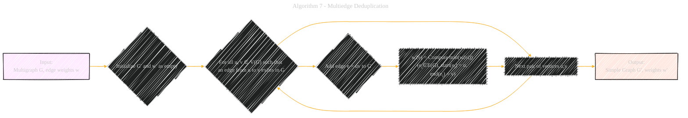

# Universal Optimality of Dijkstra via Beyond-Worst-Case Heaps
> **Disclaimer:**
>
> This document contains my personal notes on the topic,
> compiled from publicly available documentation and various cited sources.
> The materials are intended for educational purposes, personal study, and reference.
> The content is dual-licensed:
> 1. **MIT License:** Applies to all code implementations (Swift, Mermaid, and other programming languages).
> 2. **Creative Commons Attribution 4.0 International License (CC BY 4.0):** Applies to all non-code content, including text, explanations, diagrams, and illustrations.
---

## Algorithm 7 - Multiedge Deduplication

----

### Explanation and breakdown of the changes

1.  **Input and Output:**
    *   Input: `Multigraph G`, `edge weights w` (marked as yellow input).
    *   Output: `Simple Graph G'`, `weights w'` (marked as orange output).
2.  **Initialization:**
    *   `Initialize G' and w' as empty`: Clear starting state.
3.  **Main Loop:**
    *   `For all u, v ∈ V(G) such that an edge from u to v exists in G`: Iterates through all possible vertex pairs in the input multigraph. The condition ensures we only process pairs connected by at least one edge.
4.  **Edge Addition:**
    *   `Add edge e = uv to G'`: Add an edge between `u` and `v` in the simple graph `G'`.
5.  **Weight Computation:**
    *   `w'(e) = Compute min(w(ei)) (ei∈E(G), start(ei) = u, end(ei) = v)`: This step computes the weight of the edge `e` in the simple graph `G'`. It finds the minimum weight among all edges in the multigraph `G` that connect `u` to `v`.

---
**Licenses:**

- **MIT License:**   - Full text in [LICENSE](LICENSE) file.
- **Creative Commons Attribution 4.0 International:**  - Legal details in [LICENSE-CC-BY](LICENSE-CC-BY) and at [Creative Commons official site](http://creativecommons.org/licenses/by/4.0/).

---