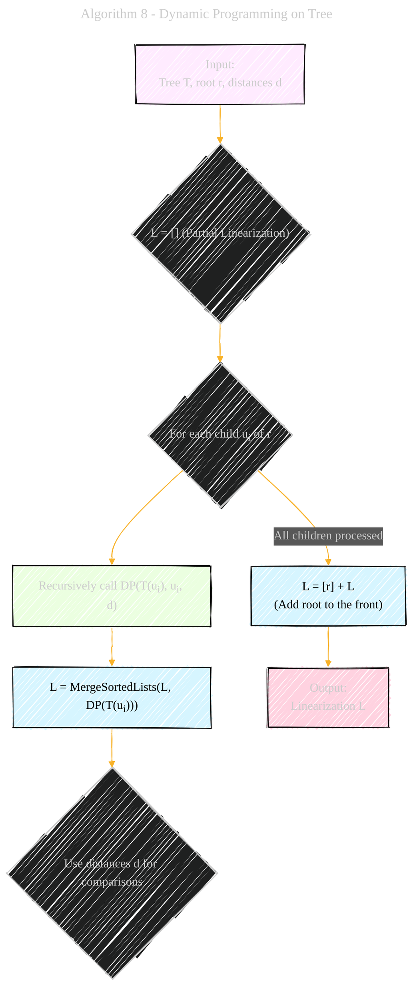

# Universal Optimality of Dijkstra via Beyond-Worst-Case Heaps
> **Disclaimer:**
>
> This document contains my personal notes on the topic,
> compiled from publicly available documentation and various cited sources.
> The materials are intended for educational purposes, personal study, and reference.
> The content is dual-licensed:
> 1. **MIT License:** Applies to all code implementations (Swift, Mermaid, and other programming languages).
> 2. **Creative Commons Attribution 4.0 International License (CC BY 4.0):** Applies to all non-code content, including text, explanations, diagrams, and illustrations.
---

## Algorithm 8 - Dynamic Programming on Tree

----

### Explanation and Element Types

*   **Yellow Circle (A):** The `Input` to the algorithm. Represents the initial data:
    *   `Tree T`: The shortest path tree we want to linearize.
    *   `root r`: The root node of the tree.
    *   `distances d`: The distances from the source to each node, used for comparisons.
*   **Blue Circle (B, E, G):** Represents operations on lists (data structures)
    *   `B`: The list L.
    *   `E`: Merge Sorted List.
    *   `G`: Add the root node to the list L.
*   **Green Circle (D):** Represents the recursive call to the `DP` algorithm itself. This is a key processing step.
*   **Orange Circle (H):** The final `Output`: the linearized ordering of the tree's nodes.

----

### Key improvements in this version

*   **Data Flow:** It shows more clearly how the partial linearizations are built up at each step.
*   **Focus on Element Types:** Aligns with the requested structure by indicating what each node represents (input, processing, output, data structure).

---
**Licenses:**

- **MIT License:**   - Full text in [LICENSE](LICENSE) file.
- **Creative Commons Attribution 4.0 International:**  - Legal details in [LICENSE-CC-BY](LICENSE-CC-BY) and at [Creative Commons official site](http://creativecommons.org/licenses/by/4.0/).

---