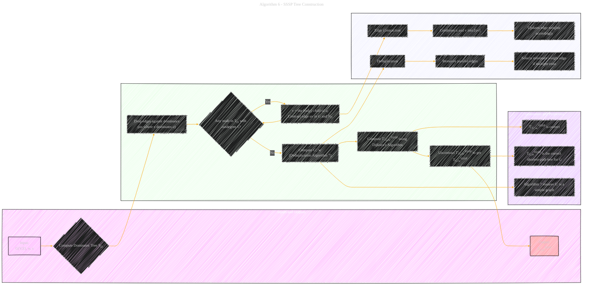
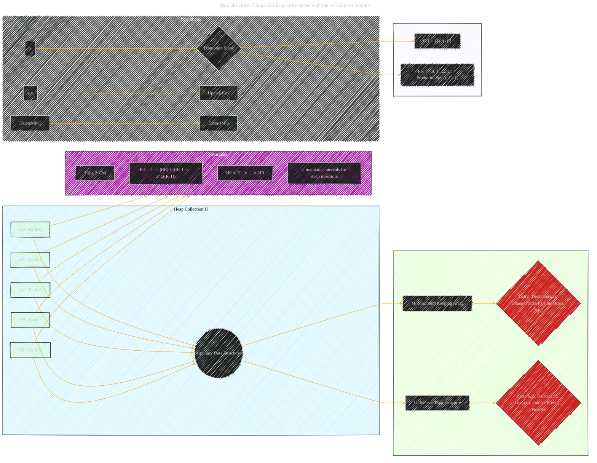

# Universal Optimality of Dijkstra via Beyond-Worst-Case Heaps
> **Disclaimer:**
>
> This document contains my personal notes on the topic,
> compiled from publicly available documentation and various cited sources.
> The materials are intended for educational purposes, personal study, and reference.
> The content is dual-licensed:
> 1. **MIT License:** Applies to all code implementations (Swift, Mermaid, and other programming languages).
> 2. **Creative Commons Attribution 4.0 International License (CC BY 4.0):** Applies to all non-code content, including text, explanations, diagrams, and illustrations.
---

## A. Diagram 1: High-Level Algorithm 5 (Query-Universally Optimal)

*   **Changes**: Added a `Key Concepts` section to define the notations. Also, the `Input` section is created.

----

## B. Diagram 2: Algorithm 6 (SSSP Tree Construction)

*   **Changes**: Created 4 sections for better visual presentation.

---

## C. Diagram 3: Algorithm 7 (Multiedge Deduplication)

---

## D. Diagram 4: Algorithm 8 (Dynamic Programming on Tree)

----

## E. Data Structure: Fibonacci-like priority queue with the working set property

---

## F. Equations related to DeleteMin

---
**Licenses:**

- **MIT License:**   - Full text in [LICENSE](LICENSE) file.
- **Creative Commons Attribution 4.0 International:**  - Legal details in [LICENSE-CC-BY](LICENSE-CC-BY) and at [Creative Commons official site](http://creativecommons.org/licenses/by/4.0/).

---