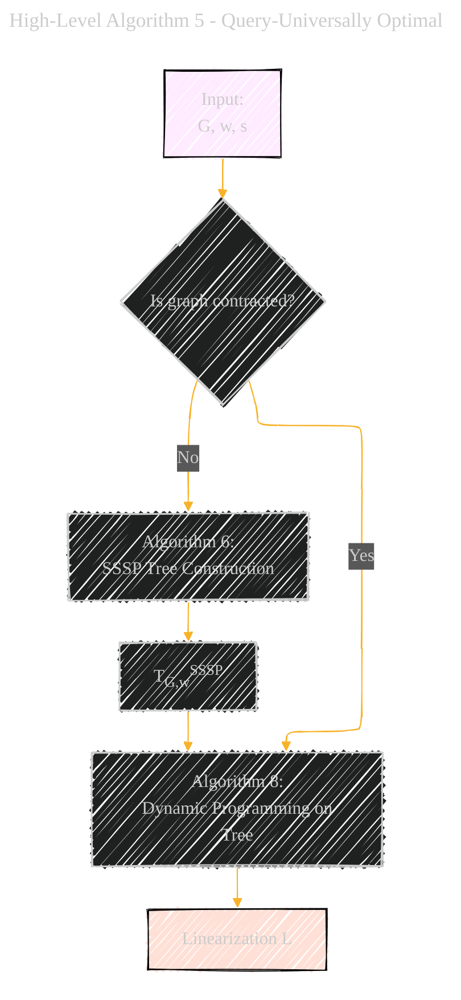
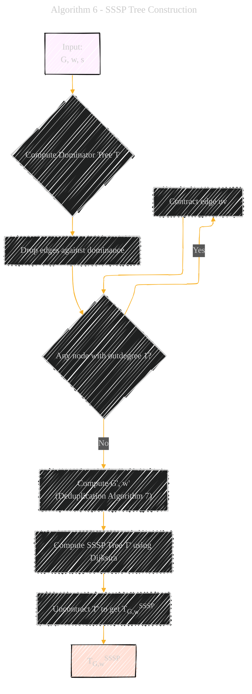
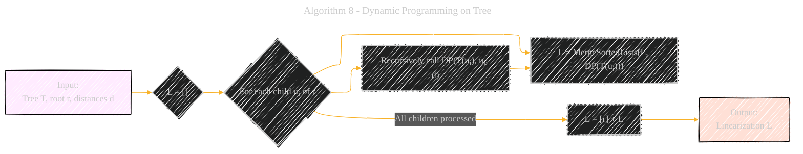
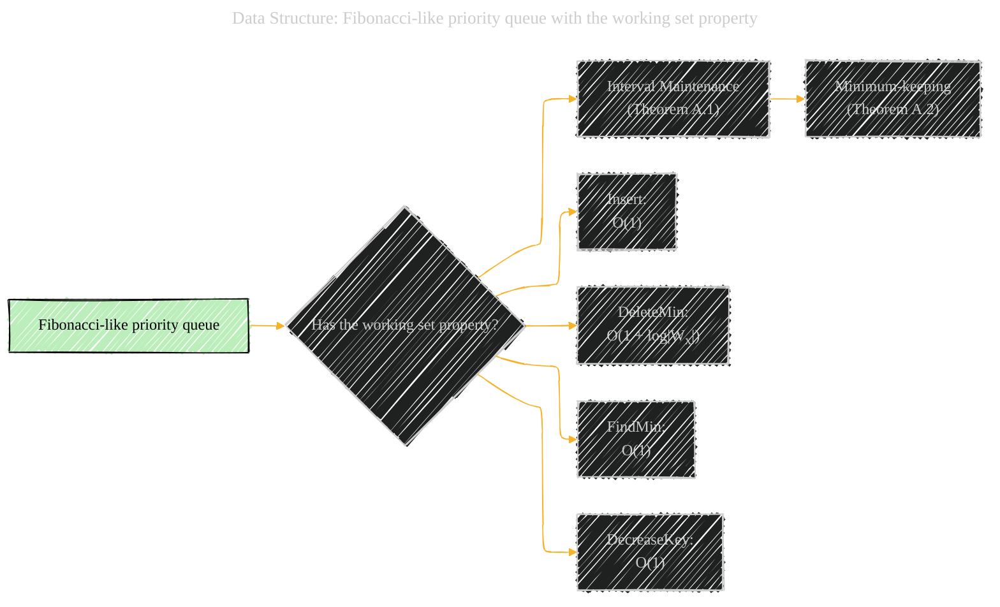
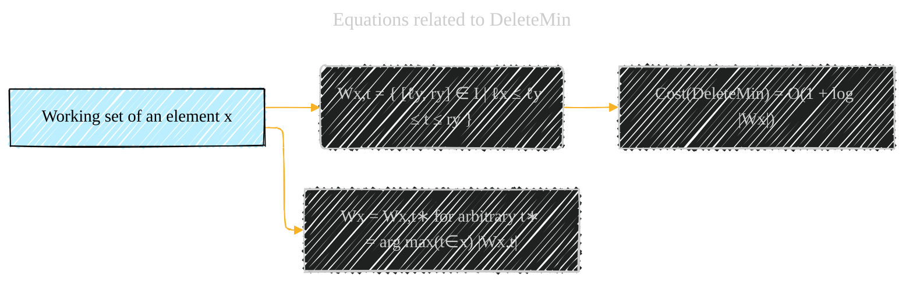

# Universal Optimality of Dijkstra via Beyond-Worst-Case Heaps
> **Disclaimer:**
>
> This document contains my personal notes on the topic,
> compiled from publicly available documentation and various cited sources.
> The materials are intended for educational purposes, personal study, and reference.
> The content is dual-licensed:
> 1. **MIT License:** Applies to all code implementations (Swift, Mermaid, and other programming languages).
> 2. **Creative Commons Attribution 4.0 International License (CC BY 4.0):** Applies to all non-code content, including text, explanations, diagrams, and illustrations.
---

I will translate the algorithmic steps and data structure relationships of the Dijkstra algorithm with the working set property into Mermaid diagrams.

Here's a breakdown of the diagrams:

----

## 1. High-Level Algorithm 5 - Query-Universally Optimal

**Explanation:**

* `A`: The starting point, the input to the query-universally optimal algorithm.
* `B`: Main algorithm (query-universally optimal).
* `C`: SSSP tree construction, as a subroutine of the main algorithm.
* `D`: Linearization of the graph is done.

-----

## 2. Algorithm 6 - SSSP Tree Construction

**Explanation:**

* `A`: Input graph, edge weights, and source node.
* `B`: Core part of the SSSP construction.
* `C`: Perform the construction of the tree.
* `D`: Output SSSP tree of the original graph.

-----

## 3. Algorithm 7 - Multiedge Deduplication

**Explanation:**

* `A`: Input multigraph.
* `B`: Set to create the graph for the next algorithm.
* `C`: Create the graph.
* `D`: Final simple graph with proper weight assignment.

-----

## 4. Algorithm 8 - Dynamic Programming on Tree

**Explanation:**

* `A`: A rooted tree is the input
* `B`: Initialize and go through every child node.
* `C`: Dynamic programming for the final output.

----

## 5. Data Structure: Fibonacci-like priority queue with the working set property

**Explanation:**

* auxiliary data structure

----

## 6. Equations related to DeleteMin

**Explanation:**

* This digram shows the relationship between the working set and DeleteMin

---
**Licenses:**

- **MIT License:**   - Full text in [LICENSE](LICENSE) file.
- **Creative Commons Attribution 4.0 International:**  - Legal details in [LICENSE-CC-BY](LICENSE-CC-BY) and at [Creative Commons official site](http://creativecommons.org/licenses/by/4.0/).

---