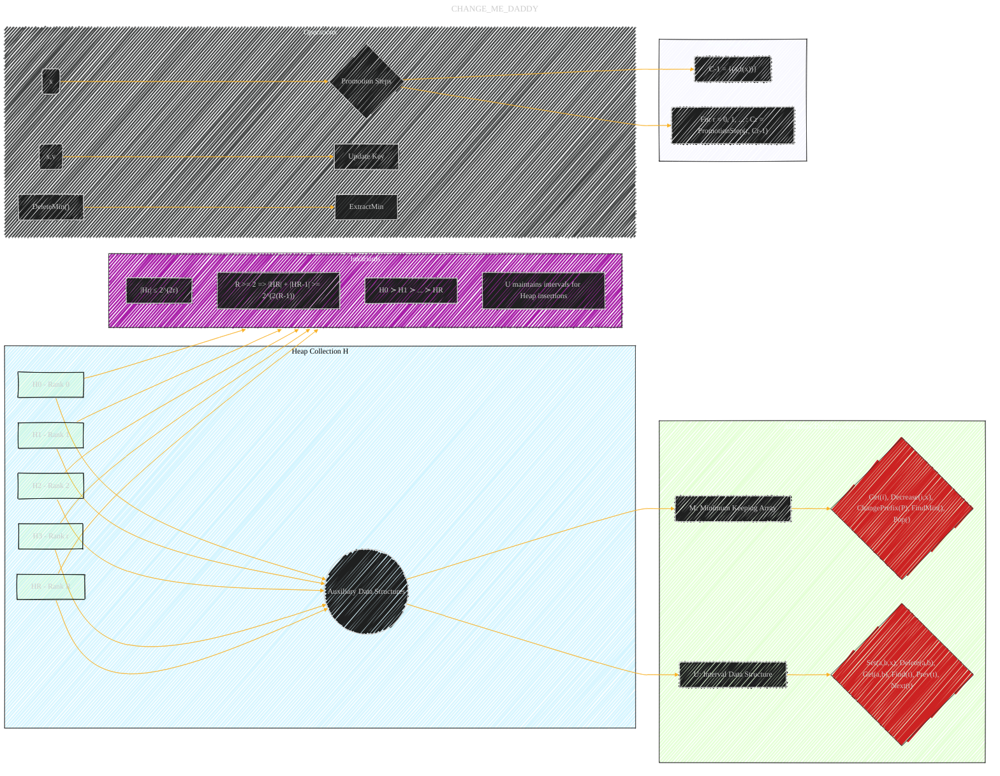

# Universal Optimality of Dijkstra via Beyond-Worst-Case Heaps
> **Disclaimer:**
>
> This document contains my personal notes on the topic,
> compiled from publicly available documentation and various cited sources.
> The materials are intended for educational purposes, personal study, and reference.
> The content is dual-licensed:
> 1. **MIT License:** Applies to all code implementations (Swift, Mermaid, and other programming languages).
> 2. **Creative Commons Attribution 4.0 International License (CC BY 4.0):** Applies to all non-code content, including text, explanations, diagrams, and illustrations.
---

## Data Structure: Fibonacci-like priority queue with the working set property

The diagram below emphasizes the relationships between the Fibonacci-like heaps, auxiliary data structures, and the key invariants that guarantee the working set property. The use of different shapes and colors helps visually distinguish the different components.

----

### Key Points & Explanation

*   **`Heap Collection H`**: This is the core, representing the collection of Fibonacci heaps of varying ranks. Each heap (`H0`, `H1`, `H2`, etc.) stores elements with their insertion times.
*   **`Auxiliary Data Structures`**: This is critical. It shows how the Minimum Keeping Array (`M`) and Interval Data Structure (`U`) are *external* to the heaps themselves but essential for efficient operation. The type of operation is listed under each block.
*   **`Invariants`**: These are *crucial* to understanding the data structure.  They maintain the structure of the heap collection, its size properties, and the ordering of elements.
*   **`Operations`**:  This shows the primary operations and their interaction with the rest of the structure.
*    **Promotion Steps:** It shows that for each operation, it need to go through promotion steps.

---
**Licenses:**

- **MIT License:**   - Full text in [LICENSE](LICENSE) file.
- **Creative Commons Attribution 4.0 International:**  - Legal details in [LICENSE-CC-BY](LICENSE-CC-BY) and at [Creative Commons official site](http://creativecommons.org/licenses/by/4.0/).

---