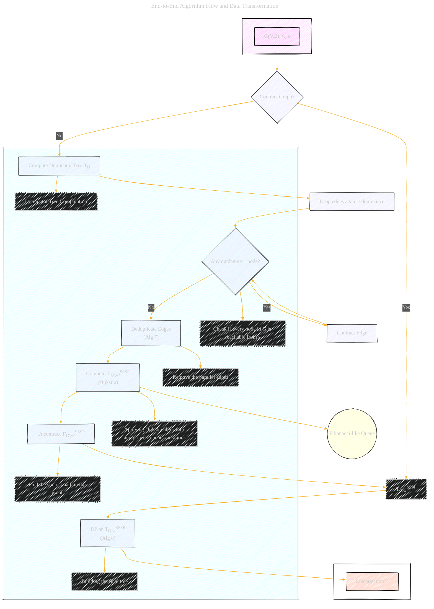

# End-to-End Algorithm Flow and Data Transformation
> **Disclaimer:**
>
> This document contains my personal notes on the topic,
> compiled from publicly available documentation and various cited sources.
> The materials are intended for educational purposes, personal study, and reference.
> The content is dual-licensed:
> 1. **MIT License:** Applies to all code implementations (Swift, Mermaid, and other programming languages).
> 2. **Creative Commons Attribution 4.0 International License (CC BY 4.0):** Applies to all non-code content, including text, explanations, diagrams, and illustrations.
---

The diagram below captures the core end-to-end flow and major data transformations described in the original algorithm.

---

## Key Elements

*   **Input:** The initial graph G, weights w, and source s.
*   **Decision:** "Contract Graph?" reflects the Algorithm 5 high-level control flow.
*   **Contraction Steps:** The Dominator Tree computation, edge dropping, and edge contraction steps mirror Algorithm 6.
*   **Deduplication:** Algorithm 7 is represented as a single "Deduplicate Edges" step.
*   **Dijkstra's Algorithm:**  Algorithm 6 culminates in running Dijkstra's, creating T'G',w'SSSP
*    **Data Flow:** There are steps for Dominator Tree Computation, checking if every node is reachable from s, etc.
*   **Outputs:** Linearization L (Orange).
*   **Fibonacci-like Queue:** The queue is represented as a database shape.

---
**Licenses:**

- **MIT License:**   - Full text in [LICENSE](LICENSE) file.
- **Creative Commons Attribution 4.0 International:**  - Legal details in [LICENSE-CC-BY](LICENSE-CC-BY) and at [Creative Commons official site](http://creativecommons.org/licenses/by/4.0/).

---