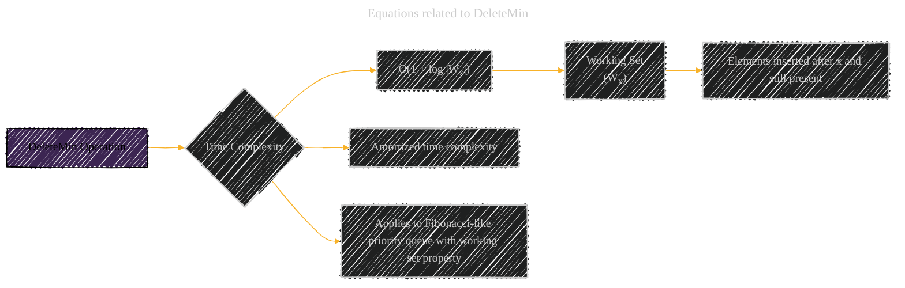

# Universal Optimality of Dijkstra via Beyond-Worst-Case Heaps
> **Disclaimer:**
>
> This document contains my personal notes on the topic,
> compiled from publicly available documentation and various cited sources.
> The materials are intended for educational purposes, personal study, and reference.
> The content is dual-licensed:
> 1. **MIT License:** Applies to all code implementations (Swift, Mermaid, and other programming languages).
> 2. **Creative Commons Attribution 4.0 International License (CC BY 4.0):** Applies to all non-code content, including text, explanations, diagrams, and illustrations.
---

## Equations related to DeleteMin

The diagram below captures the essential equation related to the `DeleteMin` operation, along with the context of its time complexity and the working set property.

---

### Explanation of the Diagram

*   **A:** `DeleteMin Operation` is the central concept.
*   **B:** `Time Complexity` highlights the key performance metric.
*   **C:** `O(1 + log |Wx|)` This is the core equation. The cost of DeleteMin depends on the size of the working set.
*   **D:** `Working Set (Wx)` provides a brief definition, emphasizing elements inserted after `x`.
*   **F:** The definition of the time complexity is amortized.
*   **G:** Only work on Fibonacci-like priority queue with working set property.

---
**Licenses:**

- **MIT License:**   - Full text in [LICENSE](LICENSE) file.
- **Creative Commons Attribution 4.0 International:**  - Legal details in [LICENSE-CC-BY](LICENSE-CC-BY) and at [Creative Commons official site](http://creativecommons.org/licenses/by/4.0/).

---